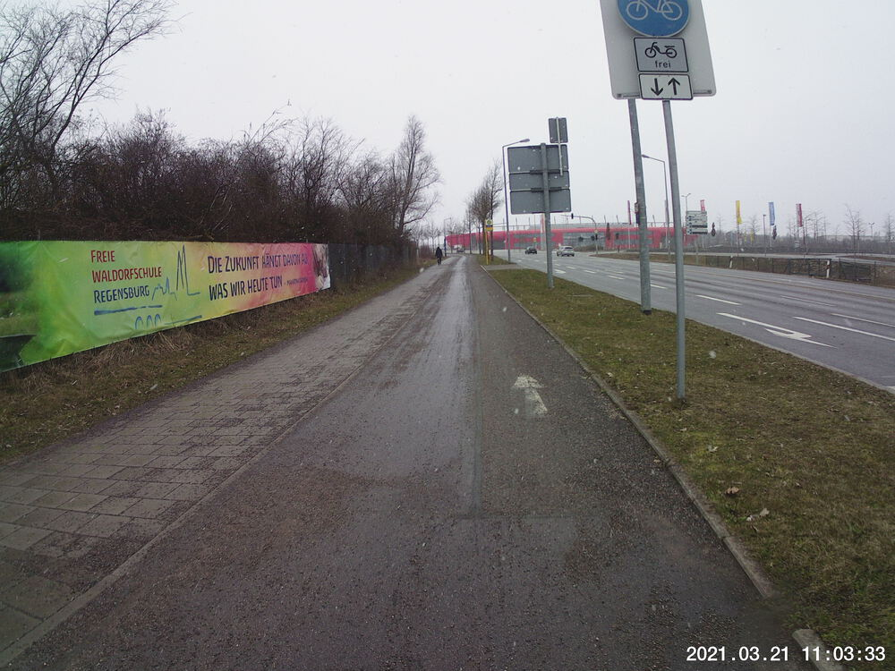
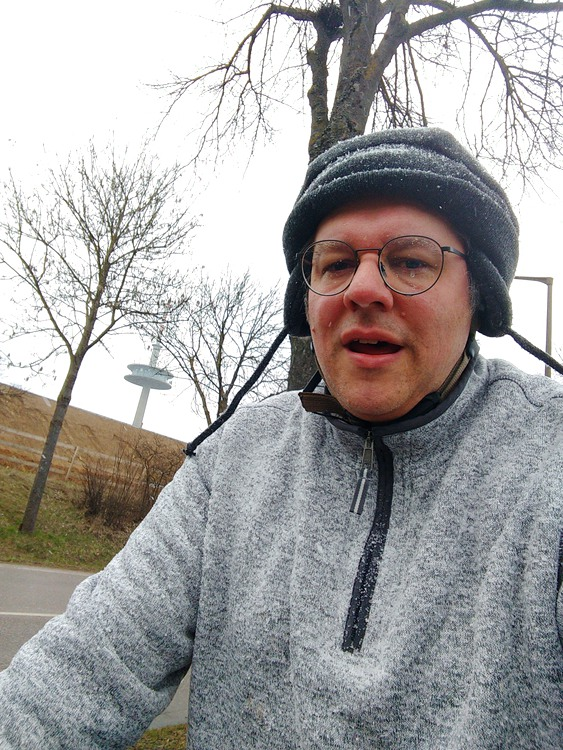
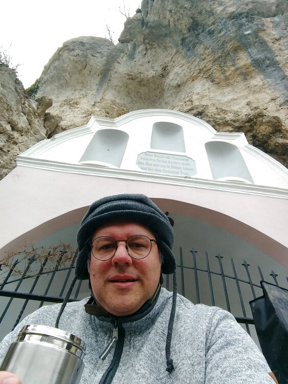
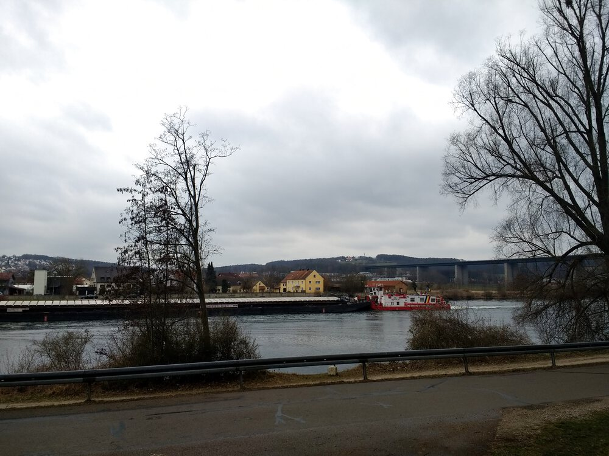
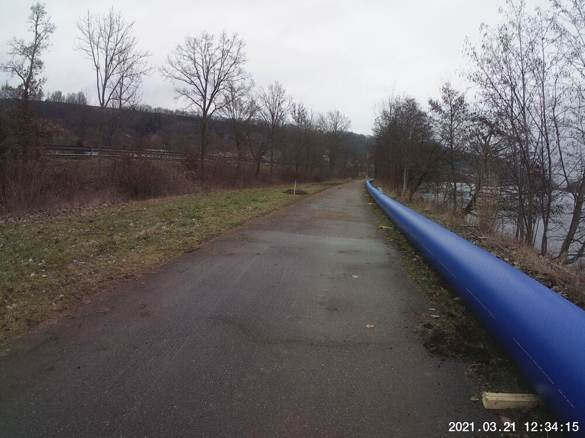
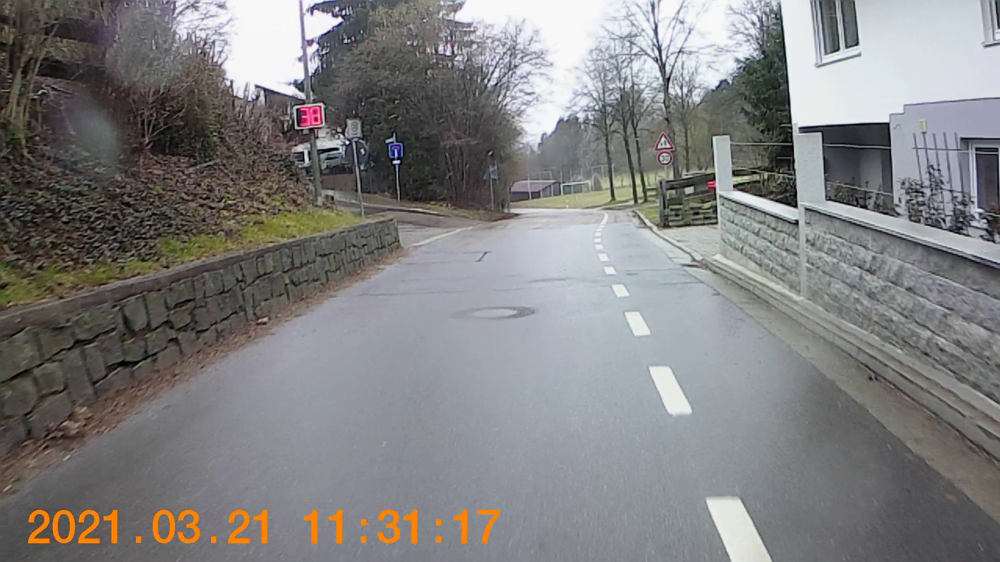

Despite the weather prediction I got out there again today.  I had planned to do a ring around Regensburg so that I wouldn't be obligated to wear a mask, which I rather dislike while on my bike (it's not so bad except for the fact that I wear glasses).  Almost right off the bat, I veered off from my planned course, but this only resulted in a a total route of a few kilometers less than the original route.  At at least two more points along the way, path closures forced me to deviate.

I was a little underdressed, but it was mostly fine as long as I kept moving.  My *jamaica* tea break along the Danube was well-placed.


## Snaps

  
  
The snow was the wet, blowy, sting-y kind that hurts upon impact with your face.  
  
> *Wenn Wasser oder Feuersnoth*              
> *Verderben Deinern Kindern droht*          
> *Dan Herr nim uns in Deinen Schutz*        
> *und biet dem Elementen Trutz*             

My Q&D translation:  
> Should a water or fire emergency  
> Threaten to ruin your children  
> Then Lord protect us  
> and show the element defiance


  
  
I didn't realize I was on a closed path until I got to the end of these hundreds of meters of pipes.

## Video Recap

None today; just a still of me exceeding the speed limit.

  


## Route
You might need to tap or click the map to make it bigger.  The red solid route was my intention.  The blue dashed route is my actual route.  


## Stats

```
Total Distance:      28 km 
Time:              2:02
Calories:          1563
Calories from fat:   12 %
Average Heart Rate: 140
Maximum Heart Rate: 164
Fat Burn:          0:03
Fitness:           1:59
```
