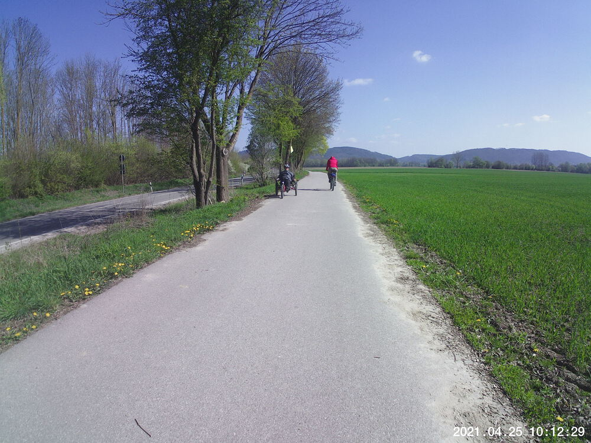
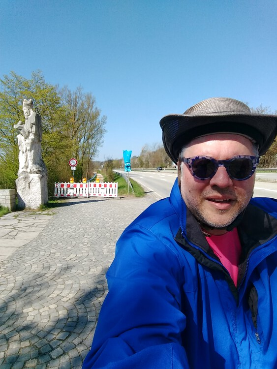

It's been two weeks since I took a Sunday ride, so I was happy the route I chose was very flat.  I rode over to a buddy's house in Neutraubling, met him there, and then we followed the Danube back towards Mariaort.  At least we'd planned to:  the bike/walking path along the north back is still all torn up &mdash; probably for the same reason as it was [on March 21st](../20210321/).  We had to divert towards Winzer, which added a little to the route.  We rode one of the paths to the end and then realized we were stuck in an empty field and had to press on back over the embankment onto a paved surface at Kneiting.  I hope they finish that section of path soon.  

Another observation:  the train trestle foot/bike bath at Mariaort is not equipped for social distancing.  See the video.

Oh, and remember that [Daredevil Chicken](../20201101-daredevil-chicken/)?  I think (s)he's been reincarnated.    See the video.


## Snaps

  
  


## Video Recaps





## Route
You might need to tap or click the map to make it bigger.  The red solid route was our intention.  The blue dashed route is our actual route.  



## Stats

```
Total Distance:      42.6 km 
Time:              2:54
Calories:          2251
Calories from fat:   14 %
Average Heart Rate: 141
Maximum Heart Rate: 166
Fat Burn:          0:10
Fitness:           2:44
```

