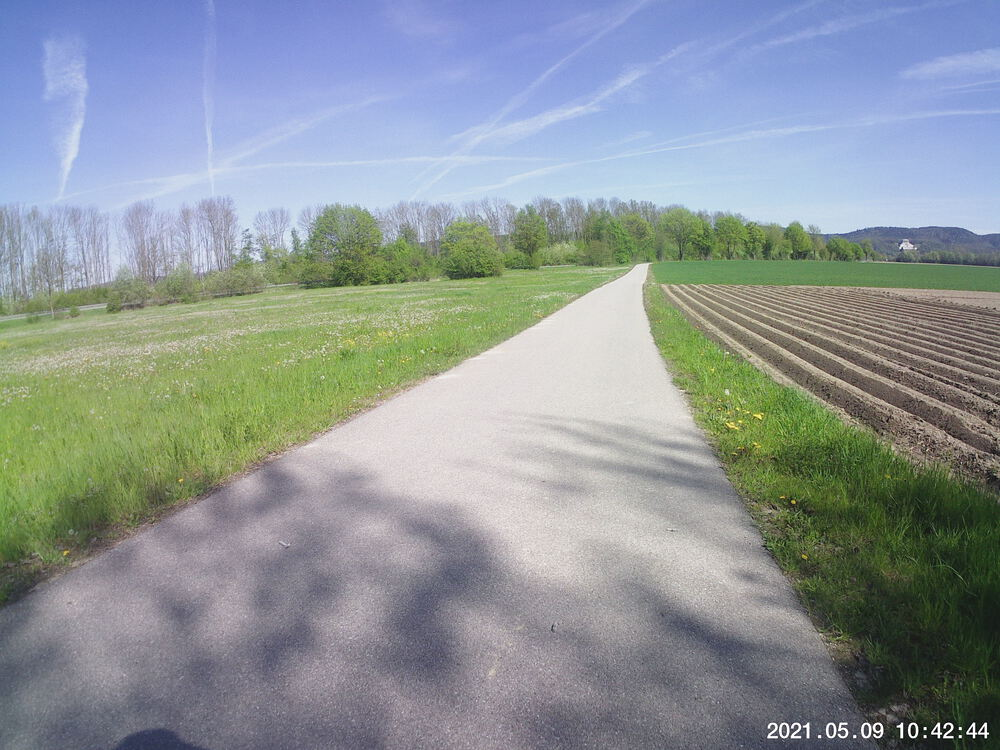
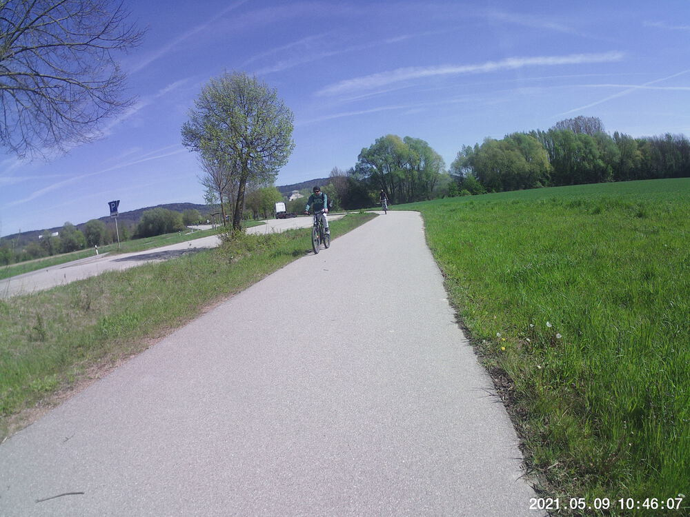
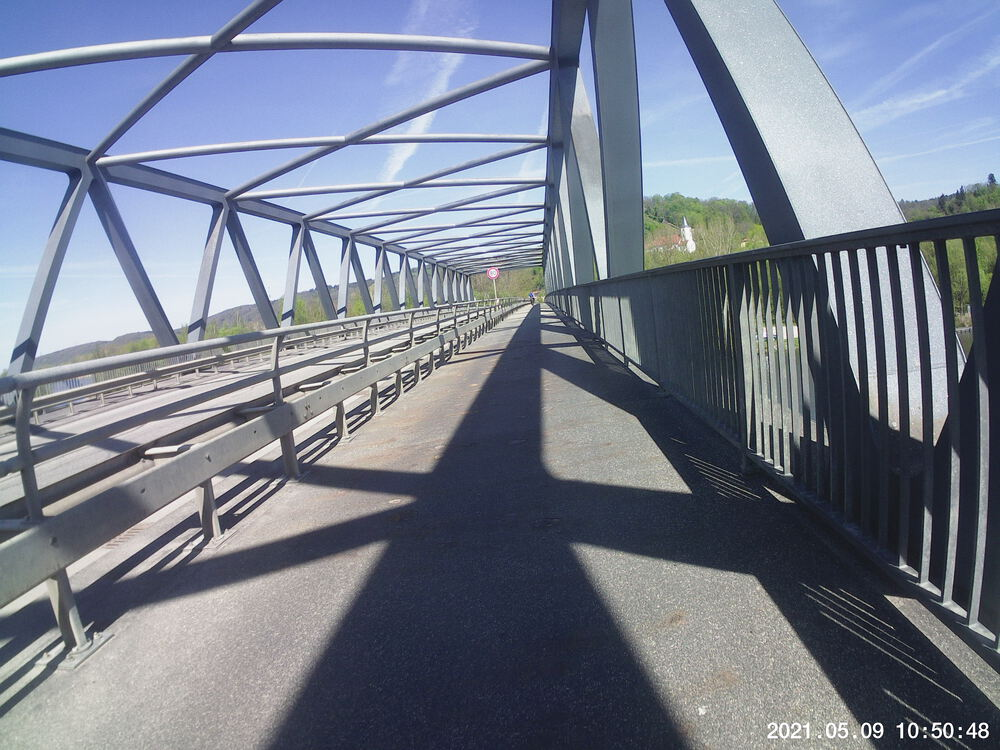
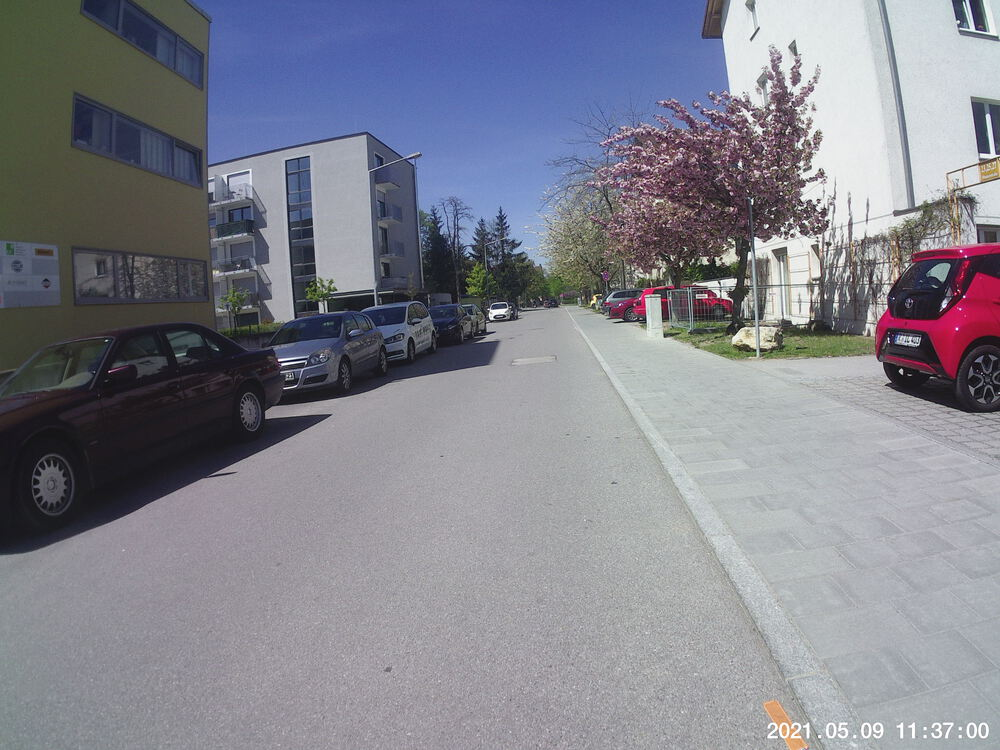

It had been a couple weeks, so I guess I'm not all that surprised that I bailed about a quarter of the way through and chopped the route in half.  Nothing hurt particularly &mdash; I could just tell I wasn't feeling it would regret not crossing the Danube at Donaustauf when I had the chance. 


## Snaps


  
  
  
  
  
  
  
  
  
  
  

## Video Recaps



## Route
You might need to tap or click the map to make it bigger.  The red solid route was my intention.  The blue dashed route is my actual route.  



## Stats

```
Total Distance:      24 km 
Time:              1:23 
Calories:           834
Calories from fat:   23 %
Average Heart Rate: 122 
Maximum Heart Rate: 142 
Fat Burn:          0:07  
Fitness:           1:16 
```

