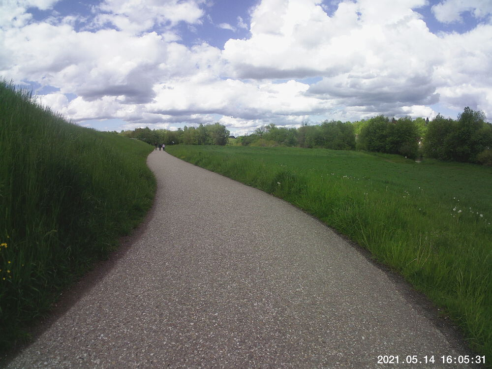
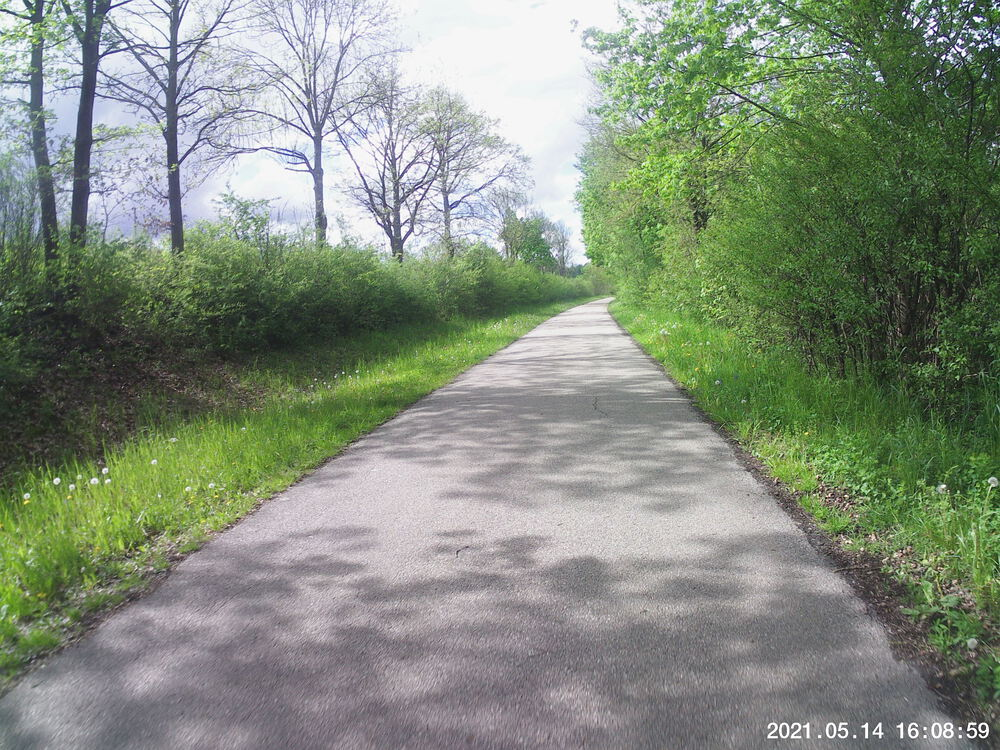
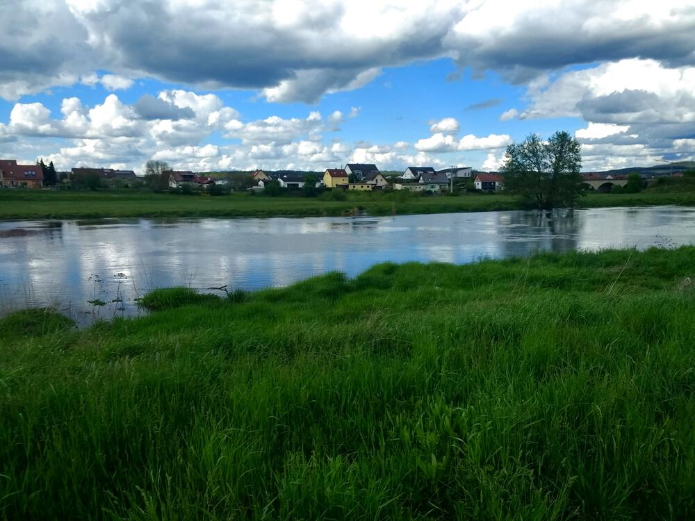
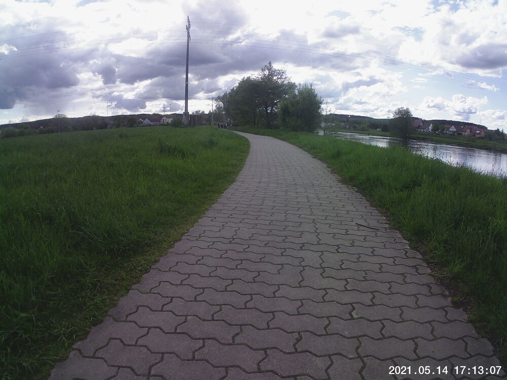
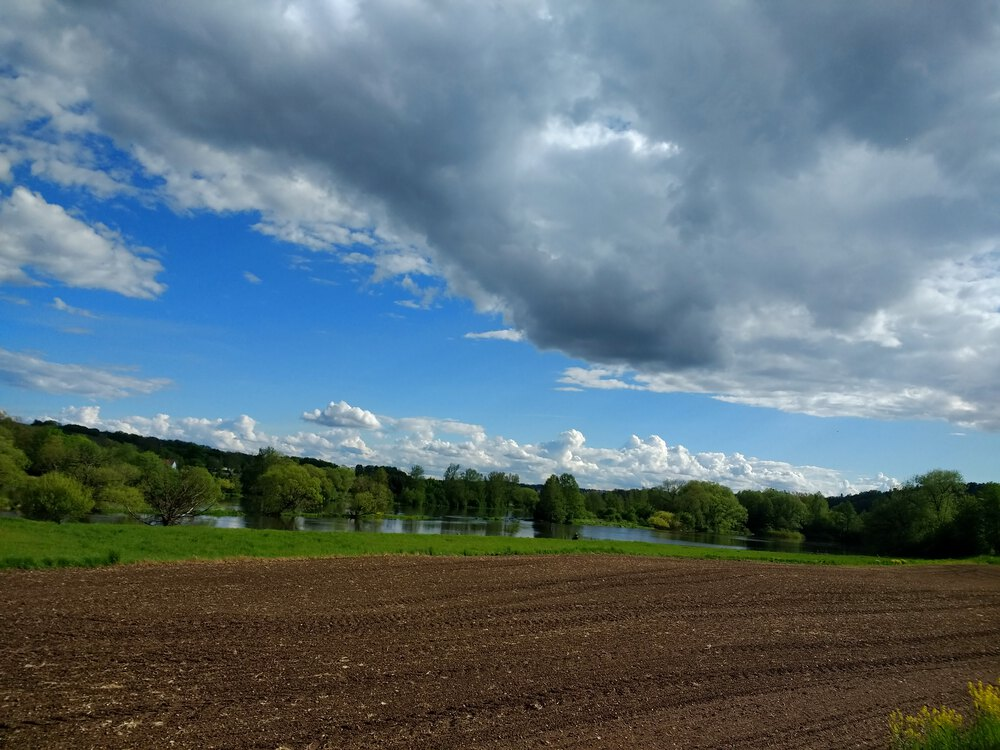
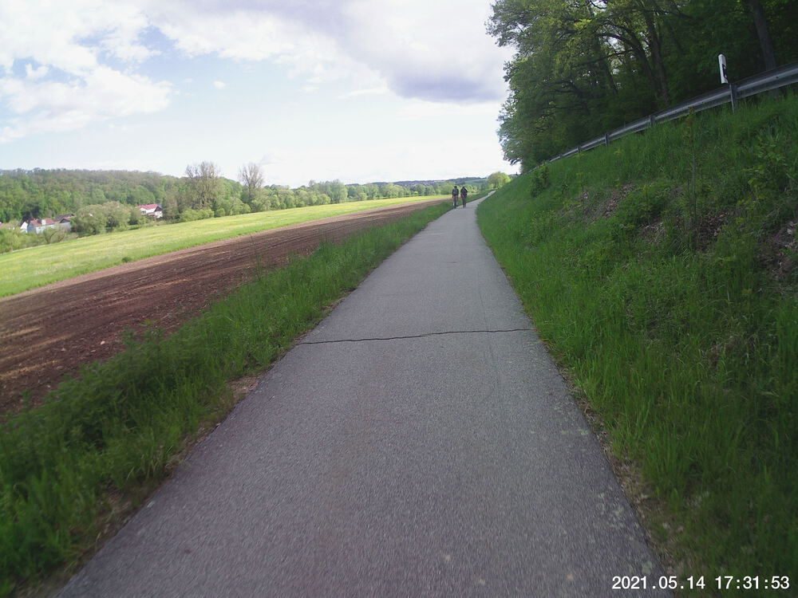
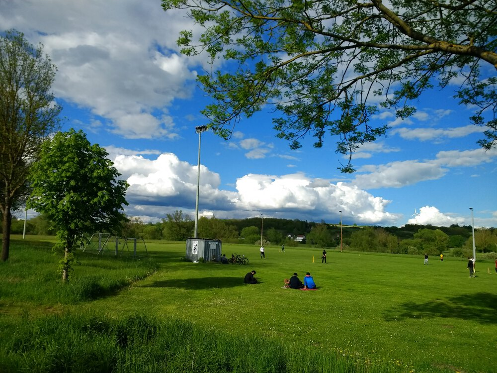

I needed to hit the packaging-free store again, and it was kind of a holiday weekend (*Christi Himmelfahrt*, or Ascension for those keeping score at home), and there was a window of agreeable weather.  (The rest of this weekend has been pretty iffy, weather-wise.)  So, after work on Friday, I got on the ol' *Drahtesel* once again and headed up to Regenstauf to [Quantum Satis](https://www.quantum-satis.de/) to refill my own containers of 

+ basmatic rice
+ pinto (a.k.a. *borlotti* a.k.a. *Wacholder*) beans
+ green caradmom pods
+ star anise
+ chick peas (a.k.a. garbanzo beans and *Kichererbsen*)

It's a nice smooth 15 km ride one-way.  On the way back, I saw a game of cricket in progress!  I have never seen that before in Germany.  I managed to snap a photo of it.


## Snaps


  
  
  
  
  
  
  
  
  )  
  


## Video Recap




## Route
You might need to tap or click the map to make it bigger.  The red solid route was my path up to Regenstauf.  The blue dashed route was my route back.  



## Stats

```
Total Distance:       ~30 km 
Time:                1:42 
Calories:            1261 
Calories from fat:     13 %
Average Heart Rate:  138 
Maximum Heart Rate:  158
Fat Burn:            0:02 
Fitness:             1:40
```

