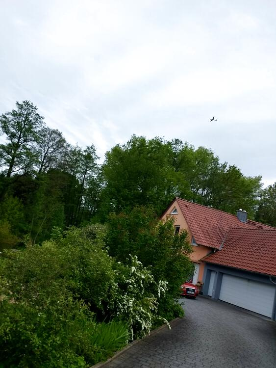

It was *Pfingstmontag* and I had the day off of work.  I intended a nice long ride, but

* I just wasn't feeling it, and
* I took a wrong turn near Burgweinting, and again at Obertraubling, and decided to swing by the airstrip, and
* the rain was threatening the whole time

So I cut it drastically short.  But it was still a pretty good ride.  Kinda got the impression that glider was following me though.


## Snaps


  
  
  
  


## Video Recap




## Route
You might need to tap or click the map to make it bigger.  The red solid route was my intention.  The blue dashed route is my actual route.  



## Stats

```
Total Distance:       20.8 km 
Time:                 1:14 
```

