It was a nice day for a ride.  Not as long as some of my other ones, but man...them hills up to Hainsacker are a real slog.


## Snaps

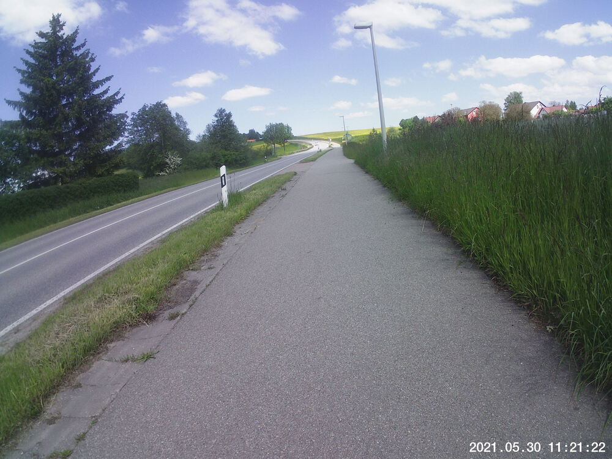  
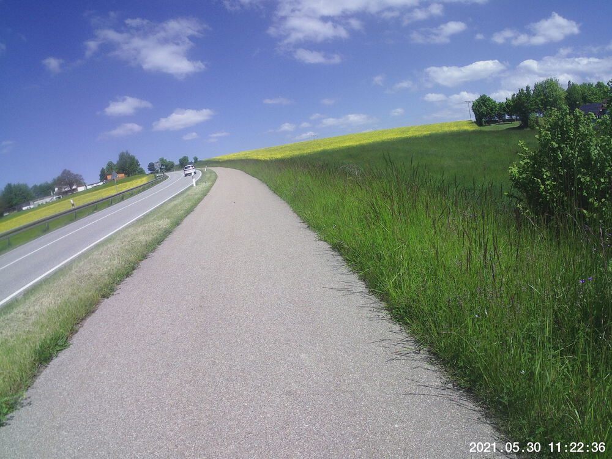  
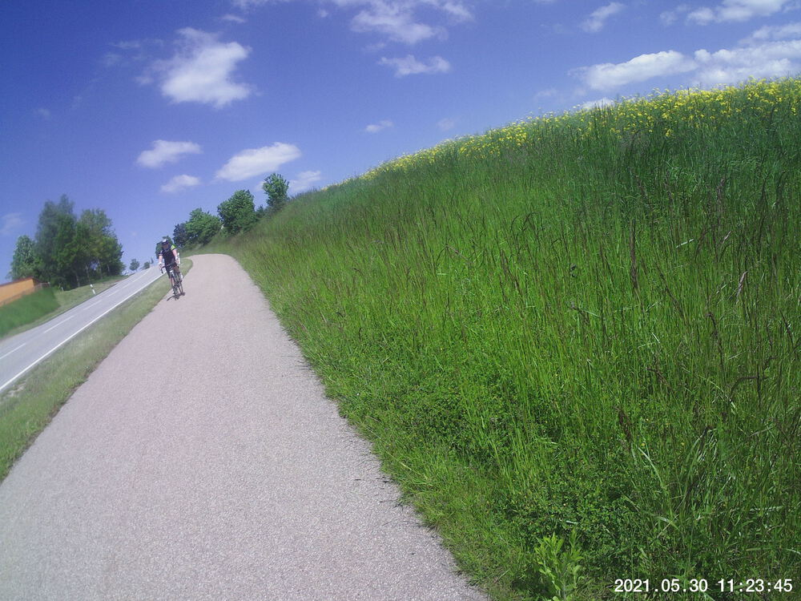  
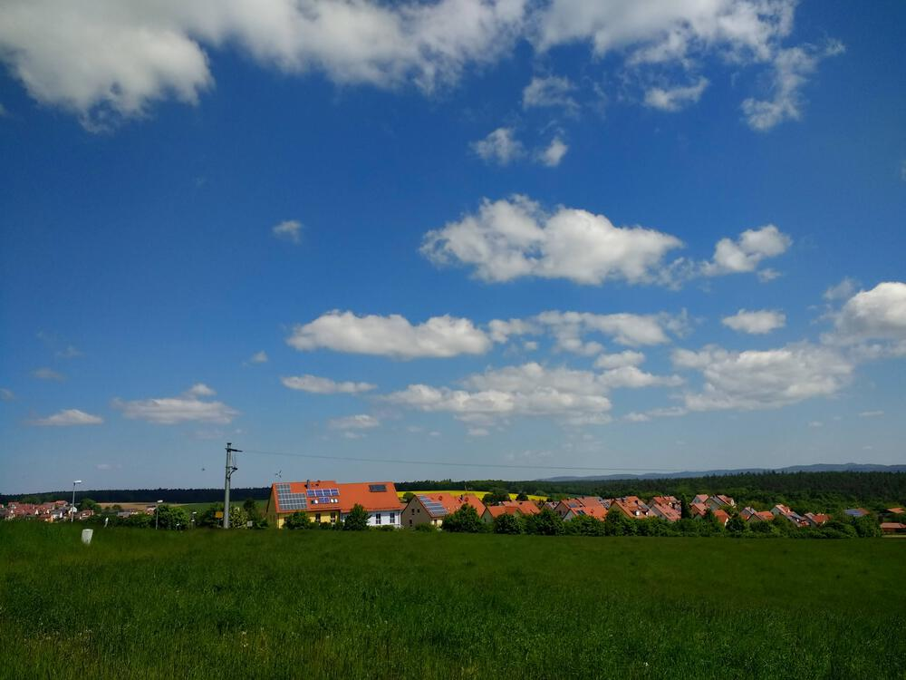  
  
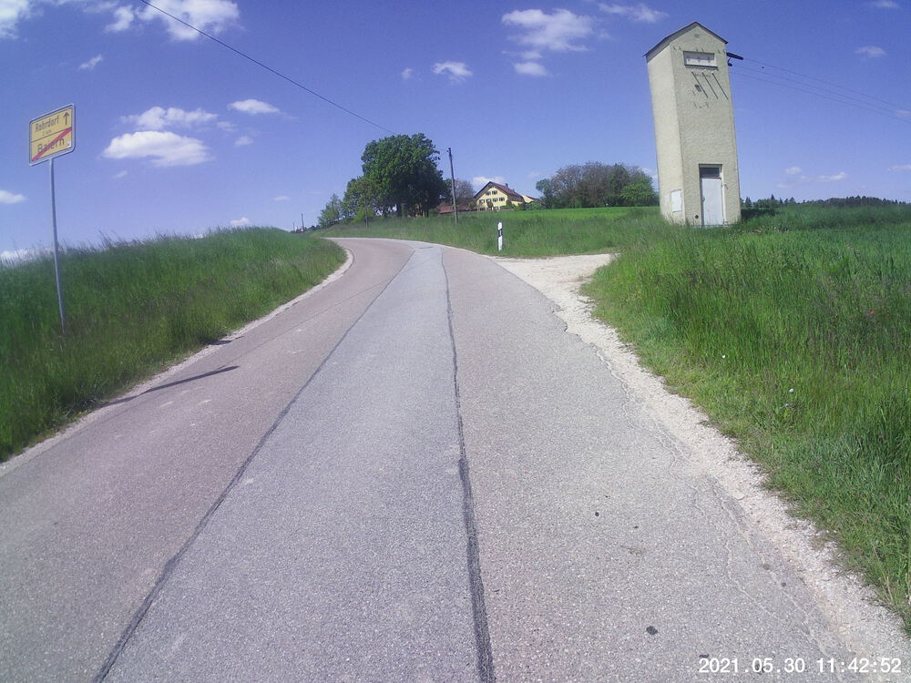  
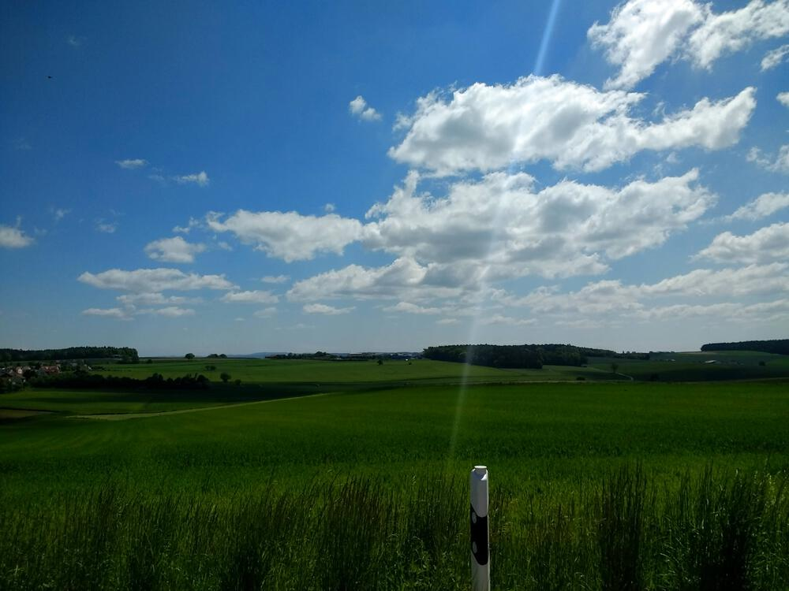  
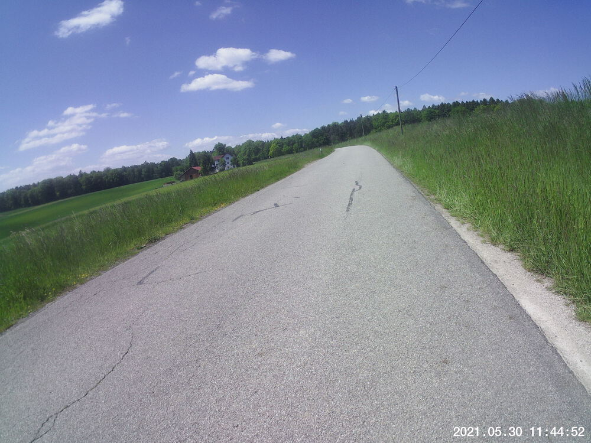  
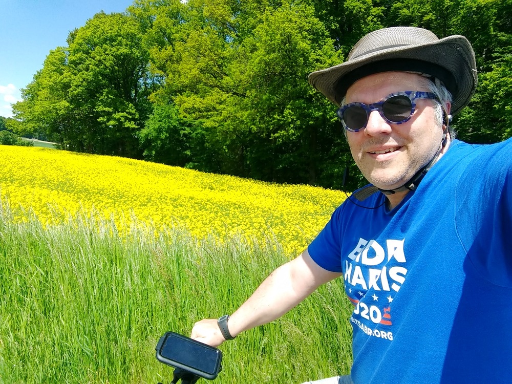  
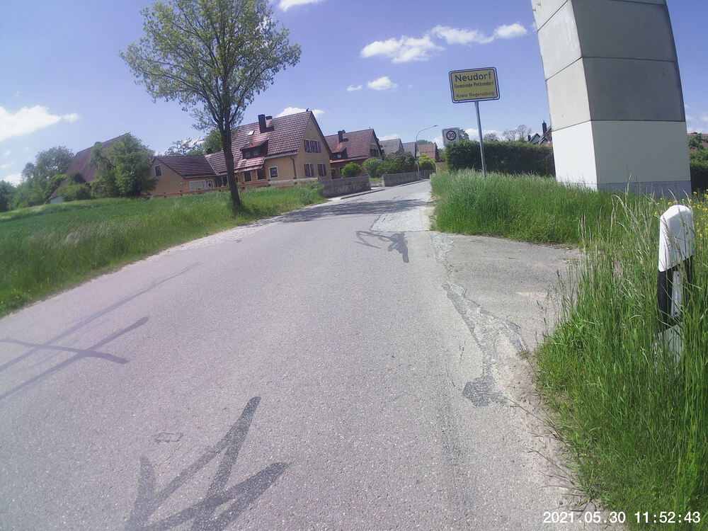  
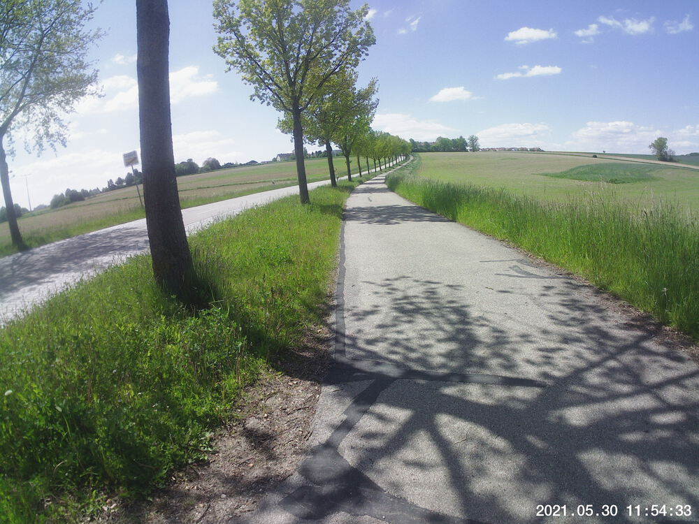  
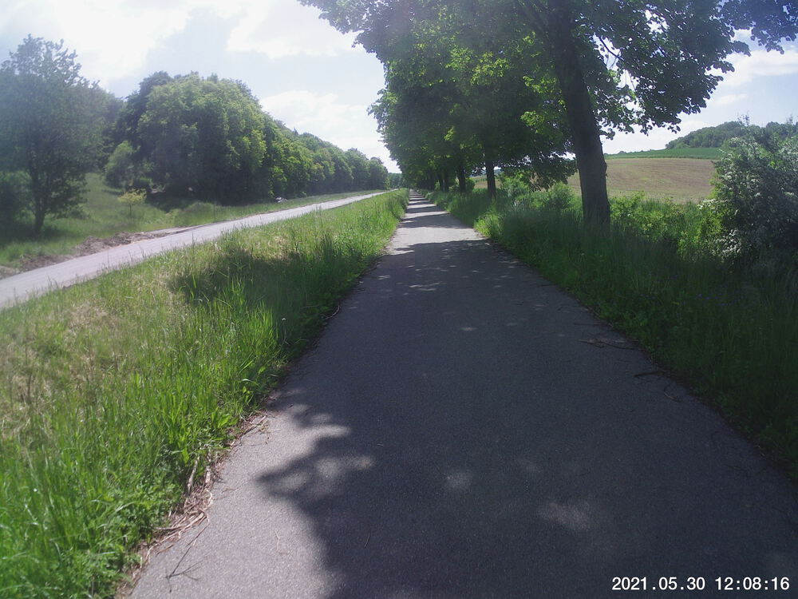  


## Video Recap




## Route
You might need to tap or click the map to make it bigger.  The red solid route was my intention.  The blue dashed route is my actual route.  



## Stats

```
Total Distance:       28.8 km 
Time:                 1:58 
Calories:             1467
Calories from fat:      15 %
Average Heart Rate:    138
Maximum Heart Rate:    170
Fat Burn:             0:06          
Fitness:              1:52
```

