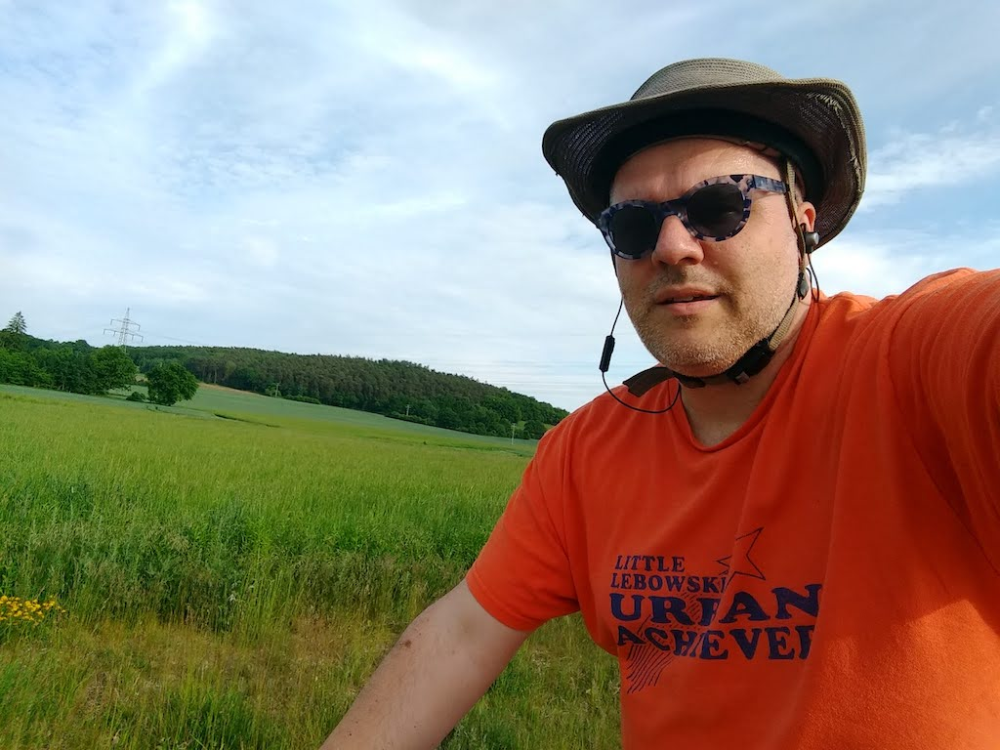

Thursday, June 3rd was *Fronleichnam* ("Happy Cadaver").  Most people I work with took Friday as a *Brückentag* (bridge day)...but not me.  I worked a good chunk of a normal day, finishing what I wanted to achieve before next week, and headed out for an evening ride, on purpose shooting for about 20 km.  I took a brand new (to me) route to the northeast heading through the Konradsiedlung, Wutzlhofen, on a tangent to Haslbach on my way to Irlbach.  I looped around some neighborhoods on my way down a long, slow hill past Grünthal back down into Regensburg.  The weather was ideal; quite the opposite of what I rode through a couple days later.


## Snap

   

## Video Recap



## Route
You might need to tap or click the map to make it bigger.  The red solid route was my intention.  The blue dashed route is my actual route.  



## Stats

```
Total Distance:       20.5 km 
Time:                 1:20
Calories:              890 
Calories from fat:      19 %
Average Heart Rate:    130
Maximum Heart Rate:    159
Fat Burn:             0:18
Fitness:              1:02
```

