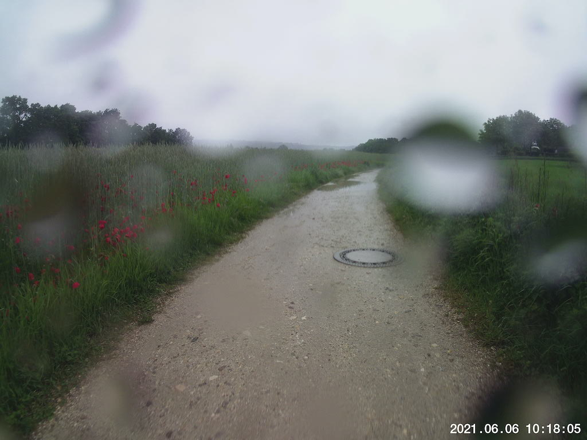

It was supposed to rain all day.  I was excited to see a break predicted, so I saddled up and trudged on.

I left the garage to find a fine mist greeting me on the street.  I thought to myself:

> _You got this, Self.  Press on, you're tougher than this._

I pressed on.  I GOT DRENCHED.

By the time I got to Mariaort, I was just _done._  I can handle being cold.  I can handle being wet.  But both is another story.  And so I turned back.  Still got almost exactly half of my route in, so there's that.

Couple final points on this trip:  

1. The north bank bike path is still off-limits, so I rode through Niederwinzer.  That was a nice stretch; I'd do that again any time, whether the bike path is open or now.

2. The mount for my cheapo action cam snapped off due to cobblestones when I was most of the way home.  Gotta find another way to mount it...maybe strap it onto my head?


## Snap

  


## Route
You might need to tap or click the map to make it bigger.  The red solid route was my intention.  The blue dashed route is my actual route.  



## Stats

```
Total Distance:       18.5 km 
Time:                 1:16 
Calories:              786
Calories from fat:      25 %
Average Heart Rate:    124
Maximum Heart Rate:    158
Fat Burn:             0:26
Fitness:              0:50
```

