I went up <a href="../20200524-finally-beat-that-hill/">those</a> <a href="../20200501-runnin-up-that-hill/">hills</a> south of Regensburg on the way to Pentling that used to discourage me.  I won't say they're easy now, but I can chug along in my lowest gear without feeling like I'm risking a heart attack.  Basically abandon all hope, ye who enter Kumpfmühl...it's a long, mostly uphill slog to Hohengebraching.  But after that it was pretty nice all the rest of the way back home.

## Snaps

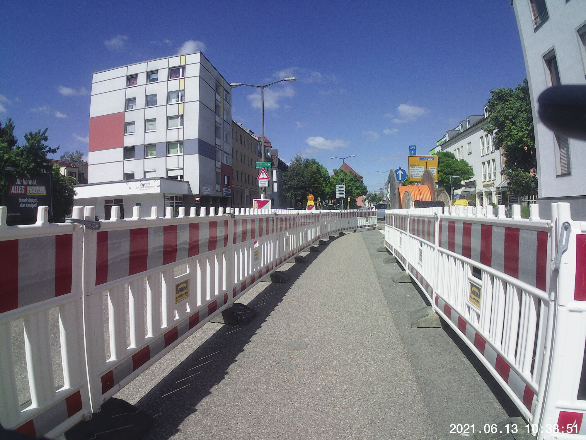  
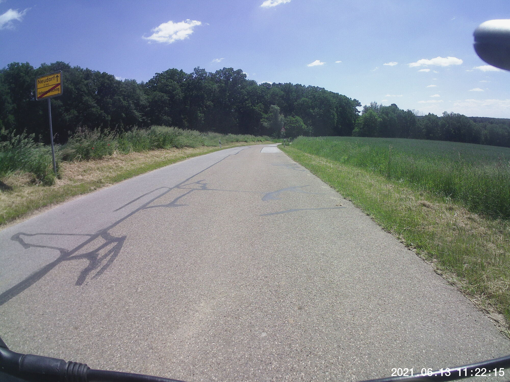  
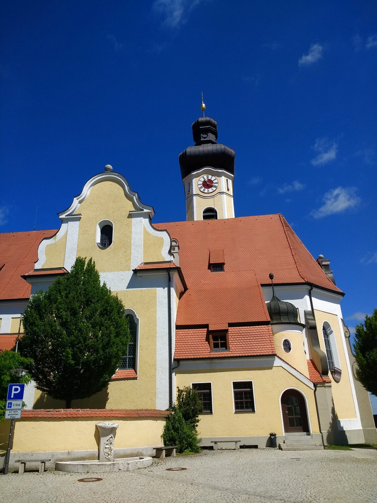  
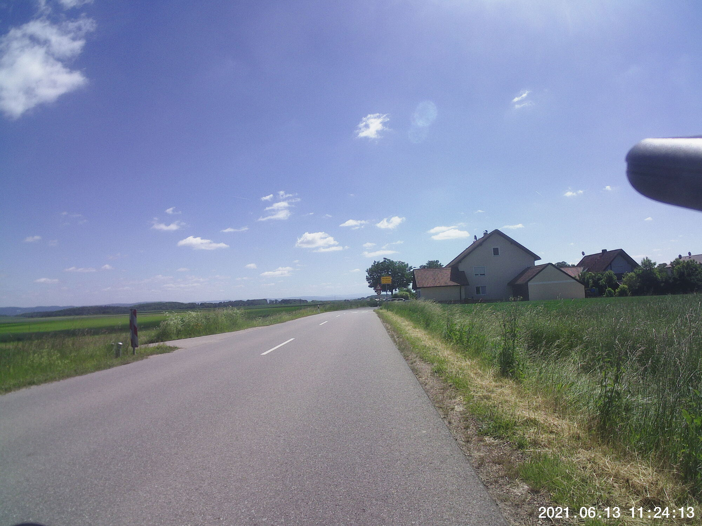  
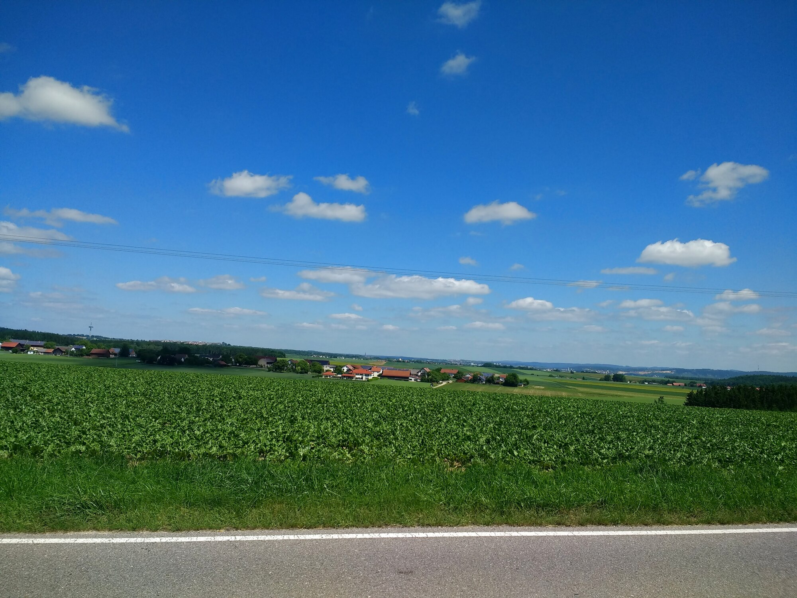  
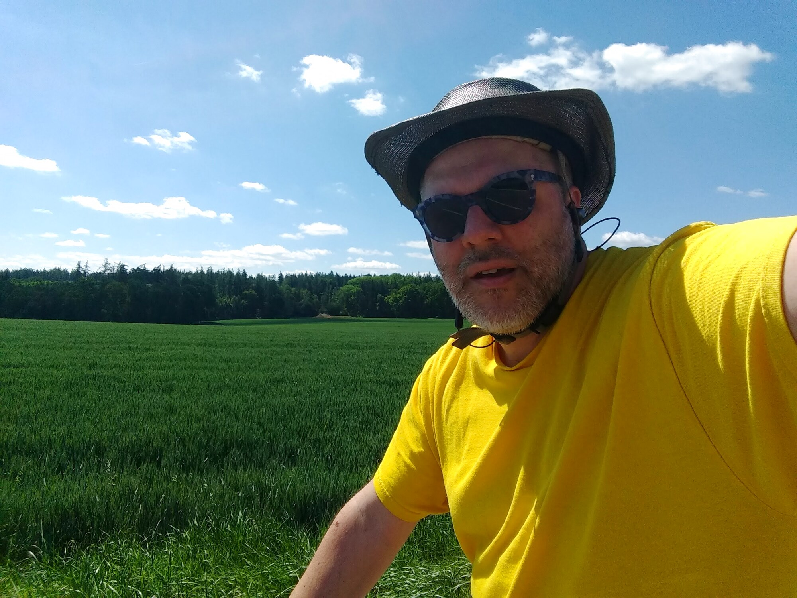  
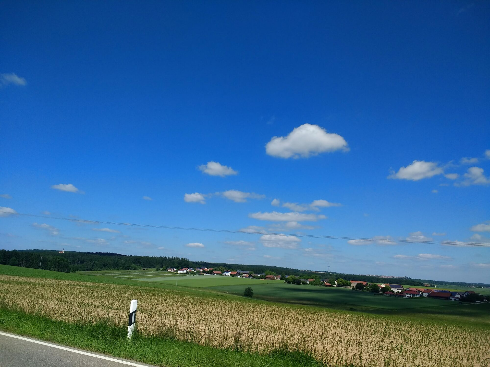  
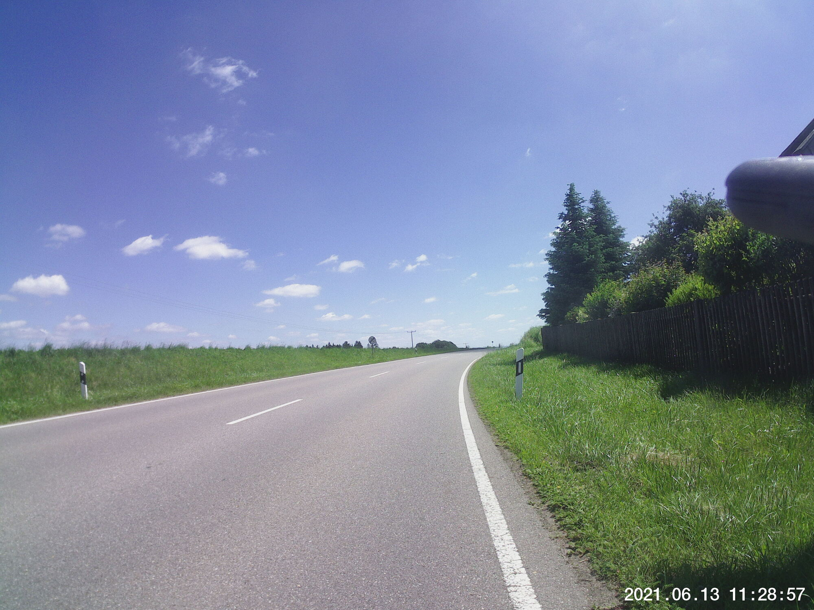  
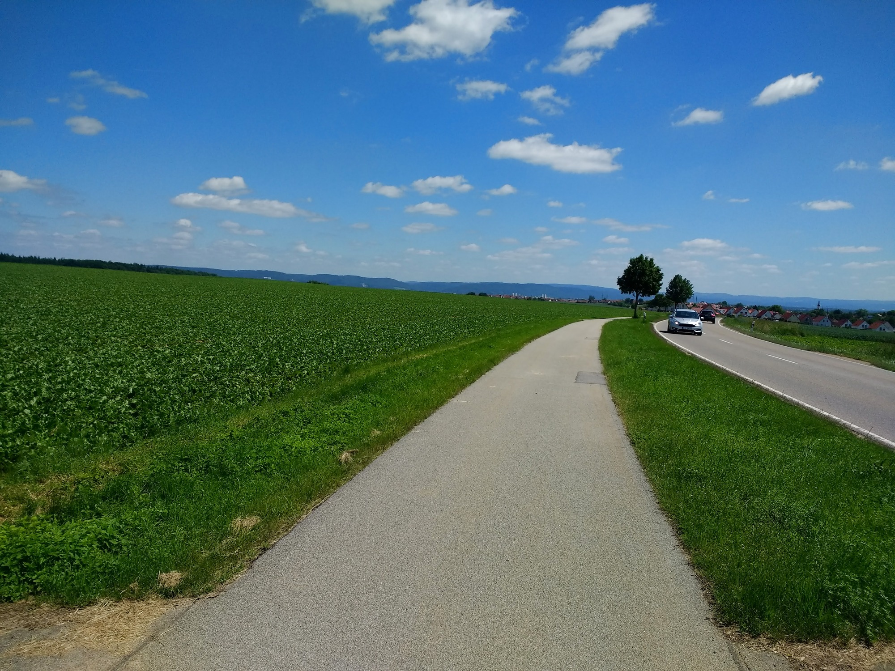  
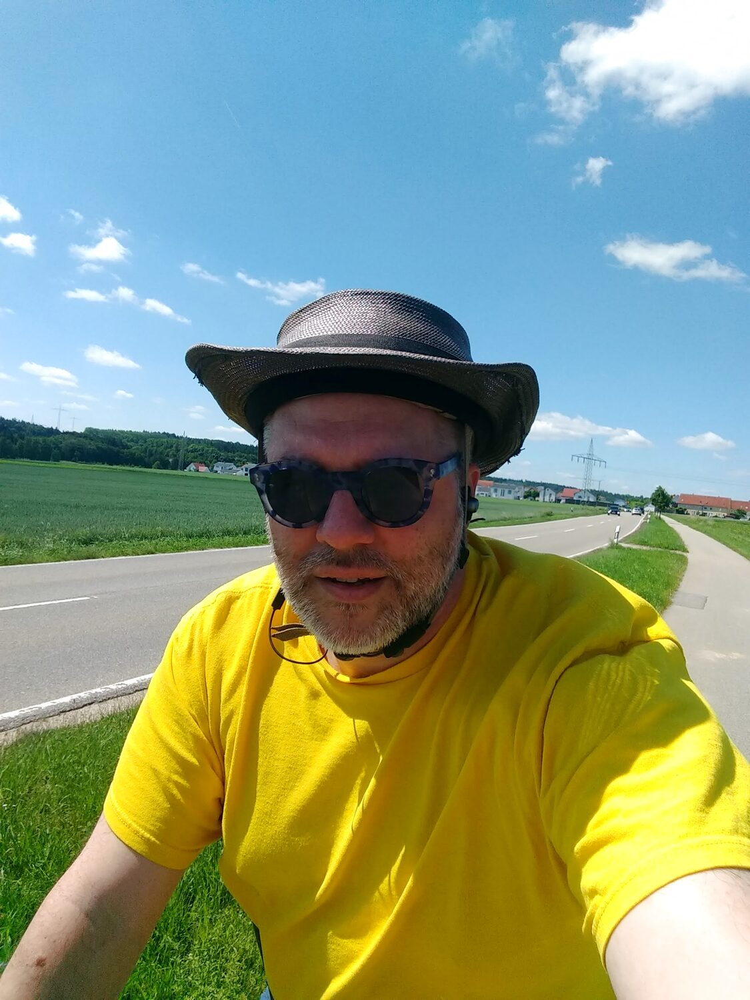  
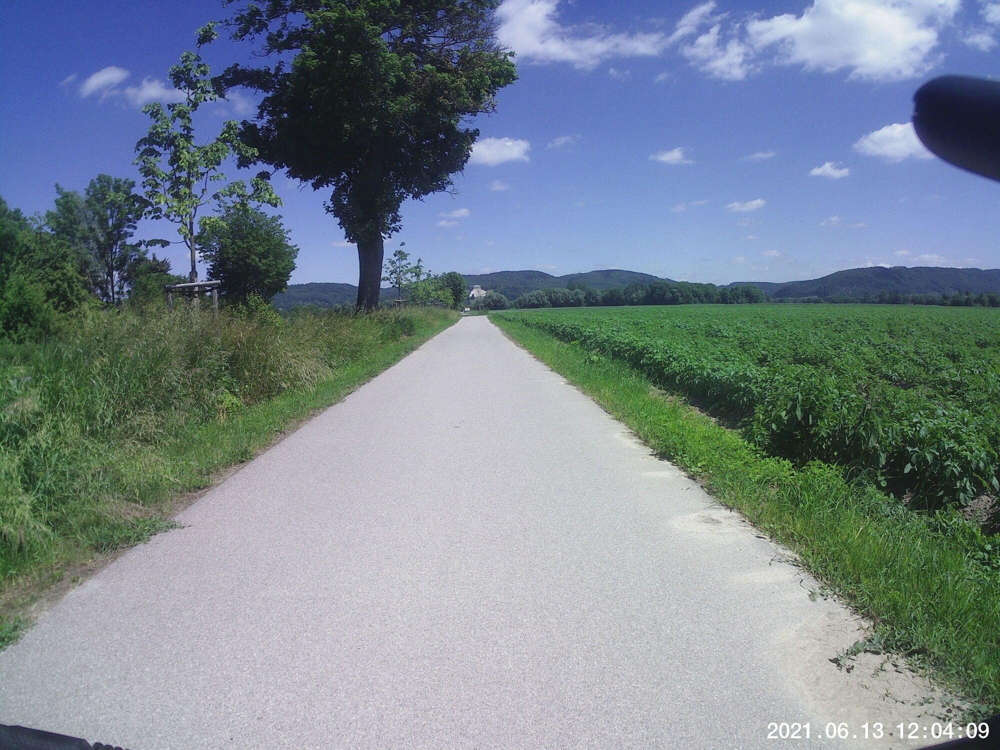  
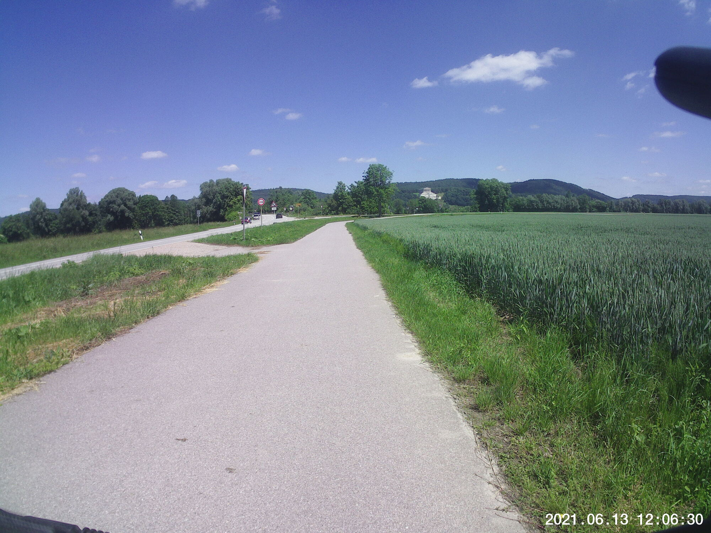  
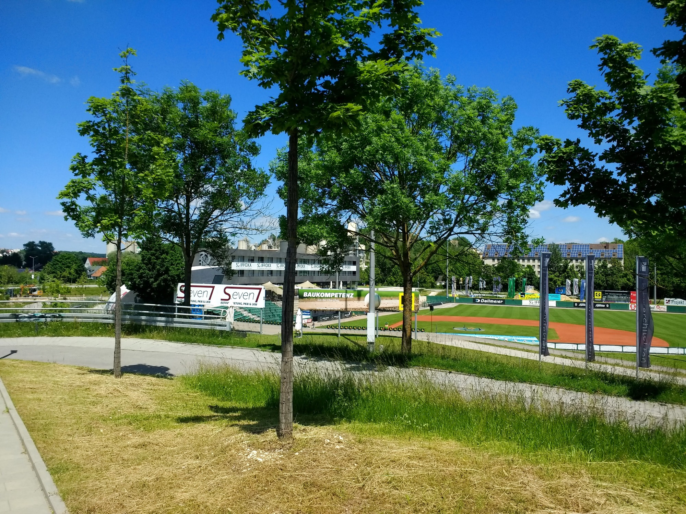  
 
## Route
You might need to tap or click the map to make it bigger.  The red solid route was my intention.  The blue dashed route is my actual route.  



## Stats

```
Total Distance:         34.5 km (plus a tiny a bit more)
Time:                   2:13
Calories:               1386
Calories from fat:    	  22 %
Average Heart Rate:      125
Maximum Heart Rate:      148
Fat Burn:               0:32
Fitness:                1:41
```

