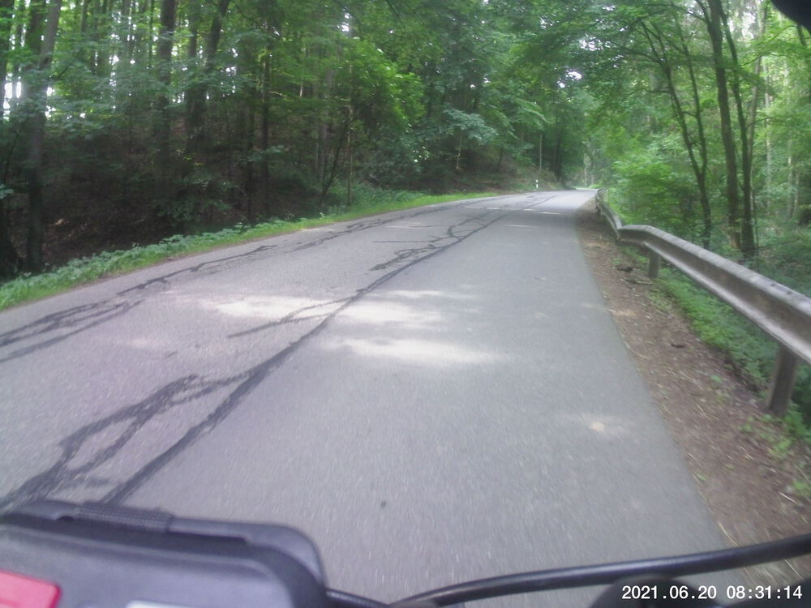
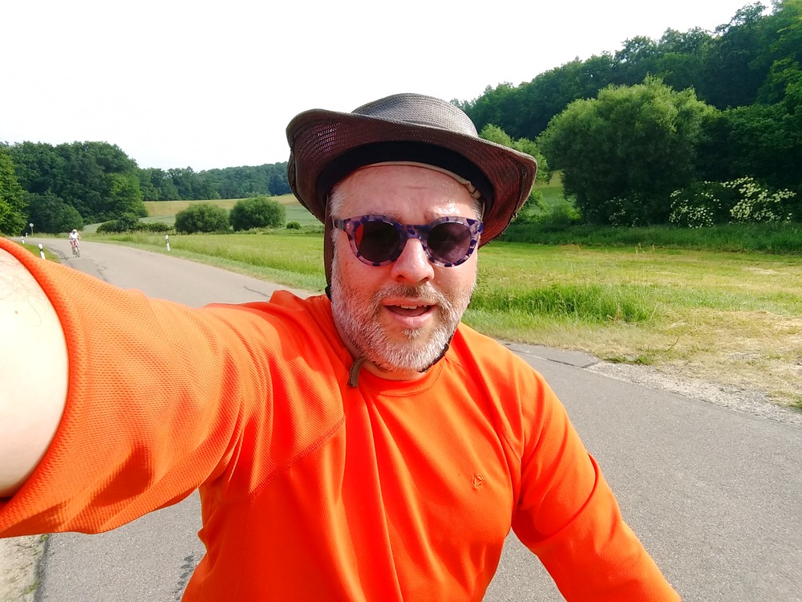
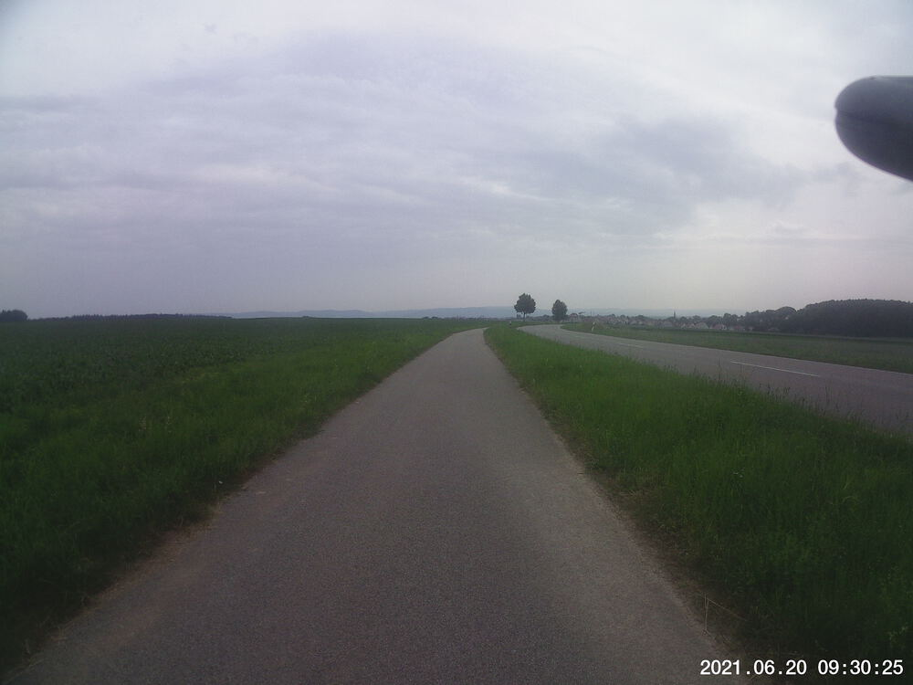
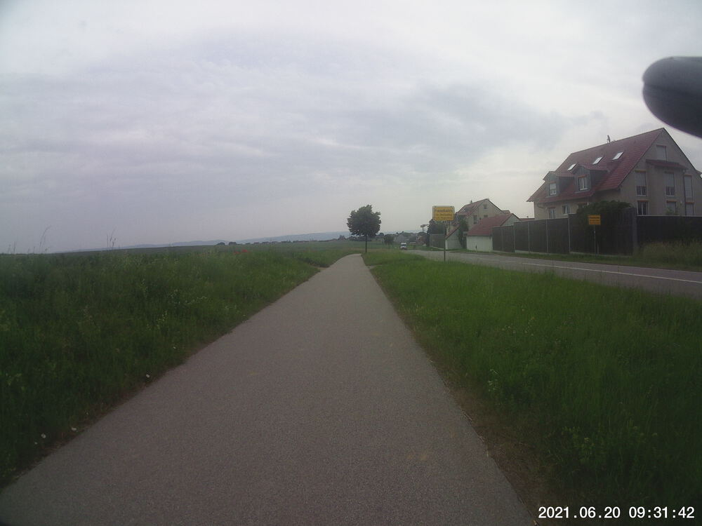

What's with all the *-ing*s around here, anyways?  

I've ridden past [*zur Walba*](https://walba.de/) more times than I can count over the last year, and I've always looked up the hill on the cross street and shuddered at the thought of biking past it.  Well, today, I bit the bullet and did it.  It was long and slow, but much less steep than I imagined.

It was supposed to be 32 °C by noon today, so I made sure to get started before 8:00.  By the time I was two-thirds of the way through my route, it looked like it was going to rain, and it actually felt cooler.


## Snaps

  
  
  
  


## Video Recap




## Route
You might need to tap or click the map to make it bigger.  The red solid route was my intention.  The blue dashed route is my actual route.  



## Stats

```
Total Distance:       30 km 
Time:               1:47 
Calories:           1228
Calories from fat:    17 %
Average Heart Rate:  132
Maximum Heart Rate:  159
Fat Burn:           0:13
Fitness:            1:34
```

