I did a Saturday ride instead of Sunday.  The weather has been so iffy lately that it didn't make sense to wait and see how Sunday would shape up.

It was a little easier to stay on the road outside Kühschlag, and avoid the inner workings of the bustling metropolis that is Downtown Nittendorf, so I opted to deviate from the planned route a bit there.

And for the stretch from Kneiting to roughly the Pfaffenstein tunnel was *STILL* under construction, so I followed the detour instructions through Winzer, which was pleasant.

Towards the end of my ride the sun started to come out, but for the first three fourths of the ride, I didn't need sunglasses.  It's a little less picturesque that way, but sure makes the exercise more tolerable.


## Snaps

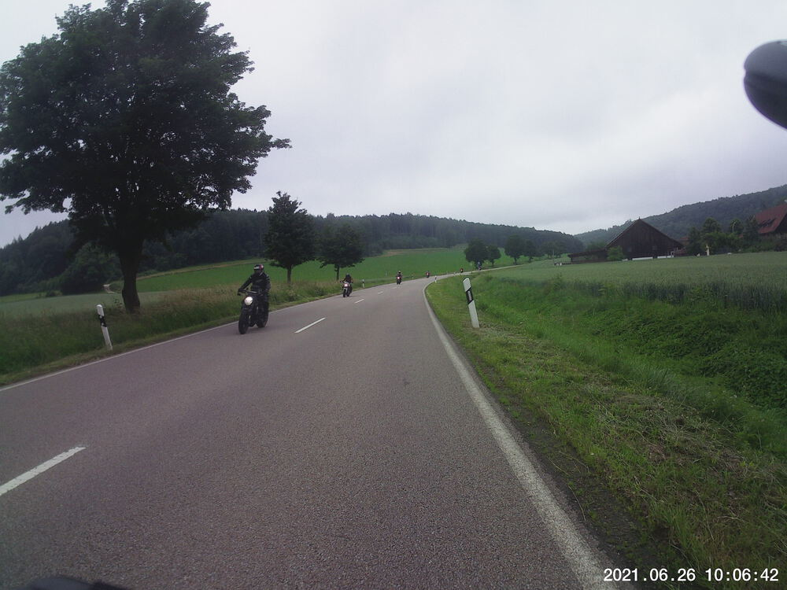  
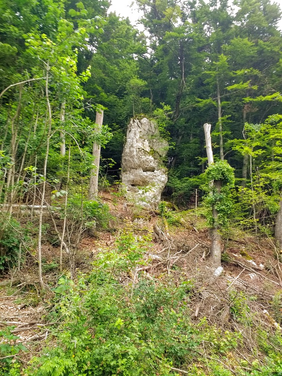  
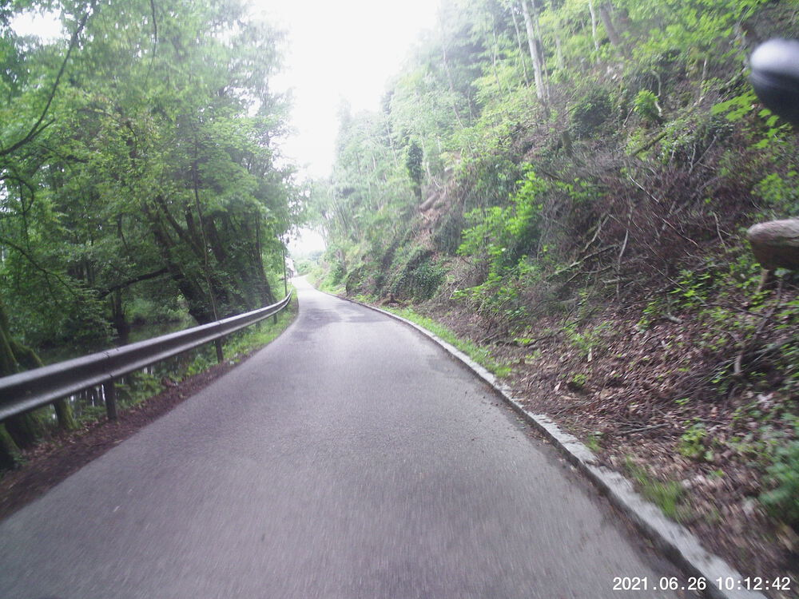  
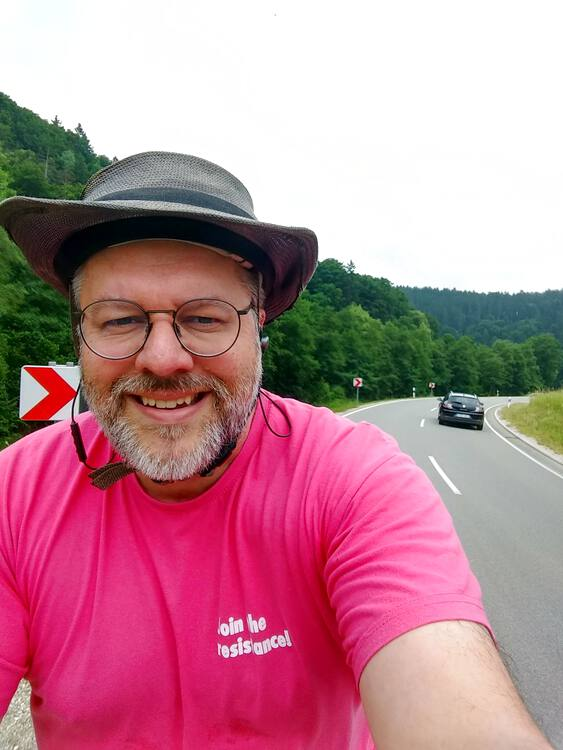  
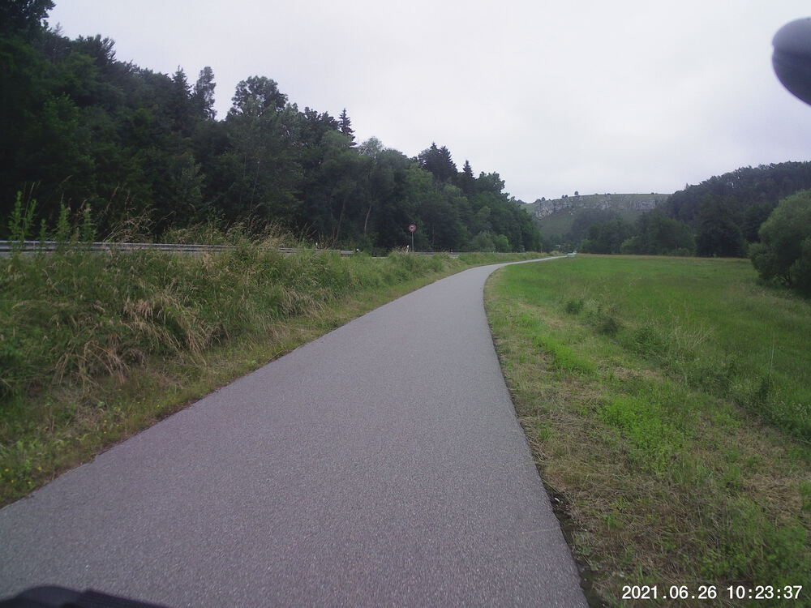  
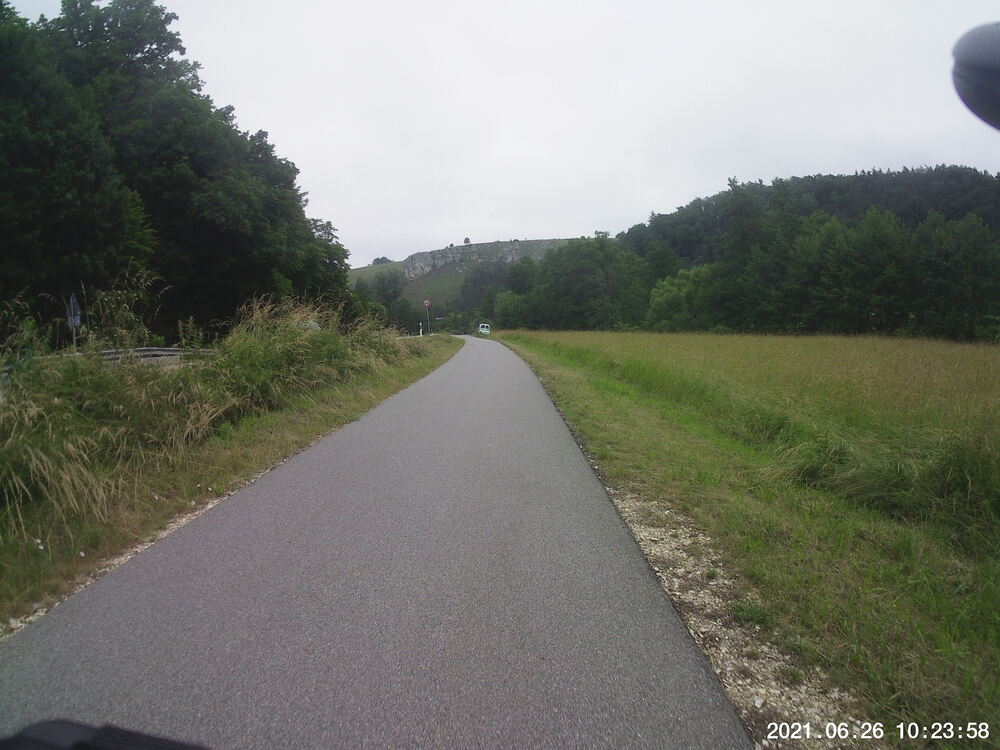  
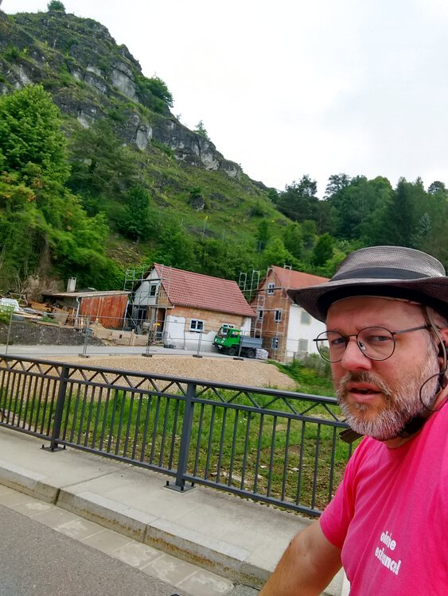  
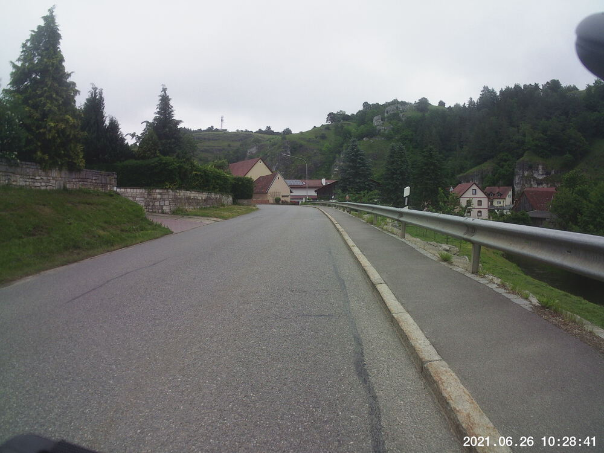  
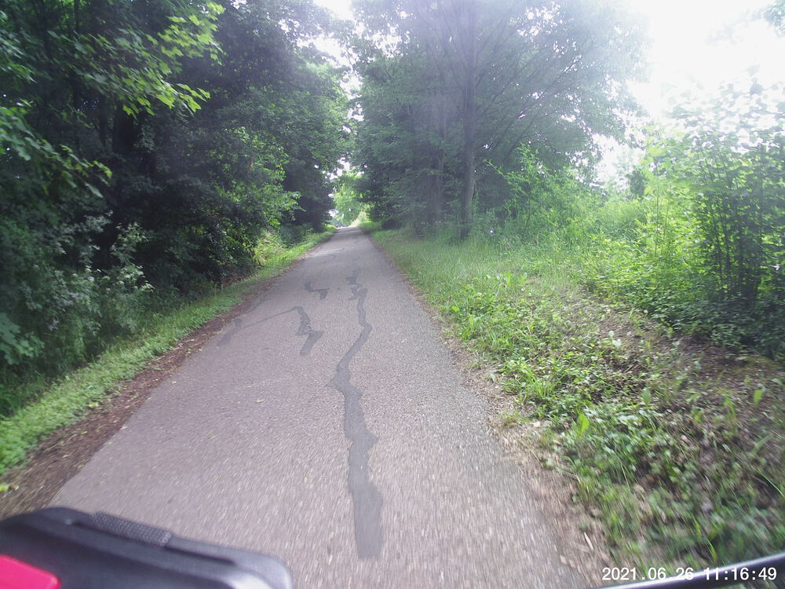  
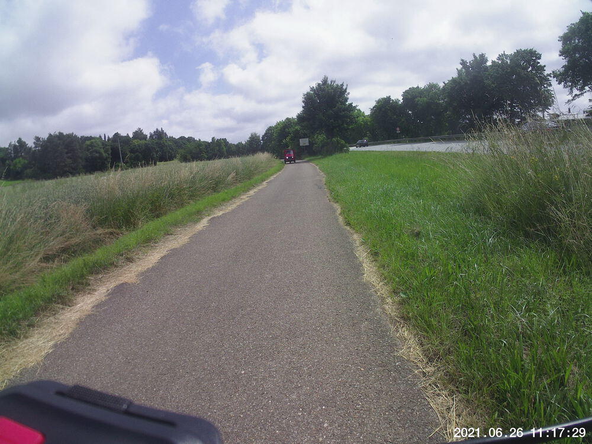  
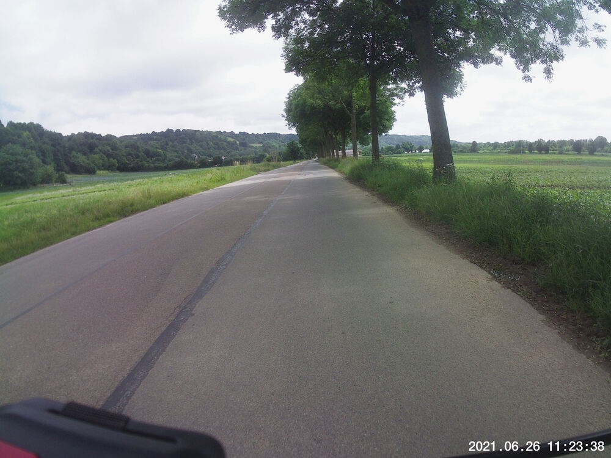  
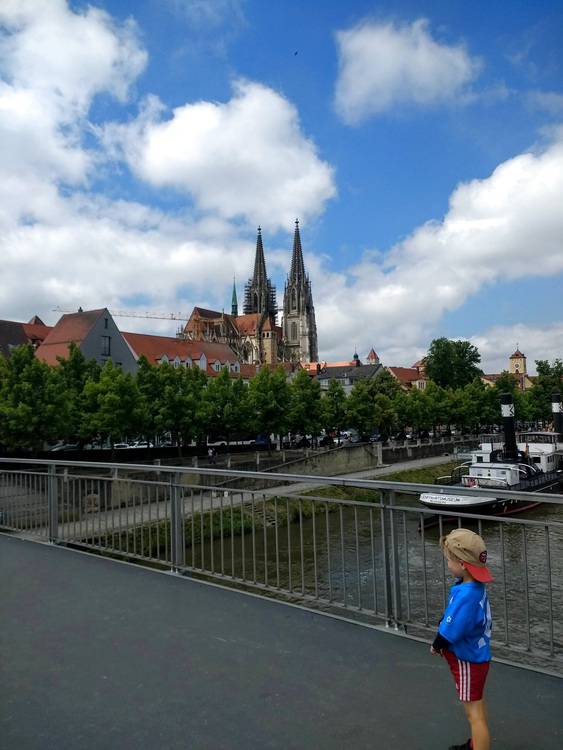  


## Video Recap




## Route
You might need to tap or click the map to make it bigger.  The red solid route was my intention.  The blue dashed route is my actual route.  



## Stats

```
Total Distance:       33.3 km 
Total Time:           2:17   
Moving Time	      1:53
Max Speed:              47 km/h
Average Elevation:     356
Elevation Range:       323 m, 430 m
Uphills total:         108 m

```
I forgot to wear my heart rate monitor on this ride, so the calorie stats are missing.  But I can offer geographic ones instead.

