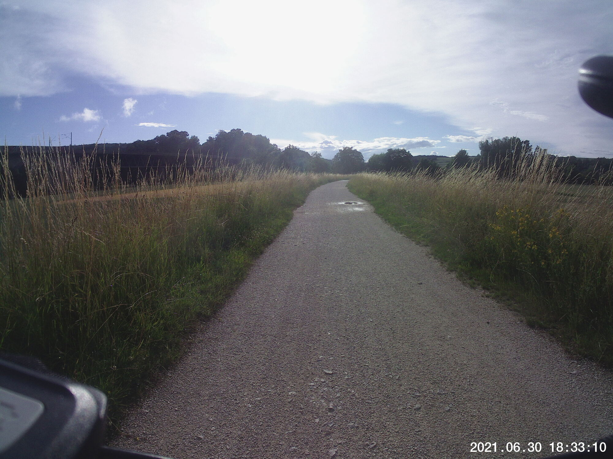
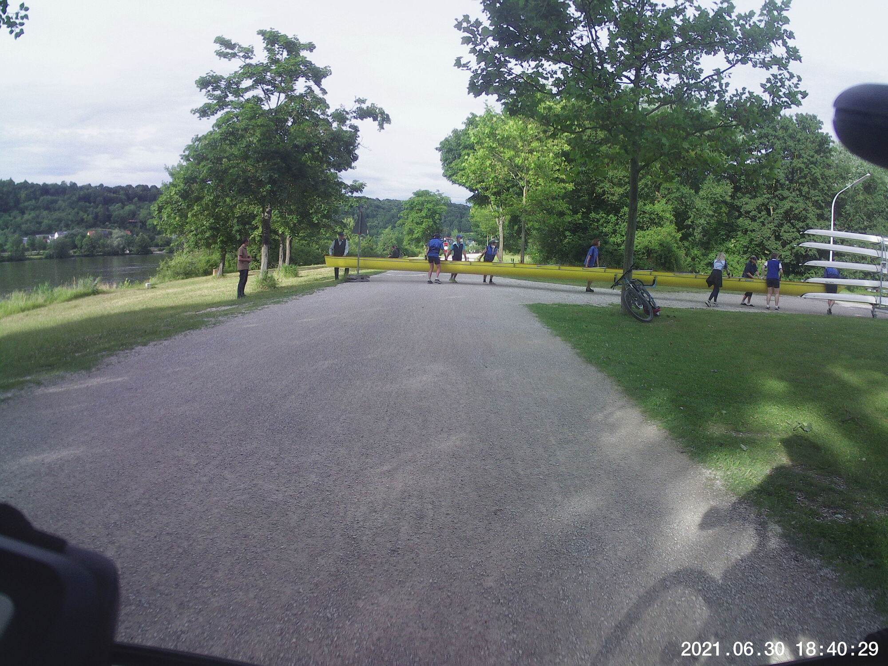
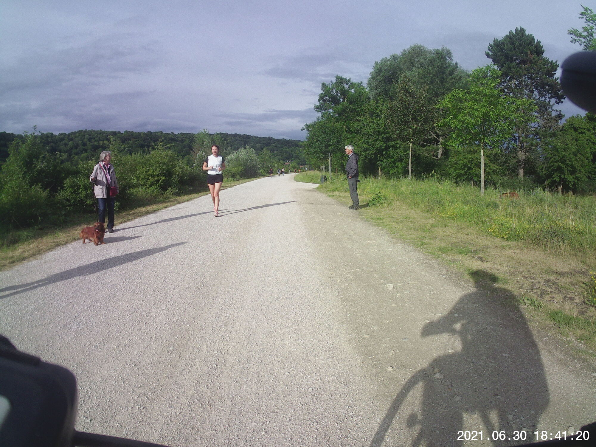
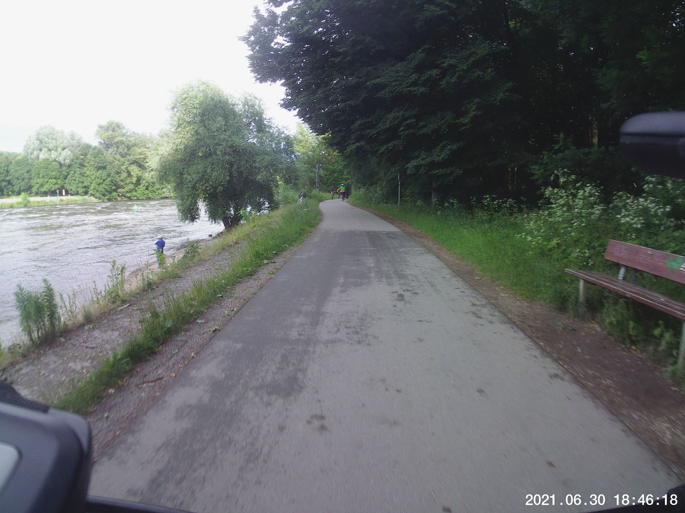

The weather had been so, *mercurial*, shall we say.  Work stuff pressing on relentlessly and cool rainy nights actually helped me sleep better than usual (at least as of late).  All of that meant precious few morning or evening walks this week &mdash; not good.  So during a break in the early evening downpours yesterday, I went for a fast loop.  I managed to keep my heart rate down pretty well.

## Snaps

  
  
  
  
  

## Route
You might need to tap or click the map to make it bigger.  



## Stats

```
Total Distance:       13.8 km 
Time:                 0:51 
Calories:              424
Calories from fat:      33 %
Average Heart Rate:    112
Maximum Heart Rate:    131
Fat Burn:             0:32
Fitness:              0:19
```

