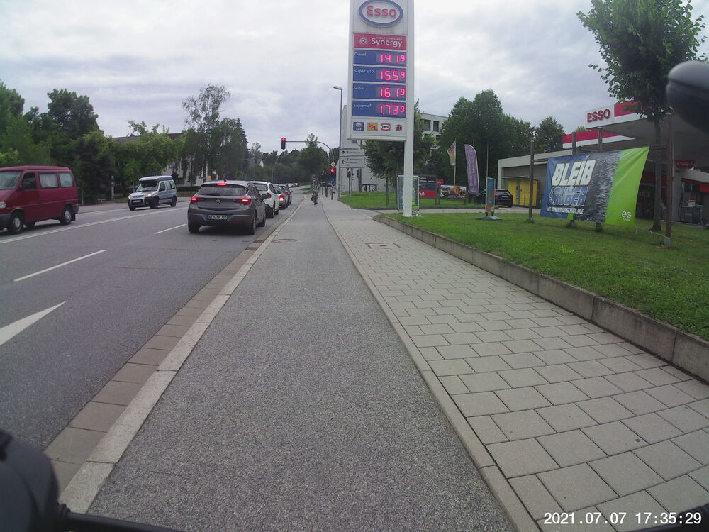
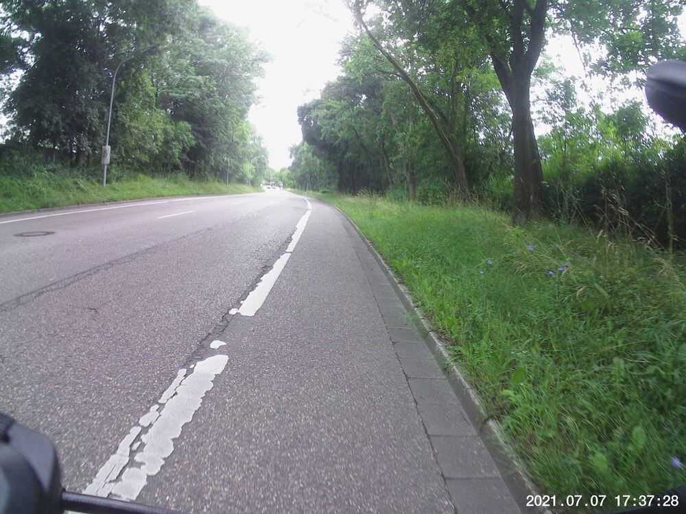
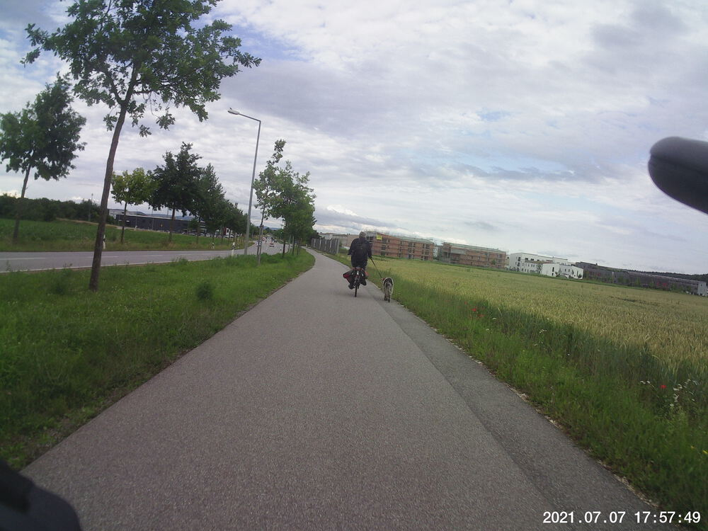

It was looking rainy, despite the prediction that it wouldn't rain, and I'd been on the phone all dang day at my desk.  I needed to get some fresh air and move around a bit.	


## Snaps

  
  
 
  


## Video Recap
It's just a nice, smooth, 40 km/h no-pedal downhill stretch from roughly the TV tower outside of Graß.



## Route
You might need to tap or click the map to make it bigger.  



## Stats

```
Total Distance:     14.1 km 
Time:               0:57 
Calories:            593
Calories from fat:    23 %
Average Heart Rate:  125
Maximum Heart Rate:  152
Fat Burn:           0:25
Fitness:            0:32
```

