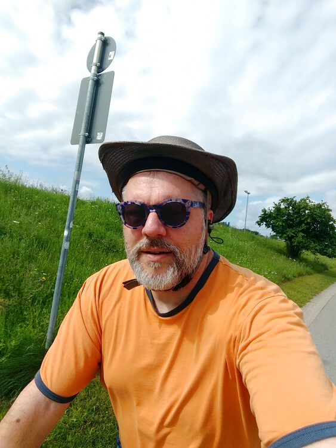

First time out riding in 3 weeks, but we were getting plenty of exercise on foot, exploring Brussels, Essen, Berlin and Leipzig for a week.  More about that soon on *[Ye Olde Regensblogge](https://www.regensblog.com)*, I hope.

Today I thought I'd like another one of those *Steckerlfisch* for lunch like on [my previous ride](../20210710/), so I planned a route through Obertrauling; but alas.  No fish stand to be found.  I did stop at [Khoros](https://khoros.de/) for a *Dürüm Kebap* in Burgweinting, but it's been a long time since I had one of those, and I'd forgotten how generous they are for 5€.  For all the good the ride did me (see the [stats](#stats) below), I bet that lunch zeroed me right out again.


## Snaps
Just a smartphone selfie today, because I neglected to notice that the bike-mounted camera's micro-SD card is full.  Oops.  Next time.  
  


## Route
You might need to tap or click the map to make it bigger.  The red solid route was my intention.  The blue dashed route is my actual route.  



## Stats

```
Total Distance:       28.4 km 
Time:                 1:41
Calories:              986 
Calories from fat:      25 %
Average Heart Rate:    121
Maximum Heart Rate:    150
Fat Burn:             0:36
Fitness:              1:05
```

