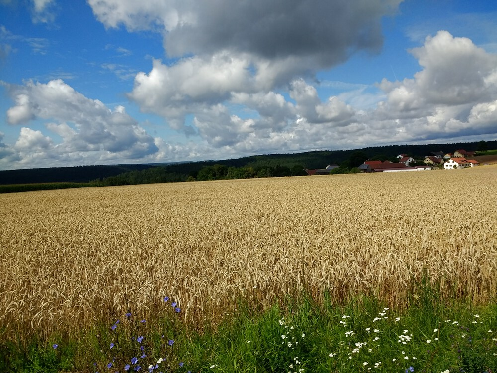

It had been kinda rainy lately, and in fact it started up again just now, but there was a window of beautiful weather this morning, so I jumped on it.  

And so did thousands of slugs.  I did my best not to run them over, but I can't promise all my swerves were successful.

This was a good route for getting back into a routine after a couple weeks off:  

+ a few mostly flat KMs on the way to Adlersberg
+ a grueling hill up to the Prösslbräu (should have rewarded myself with a *Radler*, but it was only 10:30.  Still, they might have been open already)
+ a less-grueling hill up into Pettendorf
+ a couple more little hills outside of Kaulhausen and Baiern and Hainsacker on the way back down into Regensburg through Kareth


## Snaps

  
  
  
  
  
  
  
  
  
  
  
  
  

  

  
  
  
  
  
  
  
  
  
  
  
  
  
  


## Video Recap




## Route
You might need to tap or click the map to make it bigger.  The red solid route was my intention.  The blue dashed route is my actual route.  



## Stats

```
Total Distance:       30 km 
Time:               2:07 
Calories:           1433
Calories from fat:    18 %
Average Heart Rate:  131
Maximum Heart Rate:  161
Fat Burn:           0:22
Fitness:            1:45
```

