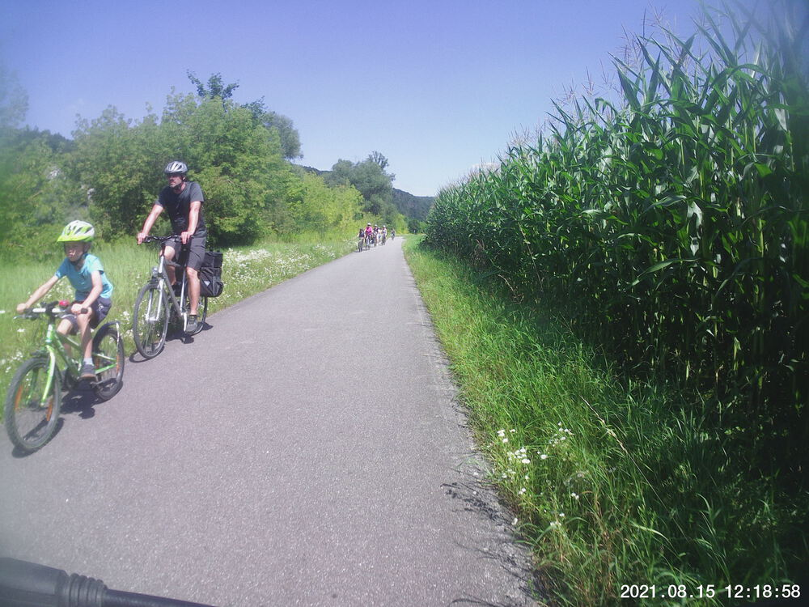

It was a hot one today.  Good day for a religious figure to get into presumably more agreeable temperatures.  I'm a little skeptical about the heart rate numbers; it really didn't *not* feel like I was working as hard as my chest strap says I was.  The ride was pleasant and at no point did I feel like I was overtaxing myself.  Those old guys towards the end obviously felt overburdened by their clothing.

## Snaps

  
  
  
  
  
  
  
  
  


## Route
You might need to tap or click the map to make it bigger.  The red solid route was my intention.  The blue dashed route is my actual route.  I accidentally recorded the route I took with a buddy's new car on a test drive, so I'm a little unclear on the exact distance biked, but the route predicted 32ish km and I didn't deviate from it at all.



## Stats

```
Total Distance:       about 32 km 
Time:                     1:59
Calories:                 1637
Calories from fat:          12 %
Average Heart Rate:        146
Maximum Heart Rate:        166
Fat Burn:                 0:03
Fitness:                  1:55
```

