*Alternate Title:  "WTH is with all these cruise ships?"*

The weather is supposed to be rainy tomorrow, so I opted for a Saturday afternoon ride instead.  First thing I noticed:  there are a ton of cruise ships in port.  Has anyone said today's incidence stats?  THEY ARE NOT GOOD AND GETTING WORSE.

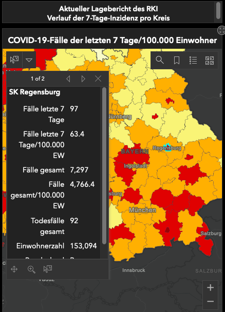

But anyway, I realized I'd never been up Zeitlarn.  It's a cute little town, definitely bikable from there into the offi....HA.  Like anyone's ever going into the office again.  Back to Zeitlarn:  I like the way it backed up onto big, wide open pastures.

Other highlights of this ride:

* along the Regen, some kind of South Asian cultural thing was happening:  bumpin' Bhaṅgṛā beats and at least one cricket match underway as I rode past
* I stopped for some groceries at the Real&rarr;Kaufland just to see what they've done with the place.  I know I am getting old when the most remarkable thing about a first-time visit to a supermarket is that the layout is different and will take some getting used to.
* I forgot to tell my mapping service that I have a "city" bike and need paved paths; that's the reason it took my through that cool-looking quarry.  The gravel road wasn't too bad and the sights proved worth it.


## Snaps
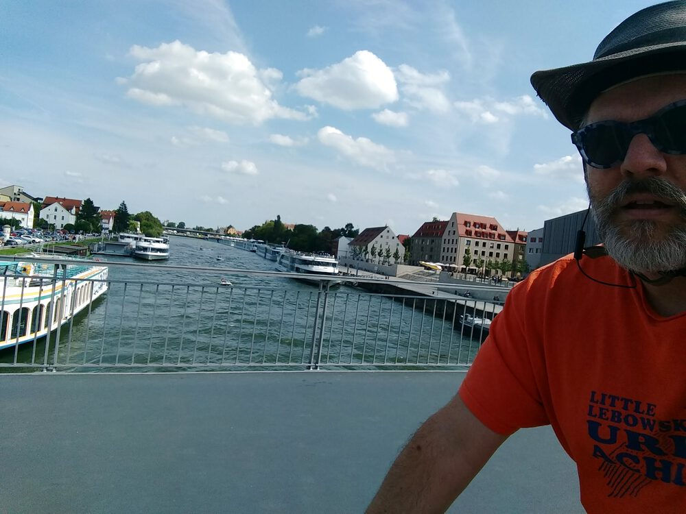  
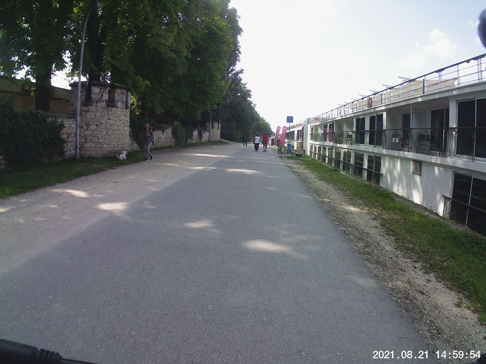  
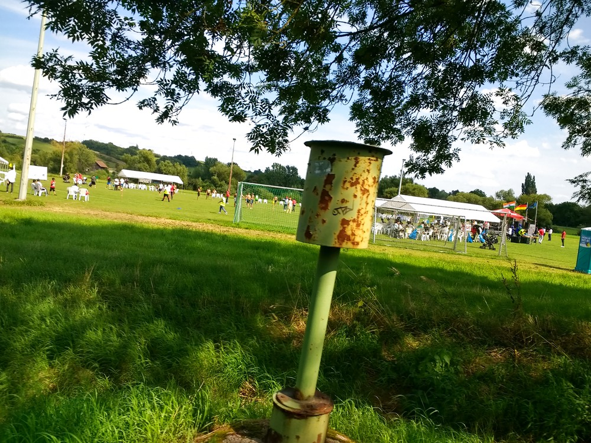  
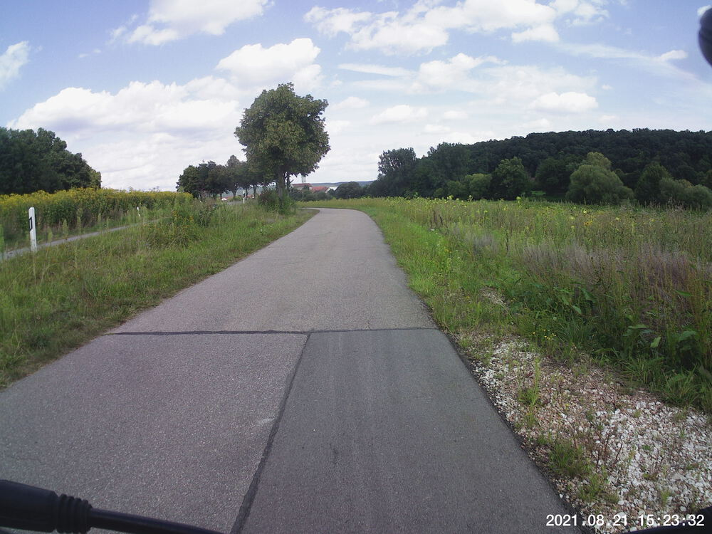  
  
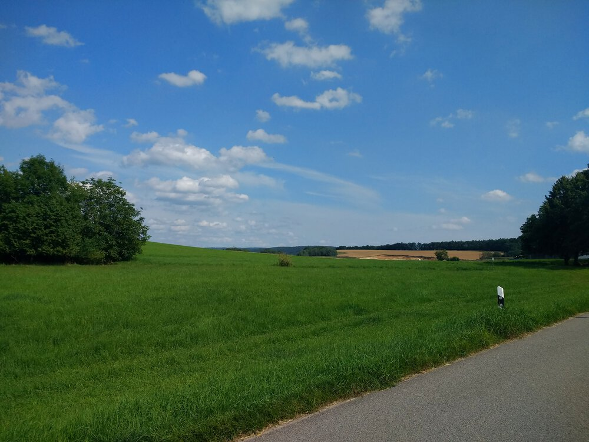  
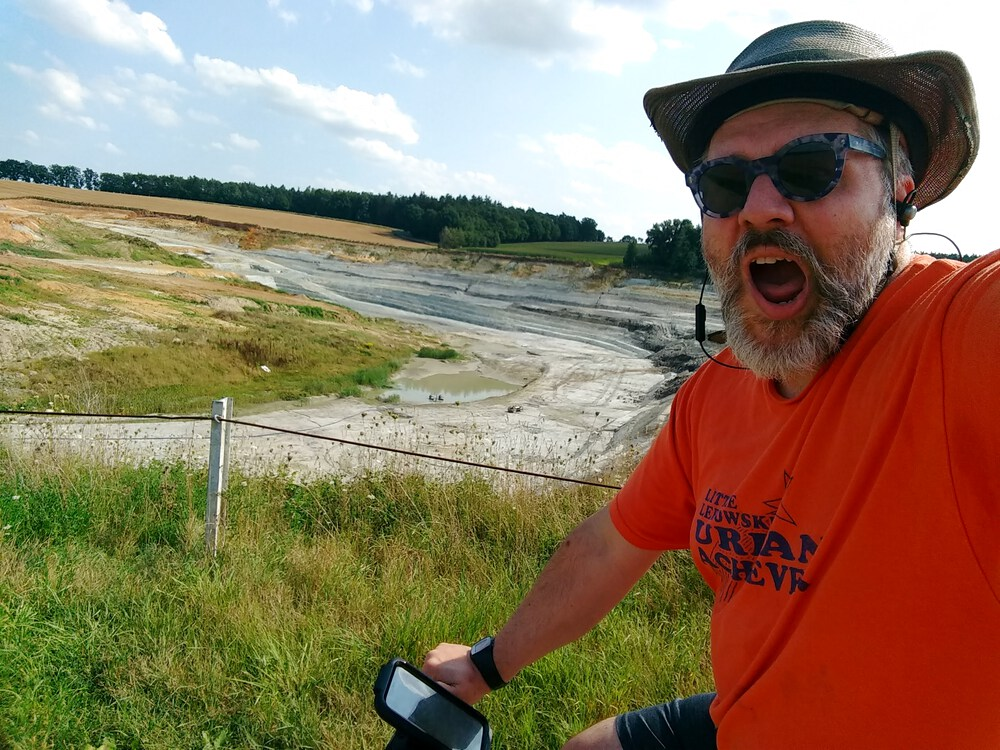  
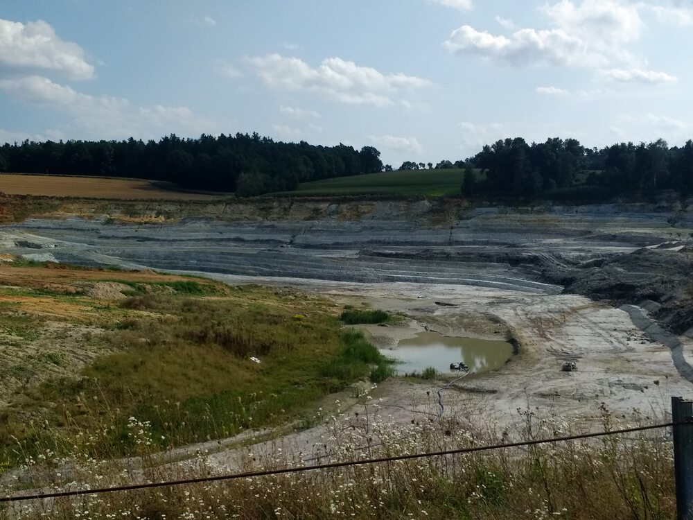  
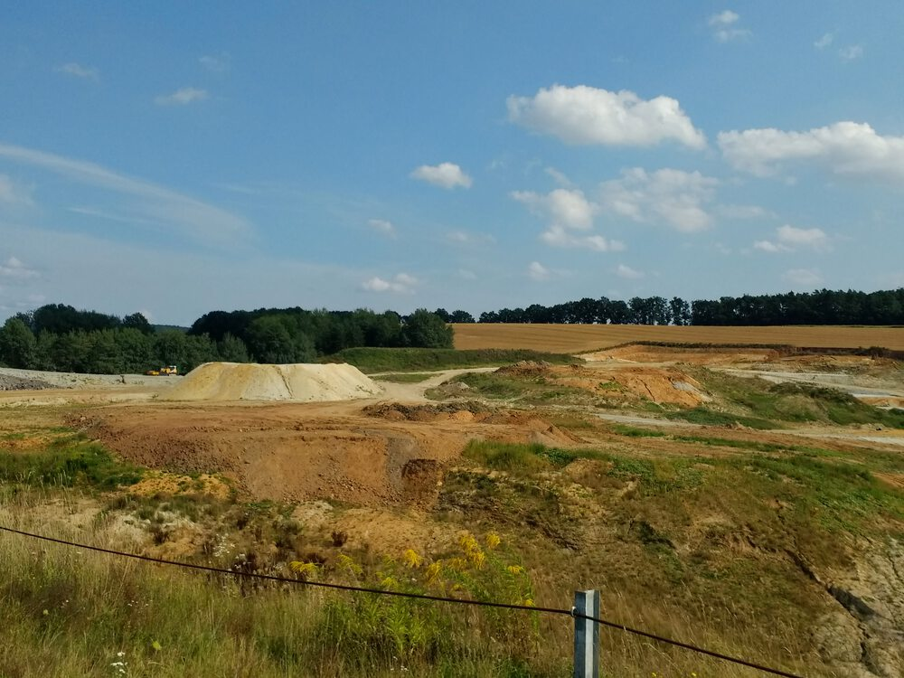  
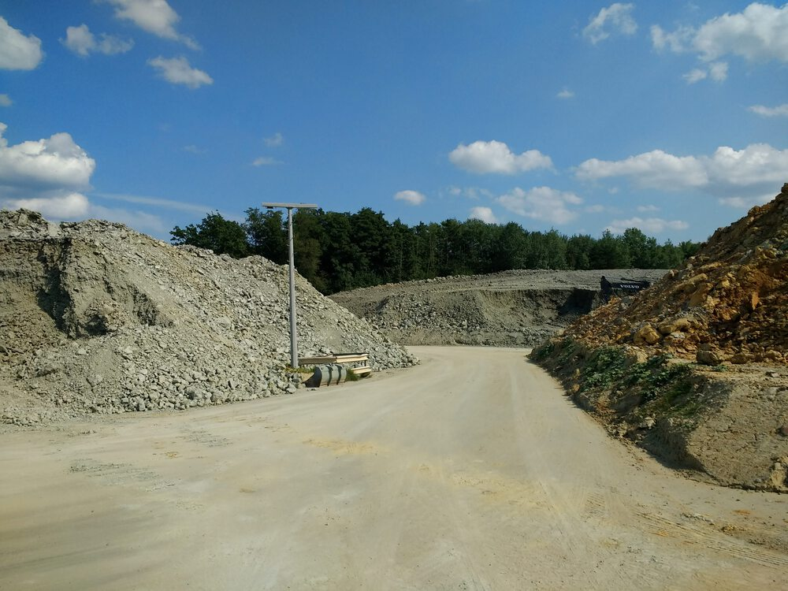  
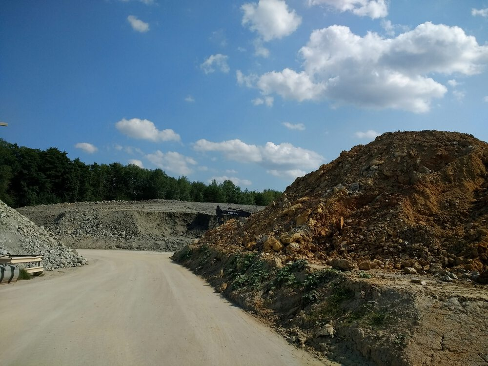  
  


## Route
You might need to tap or click the map to make it bigger.  The red solid route was my intention.  The blue dashed route is my actual route.  



## Stats

```
Total Distance:       26.1 km 
Time:                 1:38 
Calories:             1113
Calories from fat:      18 %
Average Heart Rate:    131
Maximum Heart Rate:    157
Fat Burn:             0:08
Fitness:              1:30
```

