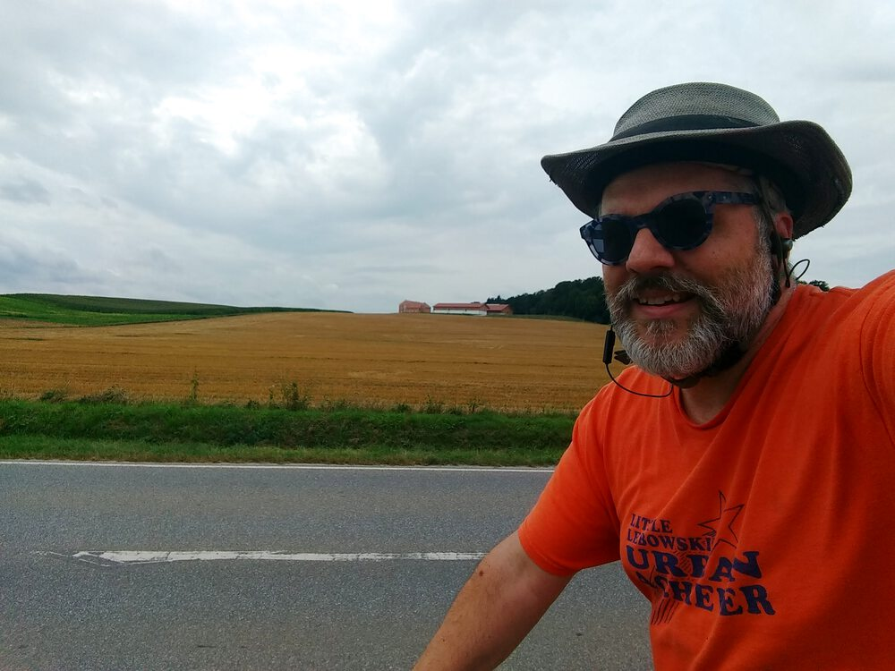
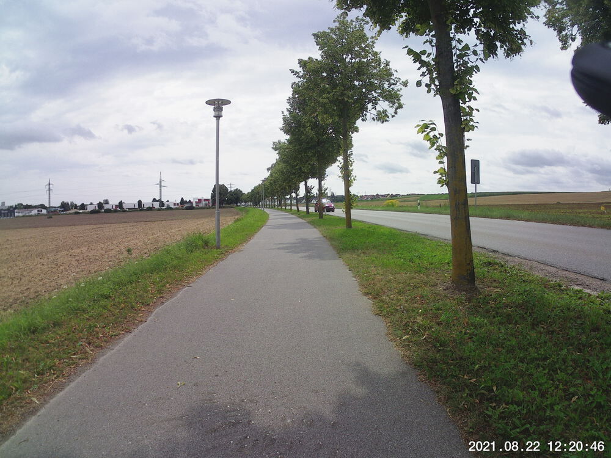
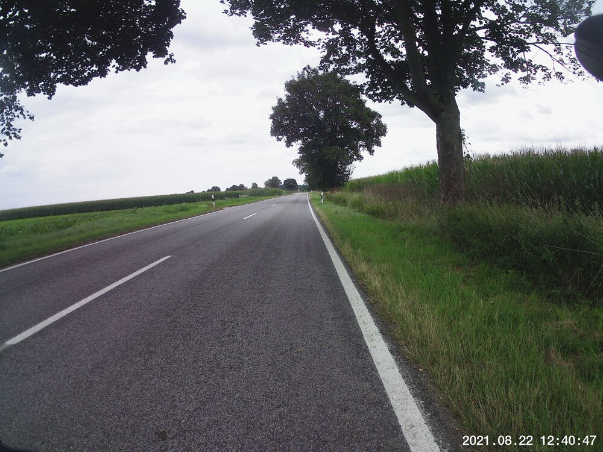
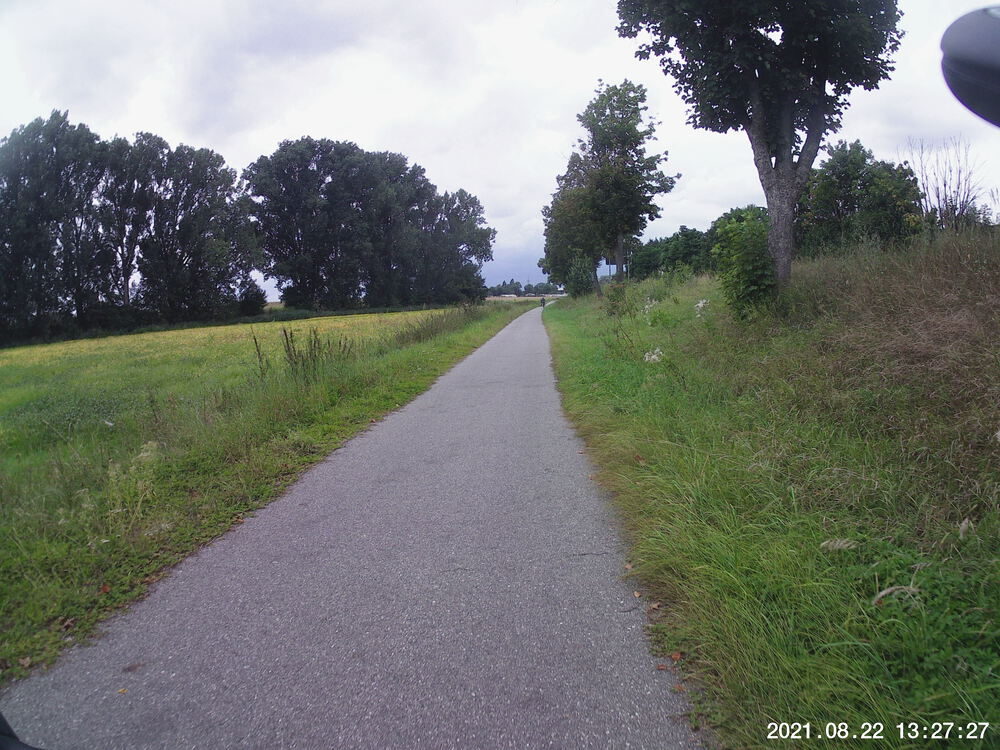
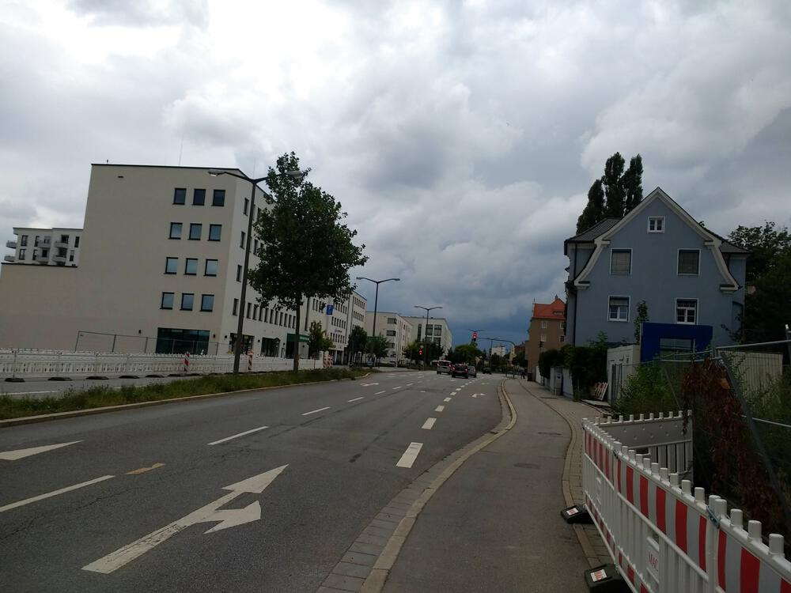
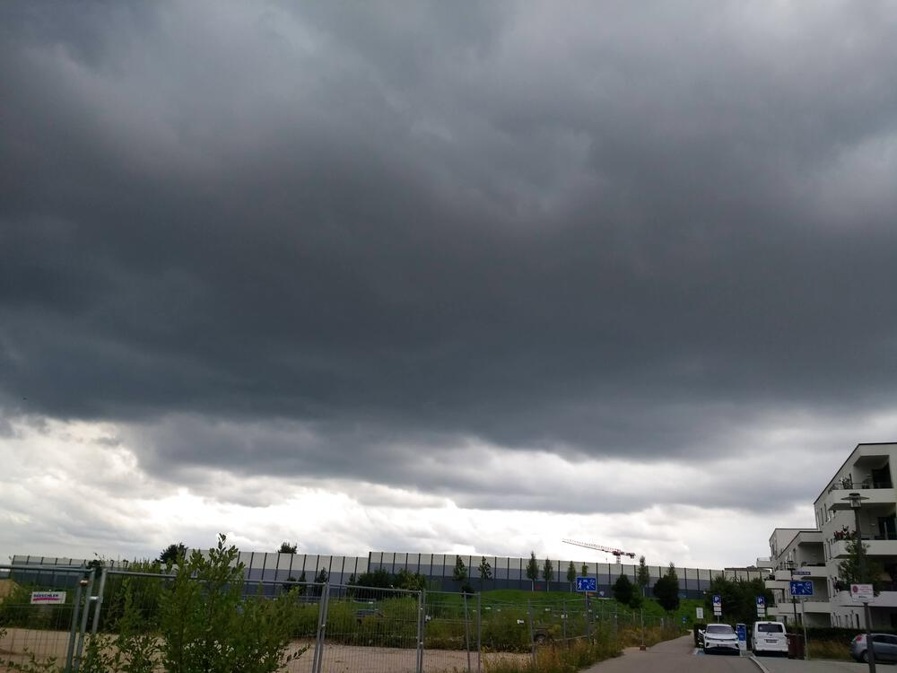

Rain was predicted for all day today, so I did [a 26-km ride yesterday](../20210821)...but then it kinda looked OK early this afternoon, at least for a couple hours, and since it was less than 30 km, the ol' carcass wasn't complaining too much, so why not?  

I saddled up and headed out east, away from the likely soure of the rain.

In the end, I made it back before the rain arrived, but not by much.


## Snaps

  
  
  
  
  
  
  
  

## Route
You might need to tap or click the map to make it bigger.  The red solid route was my intention.  The blue dashed route is my actual route.  



## Stats

```
Total Distance:       30.2 km 
Time:                 1:50 
Calories:              978
Calories from fat:      32 %
Average Heart Rate:    115
Maximum Heart Rate:    135
Fat Burn:             1:15
Fitness:              0:35
```

