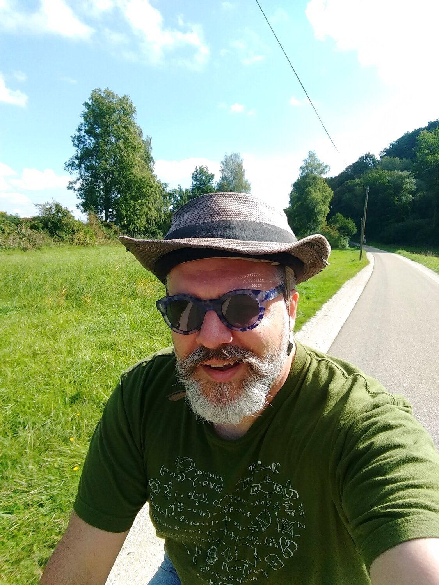

I should have paid attention to the *Fahrräder Verboten* signs.  But the ride along the Naab was rather pleasant.  I don't think I've gone that way before.


## Snaps

  
  
  
  
  
  
  
  

## Route
You might need to tap or click the map to make it bigger.  The red solid route was my intention.  The blue dashed route is my actual route.  



## Stats

```
Total Distance:       22.5 km 
Time:                 1:26              
Calories:             1010
Calories from fat:      15 %
Average Heart Rate:    133
Maximum Heart Rate:    156
Fat Burn:             0:04
Fitness:              1:22
```

