## Snaps

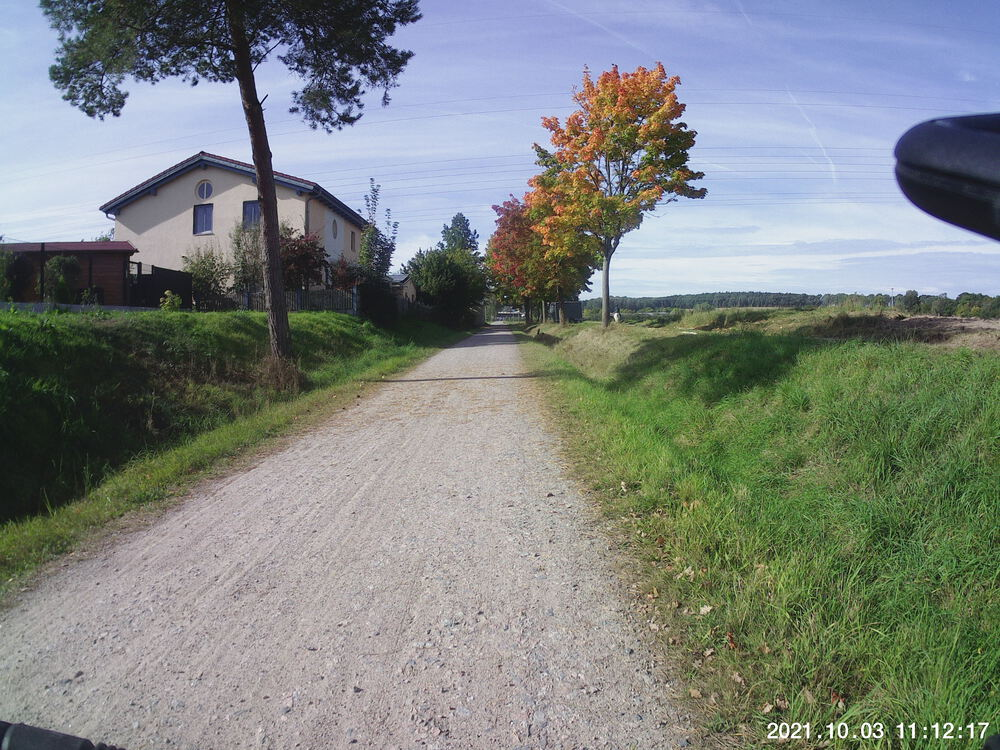  
  
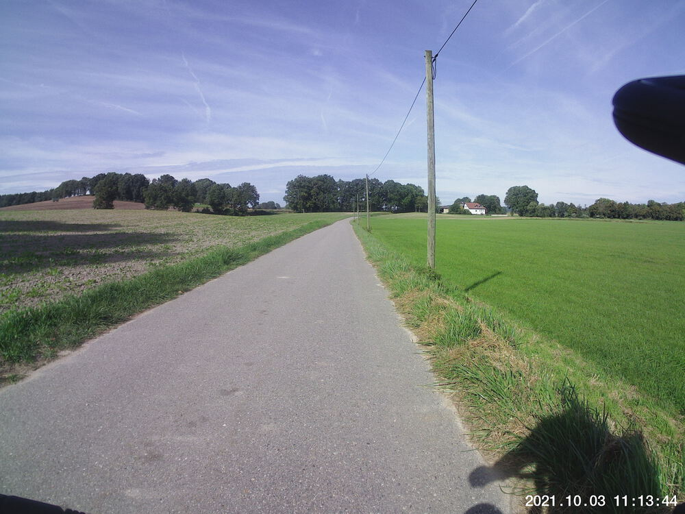  
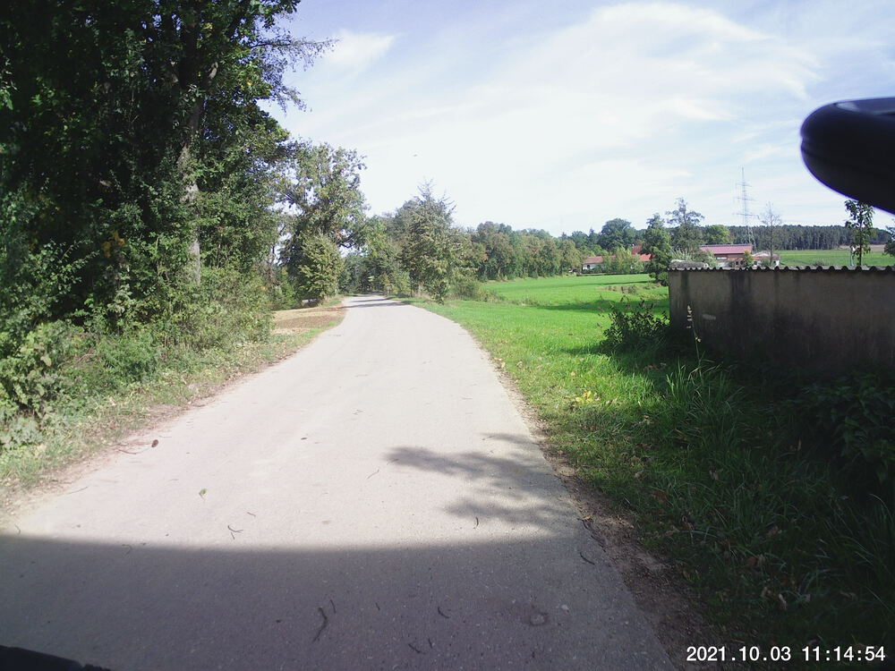  
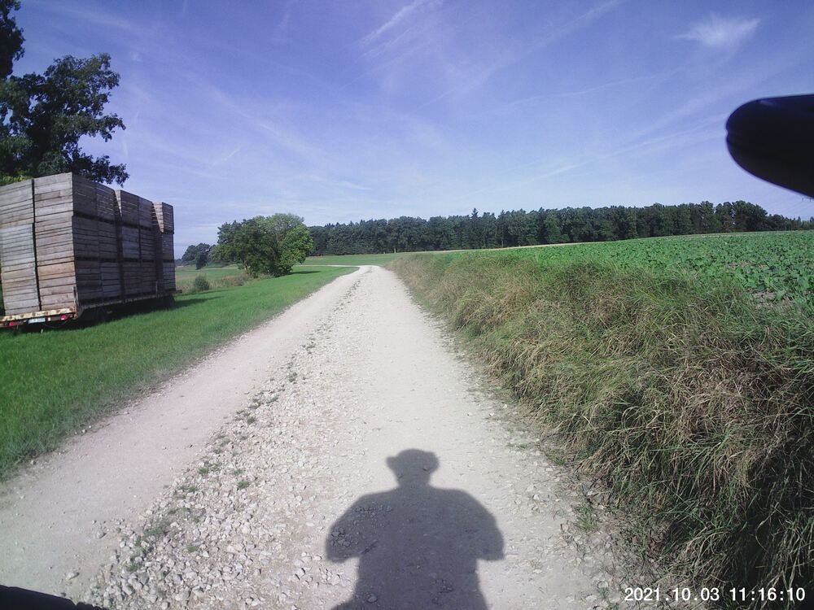  
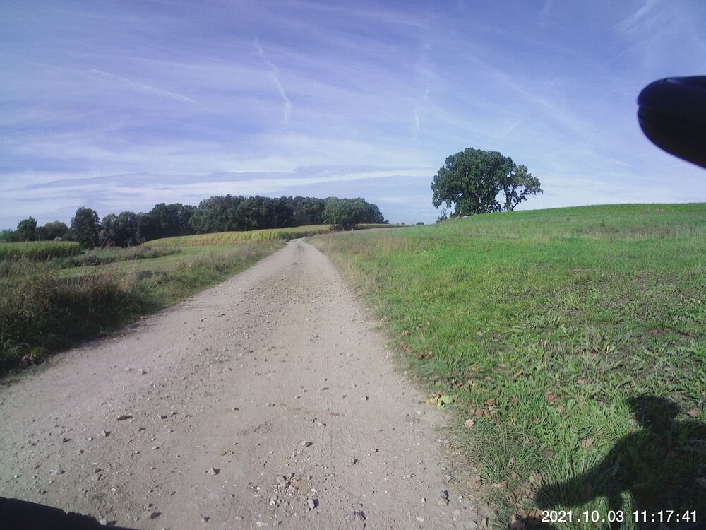  
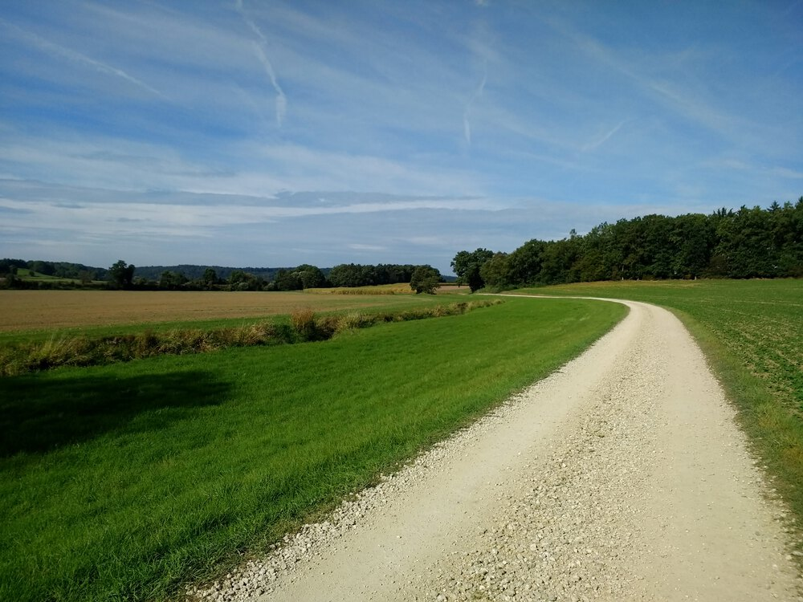  
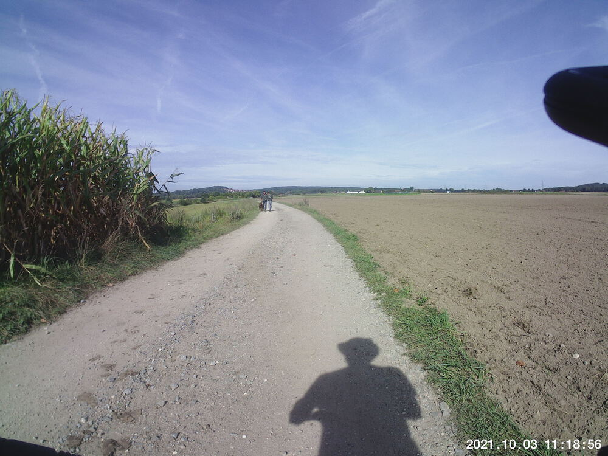  
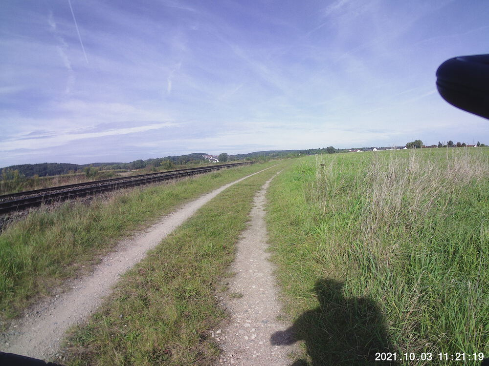  
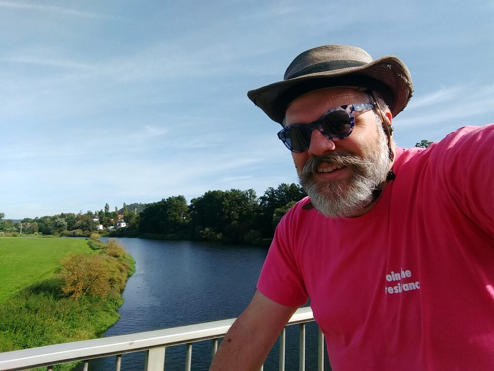  
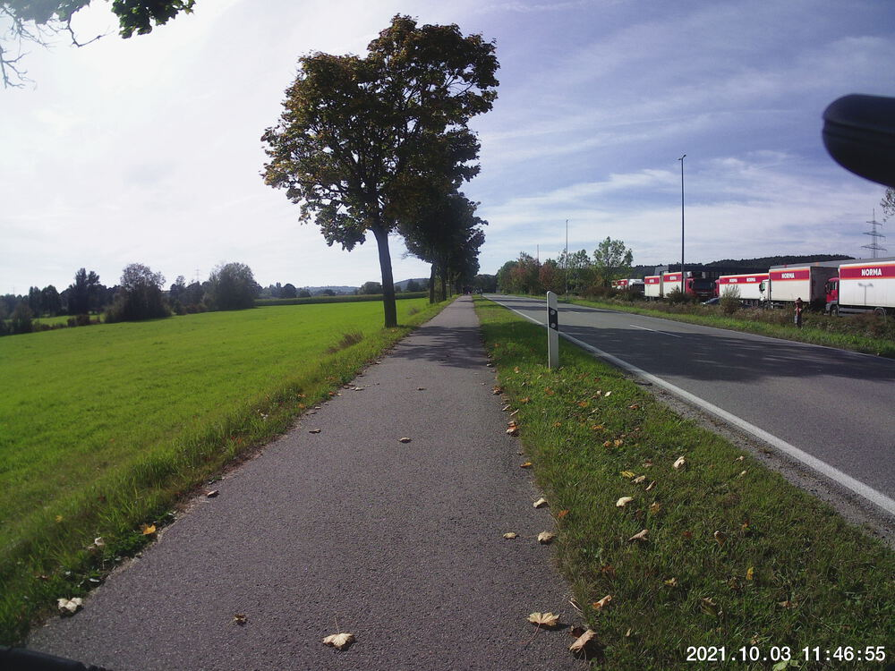  
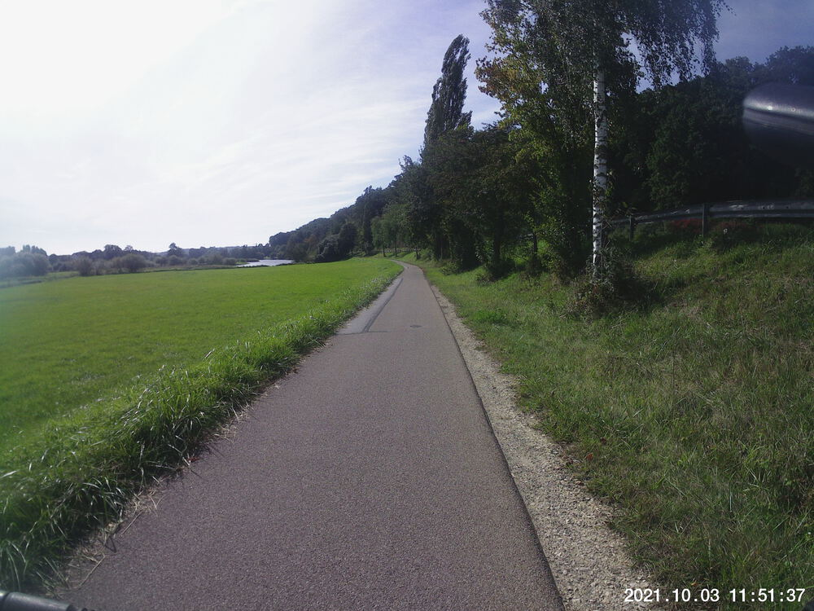  
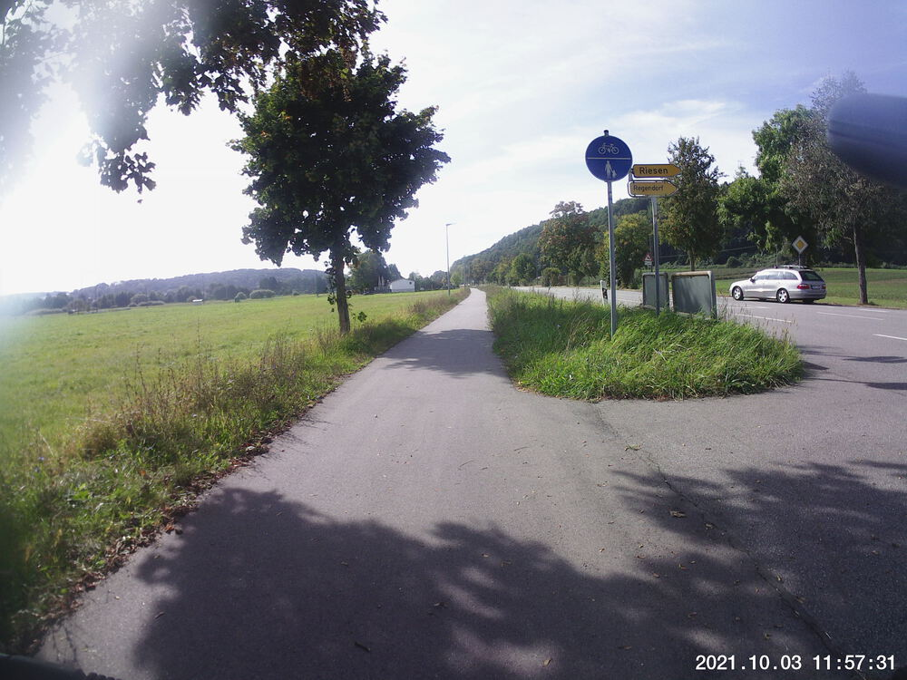  
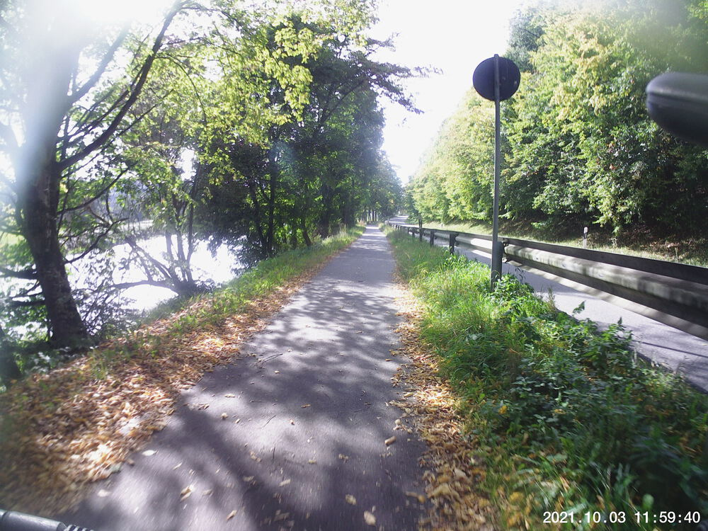  
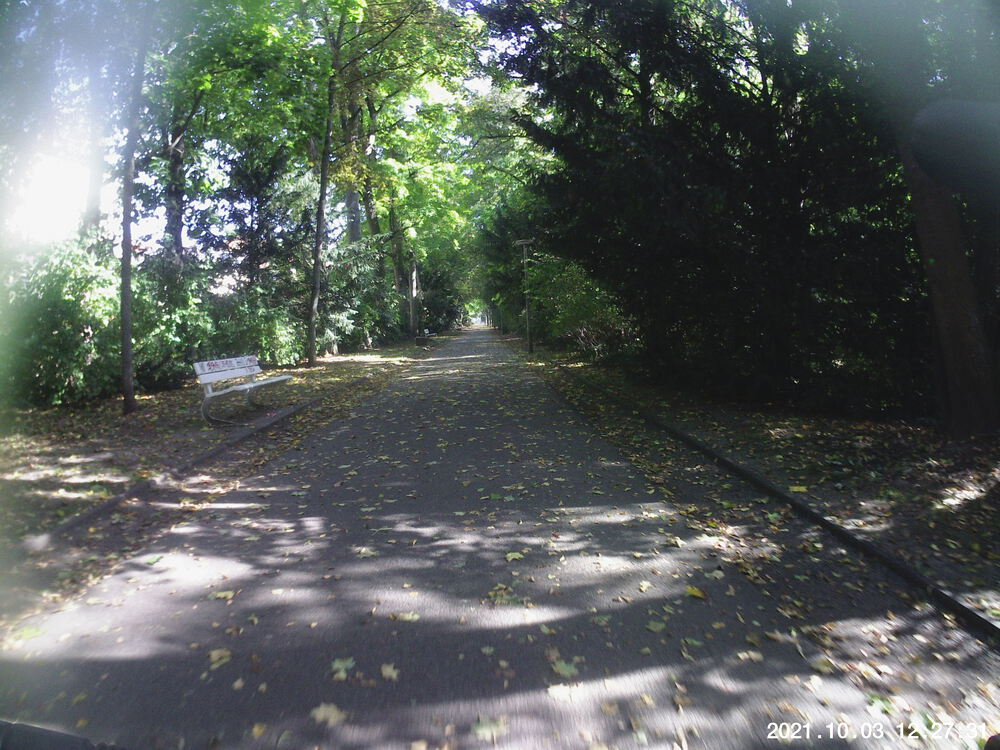  


## Video Recap




## Route
You might need to tap or click the map to make it bigger.  The red solid route was my intention.  The blue dashed route is my actual route.  



## Stats

```
Total Distance:       31.3 km 
Time:                 2:05 
Calories:             1377
Calories from fat:      19 %
Average Heart Rate:    129
Maximum Heart Rate:    153
Fat Burn:             0:11
Fitness:              1:54
```

