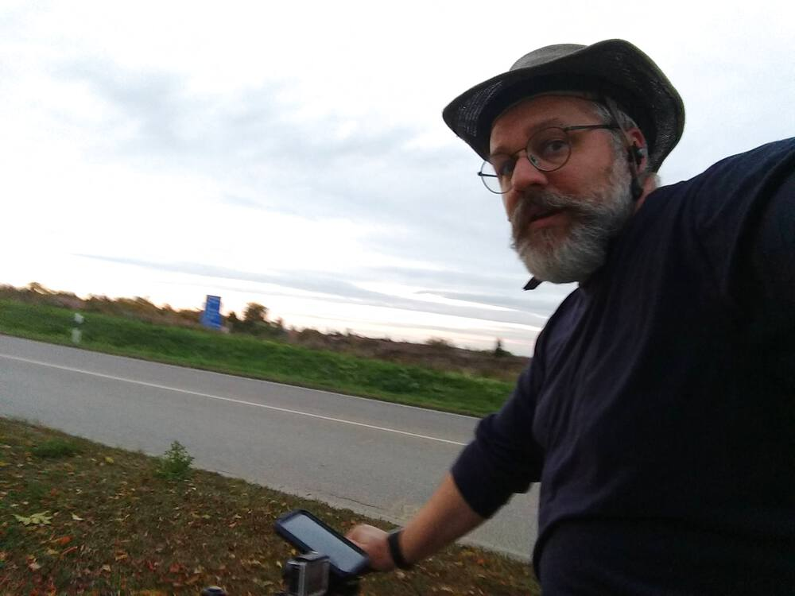
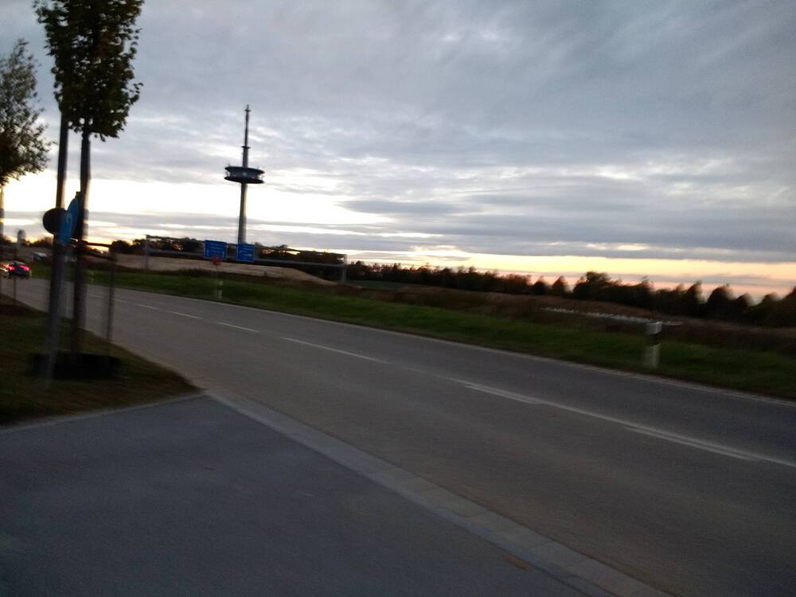
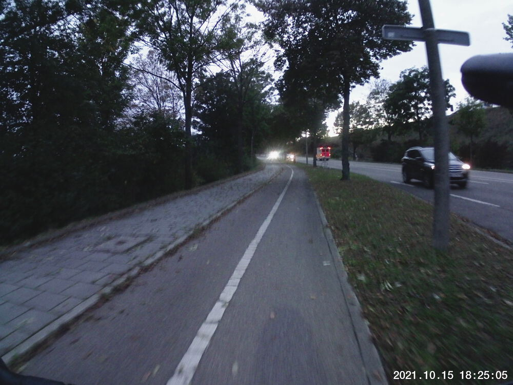
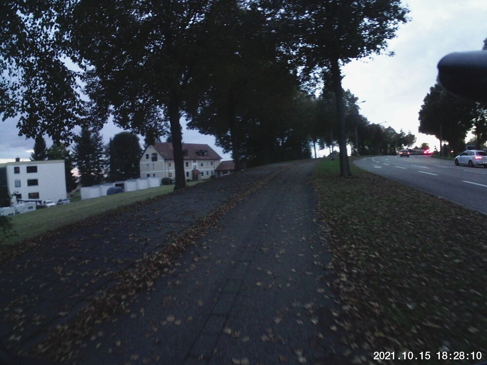

I needed to burn off some energy after a frustrating work week.  Thus the
zigzagging you see in the football stadium's parking lot (southeast corner of
my route).  The snaps aren't great because of how dark it was already.  I
anticipated this, so I shot a video of basically the southwest corner of my
route to the northwest corner.  You'll want to turn the sound off for that.  It's not pleasant.

## Snaps

  
  
  
  


## Video Recap




## Route
You might need to tap or click the map to make it bigger.  The red solid route was my intention.  The blue dashed route is my actual route.  



## Stats

```
Total Distance:       11.1 km 
Time:                 0:56
Calories:              600 
Calories from fat:      22 %
Average Heart Rate:    126
Maximum Heart Rate:    155
Fat Burn:             0:20
Fitness:              0:36
```

