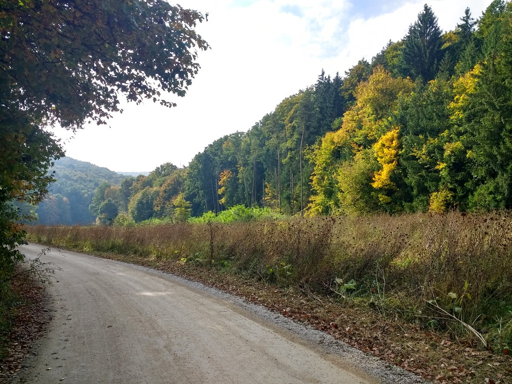

I enjoyed the route [the last time I followed the Naab](../20210919/) &mdash; at least the first part of it.  I repeated that this time, but on purpose at the Ederer car dealership and gas station outside of Etterzhausen, I went north instead of east and headed up the Goldberg.  It turns into dirt/gravel road pretty quick, so be aware of that.  And it got steeper, quicker than I expected.  So much so, that I got off and walked a bit (haven't had to do that in a while, but my pulse was racing, and that's not was I was going for).  Up at the top, overlooking Adlersberg from across the valley, it was smooth sailing again all the way back.


## Snaps


  
  
  
  
  
  
  
  
  
  
  
  
  
  
  
  
  
  


## Route
You might need to tap or click the map to make it bigger.  The red solid route was my intention.  The blue dashed route is my actual route.  



## Stats

```
Total Distance:       22.3 km 
Time:                 1:32 
Calories:             1156 
Calories from fat:      14 %
Average Heart Rate:    139
Maximum Heart Rate:    171
Fat Burn:             0:07
Fitness:              1:25
```

