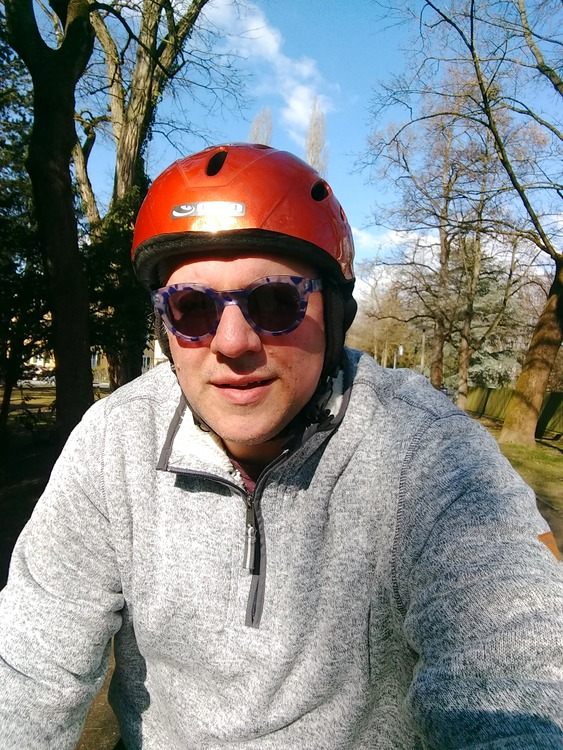

I'm back in the saddle for the first time this year.  Lots of reasons why only now; none of them are good.  My route looks like a snail, which might explain my sluggishness (that's one of those cross-language puns).


## Snaps

Here I am, happy to be outdoors and in motion again.


Wait, what's going there on the riverbank?


Wow, hard core!


## Route
You might need to tap or click the map to make it bigger.



## Stats

```
Total Distance:       14.7 km
Time:                 0:59
Calories:              628
Calories from fat:      21 %
Average Heart Rate:    126
Maximum Heart Rate:    148
Fat Burn:             0:14
Fitness:              0:44
```

