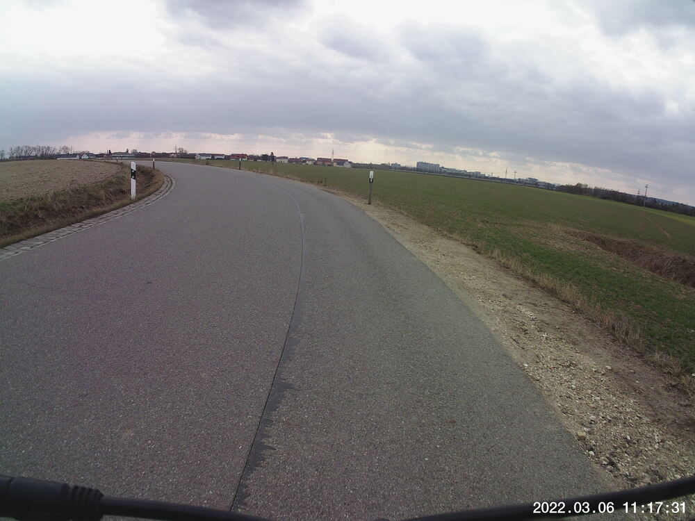
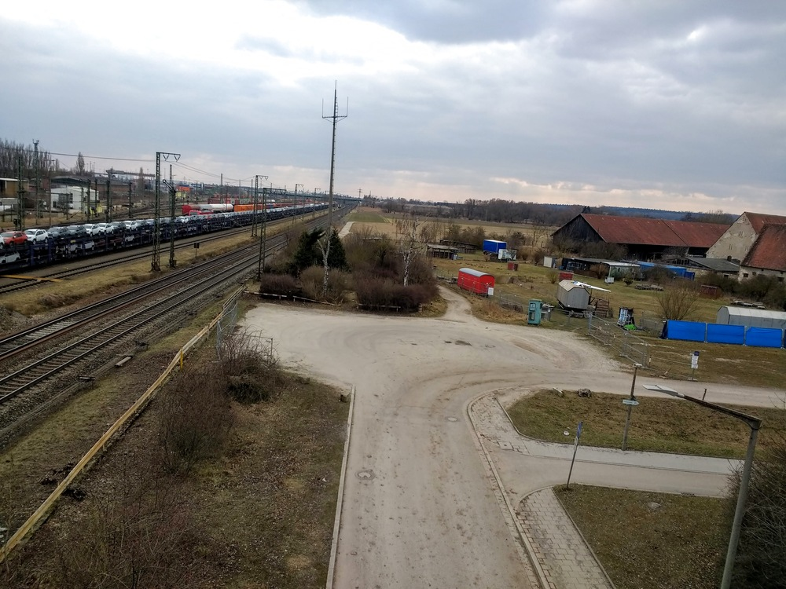
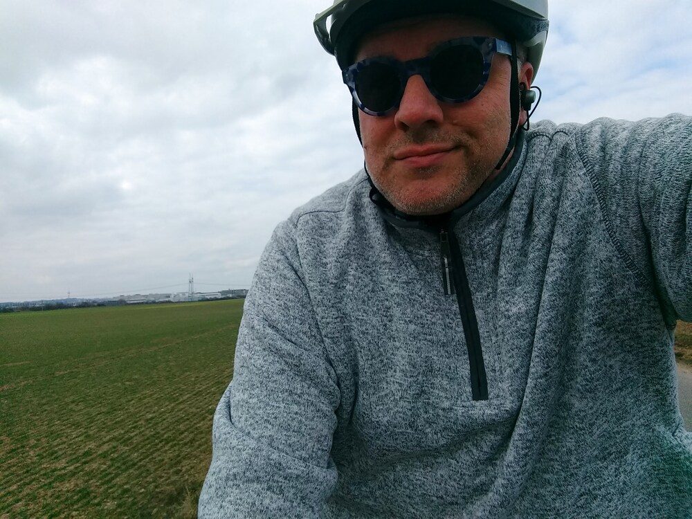

I'm still getting back into the swing of biking.  This time I remembered to wear my delicate-biker-tushy-underwear, but I still got cold kinda early (trying out a new helmet I bought for the summer, with much better airflow...not ready for that quite yet, I guess).  So I turned south early and hopped the river a couple times before coming back via Irl and the Conti test track instead of Donaustauf, Barbing, and Harting.  That cut my route down from about 25 to about 16 km, but...maybe next time.


## Snaps







## Route
You might need to tap or click the map to make it bigger.  The red solid route was my intention.  The blue dashed route is my actual route.



## Stats

```
Total Distance:       16 km
Time:               1:16
Calories:            861
Calories from fat:    17 %
Average Heart Rate:  130
Maximum Heart Rate:  160
Fat Burn:           0:09
Fitness:            1:07
```

