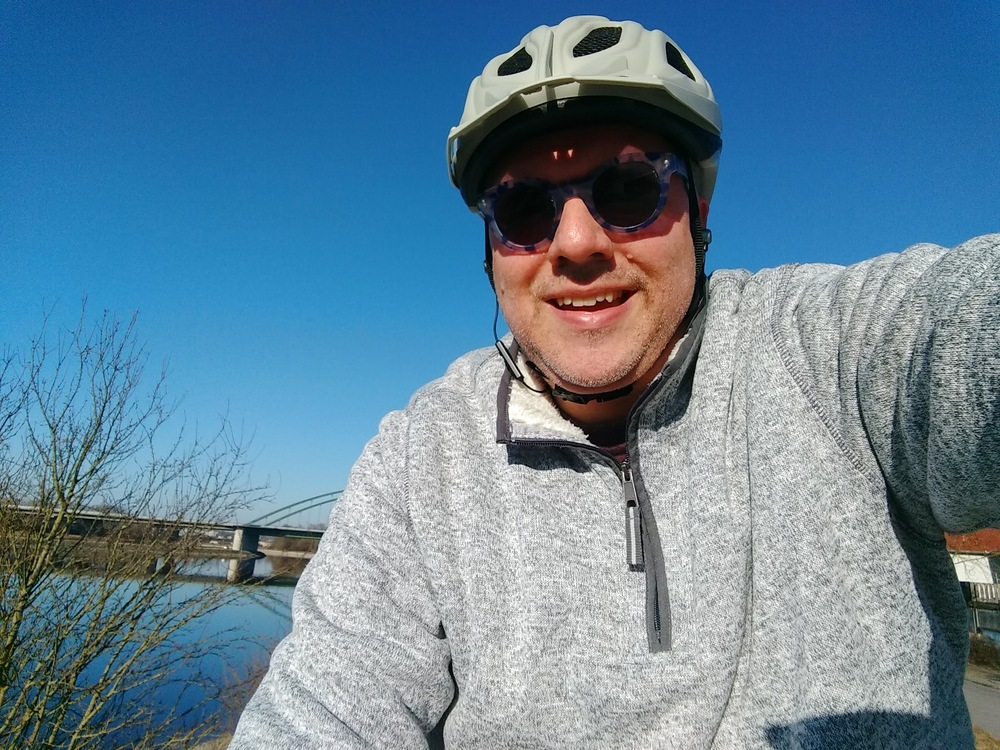

It was quite cold this morning when I started out, but it was almost pleasant in the sun while not moving.  Full sun while moving was tolerable at least, but moving in the shade almost wasn't.  Should have worn my gloves, but I thought I'd warm up more than I actually did.

Last week I meant to do this route, but I wussed out at the temperature in the morning and cut it short.  Today I stuck it out!


## Snaps


  
  
  
  
  
  
  
  
  
  
  
  
  


## Route
You might need to tap or click the map to make it bigger.  The red solid route was my intention.  The blue dashed route is my actual route.  



## Stats

```
Total Distance:       27.5 km
Time:                 1:48
Calories:             1220
Calories from fat:      17 %
Average Heart Rate:    130
Maximum Heart Rate:    152
Fat Burn:             0:09
Fitness:              1:40
```

