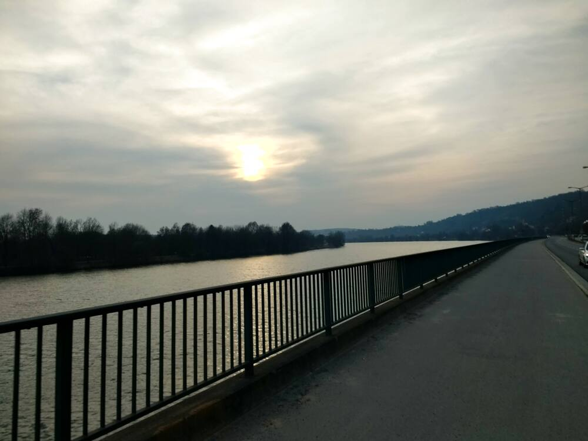
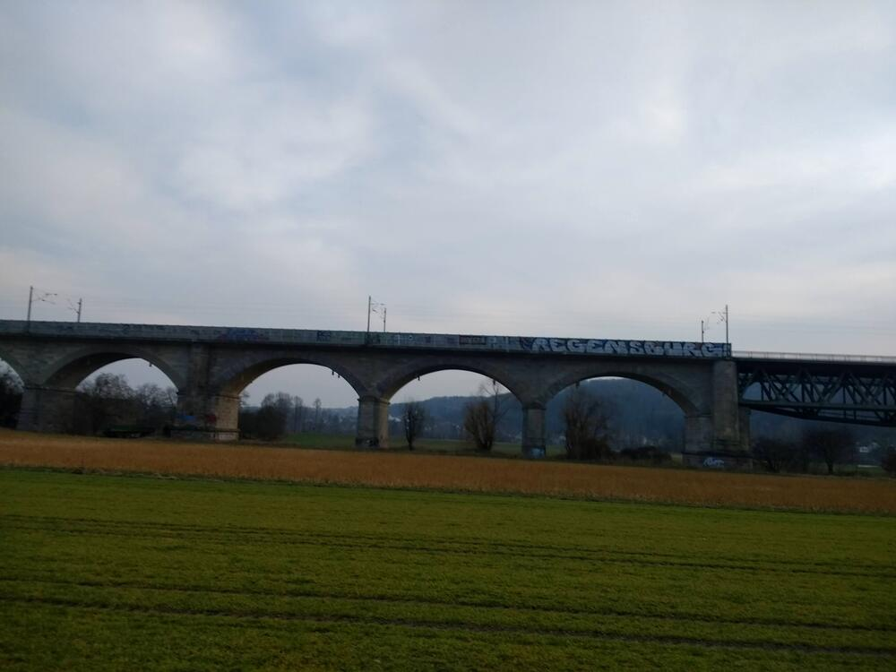
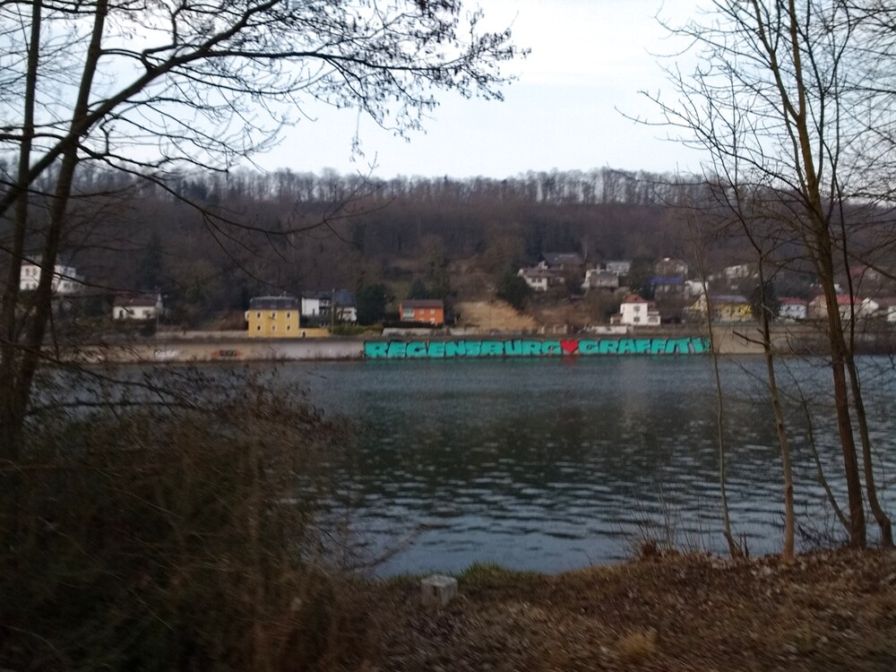

I had a good chance to catch up on long-open work stuff this week, which was nice, but it might long hours of solo work in front of the computer.  At the end of it, I needed to get some fresh air activity.  It worked out nicely, timing-wise.  

I followed the Danube up on bank and down the other (as much as I could; the north bank was still closed off to bike traffic for much of the way due to construction, but that looks like it'll be completed soon), crossing the Naab and the Danube at Mariaort.  My heart rate spiked to 170 while climbing up the hill the train bridge across the river, but I was pleased that I never had to stop and huff and puff.


## Snaps

  
  
  



## Route
You might need to tap or click the map to make it bigger.



## Stats

```
Total Distance:       18.1 km 
Time:                 1:10
Calories:              815
Calories from fat:      16 %
Average Heart Rate:    132
Maximum Heart Rate:    170
Fat Burn:             0:05
Fitness:              1:05
```

