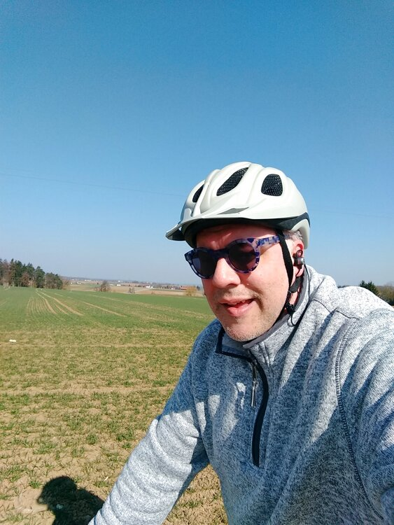
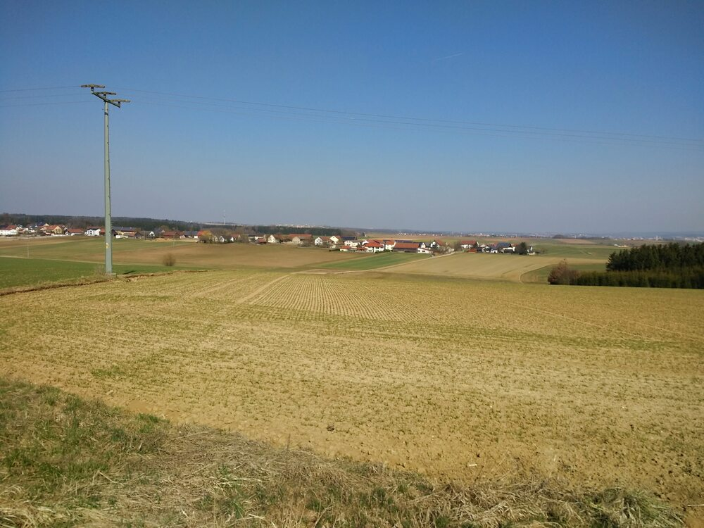
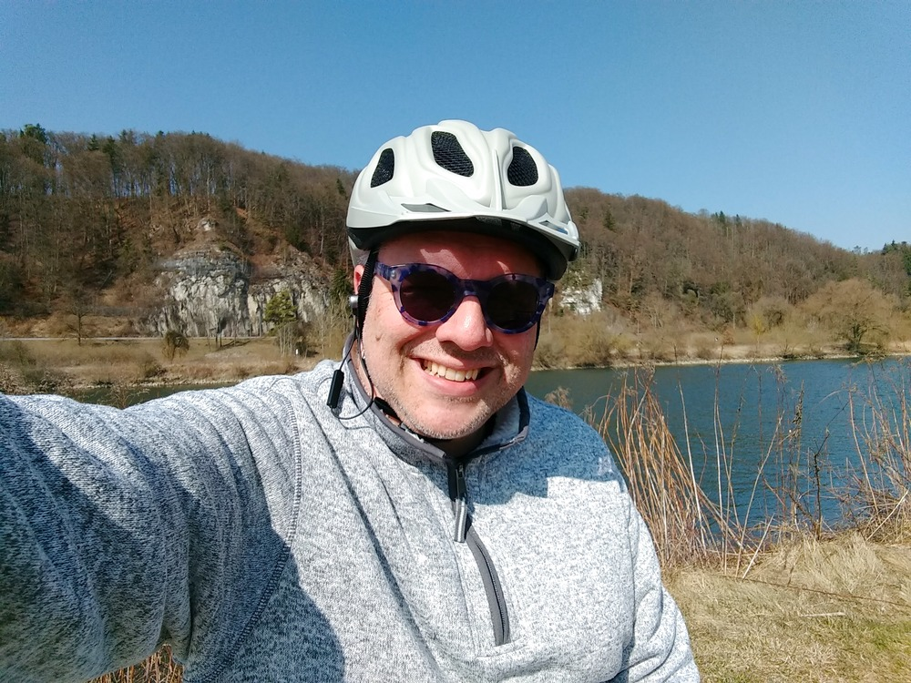
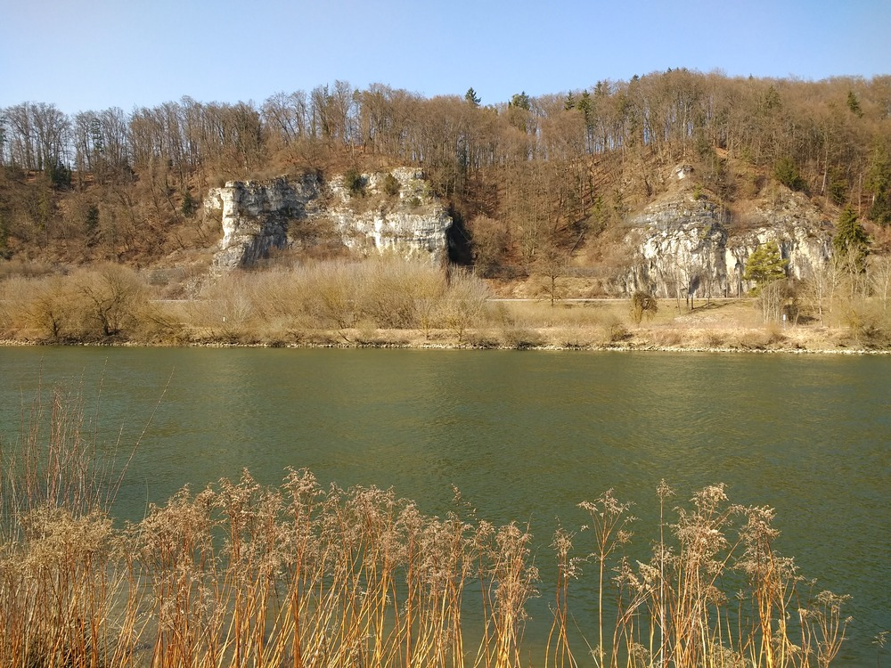

I had some brownies to drop off at a buddy's house, so set off on one of the routes I've taken many times before:  up some hills to the south, and then over to the west, and the follow the Danube most of the way back home.  But this time, it wore my sorry butt out.

Possible contributing factors:

* I think my rear tire is a little low on air &mdash; gotta rectify that before my next ride
* I did 18 unexpected kilometers on Friday after work
* I ain't gettin' any younger or lighter (see the brownies above)
* Headwind &mdash; it was pretty steady for at least half of my route

I'm taking it slowly for the rest of the day...maybe the week.

## Snaps

  
  
  
  

## Route
You might need to tap or click the map to make it bigger.  The red solid route was my intention.  The blue dashed route is my actual route.  



## Stats

```
Total Distance:       34.6 km 
Time:                 2:12
Calories:             1618
Calories from fat:      14 %
Average Heart Rate:    136
Maximum Heart Rate:    159
Fat Burn:             0:09
Fitness:              2:03
```

