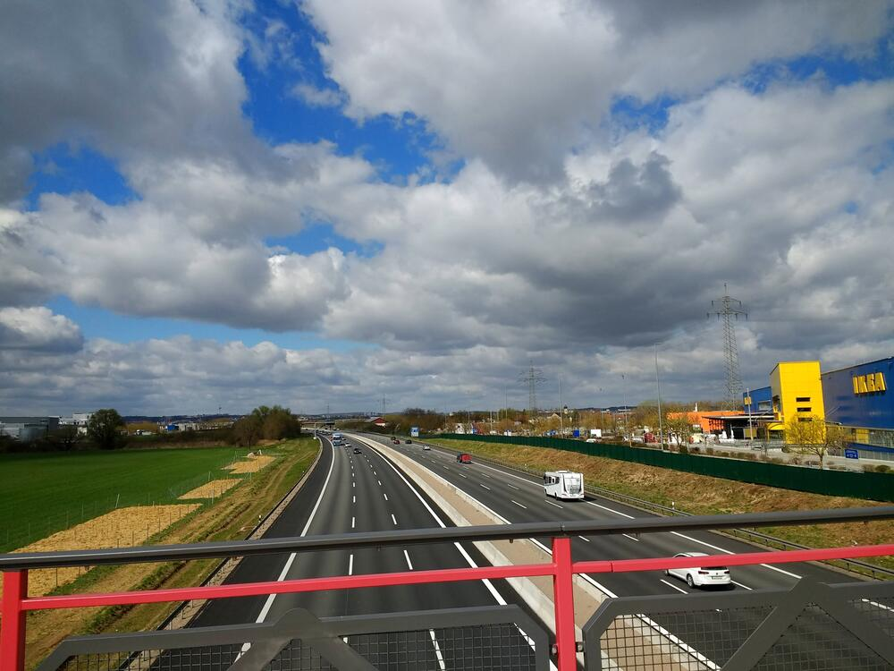

It was pretty today.  But cold when the sun wasn't right on me.  I headed east out towards IKEA and marveled at the completed work on the A3 &mdash; three lanes in each direction &mdash; and then headed over to my buddy's house by way of what he calls the *Ho Chi Minh* trail down the hill from the overflow parking at the *Uni-Klinikum*.

The timestamps from the bike cam are off by an hour because I didn't get around to updating that for DST this year yet.  I hope I remember for next time!


## Snaps

  
  
  
  
  

## Video Recap



## Route
You might need to tap or click the map to make it bigger.  The red solid route was my intention.  The blue dashed route is my actual route.  I got off course right away and just rolled with it.  I ended up going about a kilometer more than the planned route...no big deal.



## Stats

```
Total Distance:       28 km 
Time:               2:08
Calories:           1533
Calories from fat:    17 %
Average Heart Rate:  134
Maximum Heart Rate:  164
Fat Burn:           0:18
Fitness:            1:50
```

