It rained A LOT this morning in a small amount of time.  But then the forecast changed, predicting no rain until after 5, so I jumped on the chance for a short ride.  And I got rained on a little bit anyways.  


## Snaps

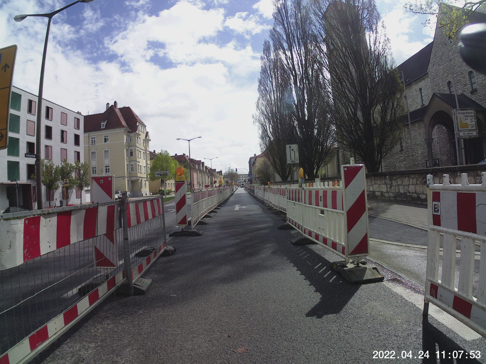  
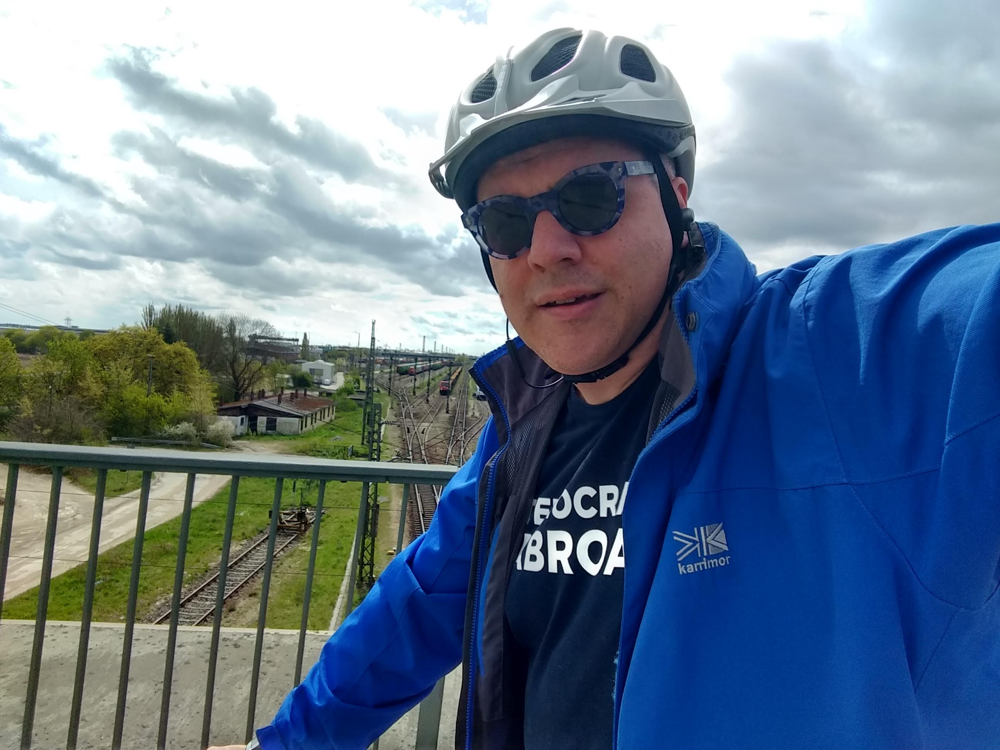  
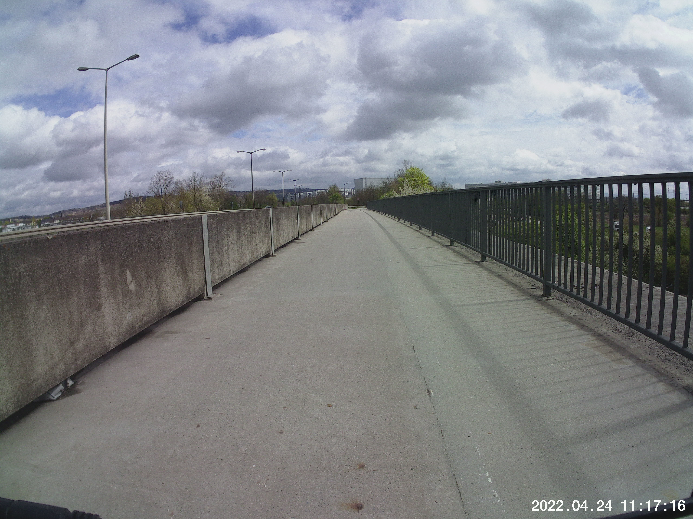  
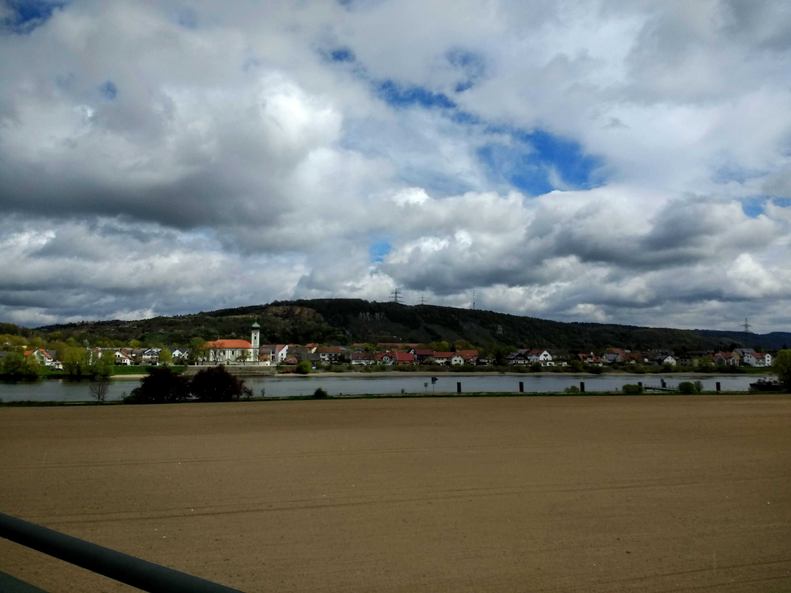  
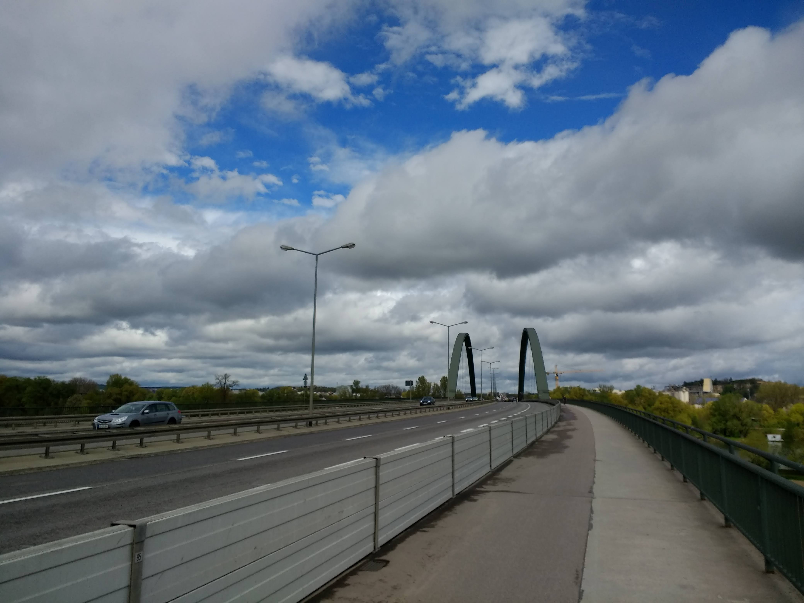  
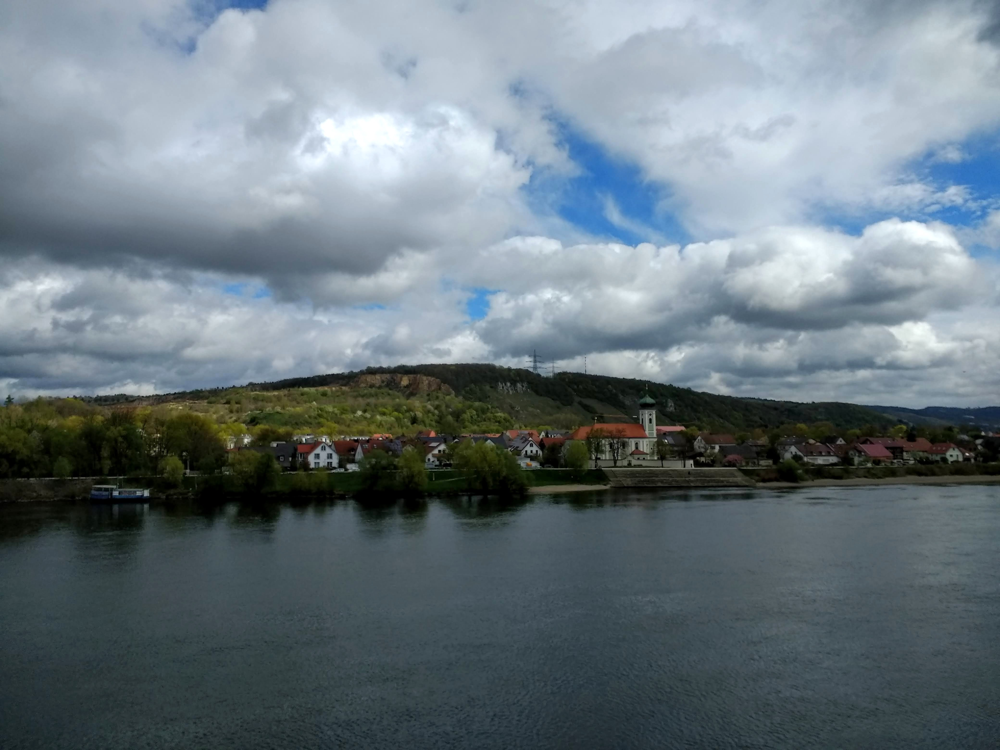  
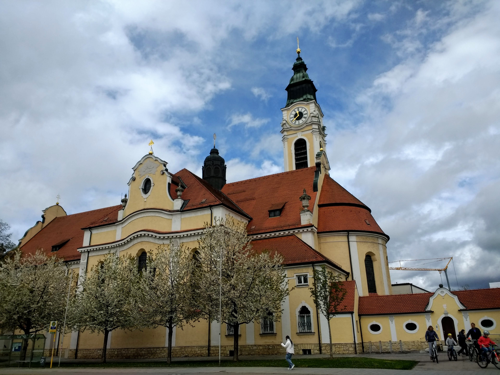  
  
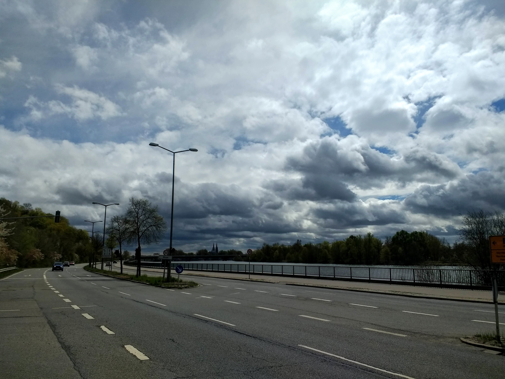  
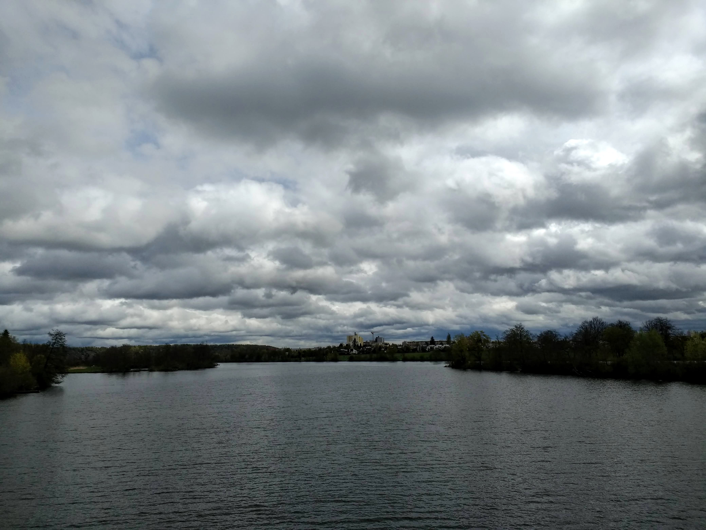  
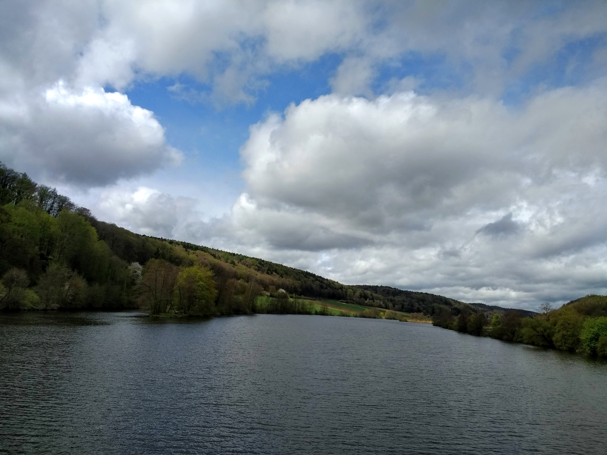  
  
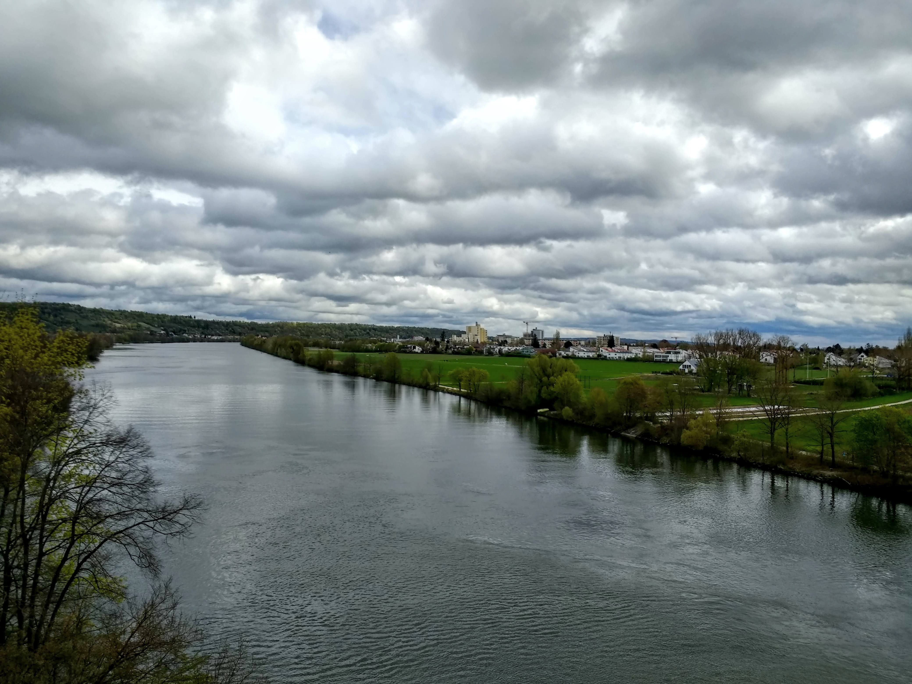  
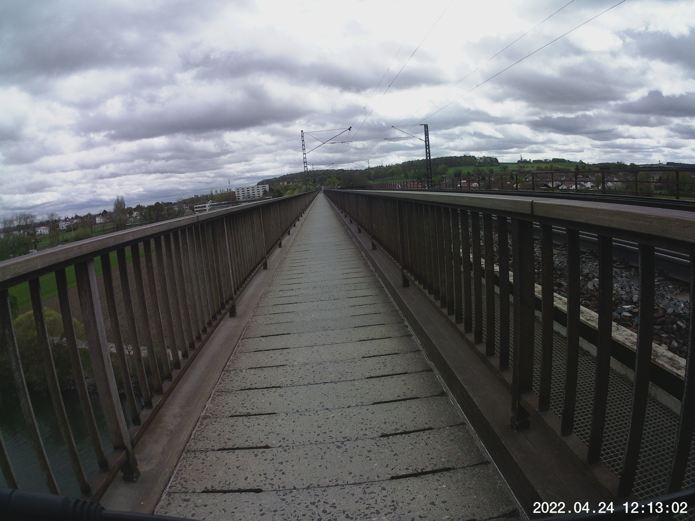  
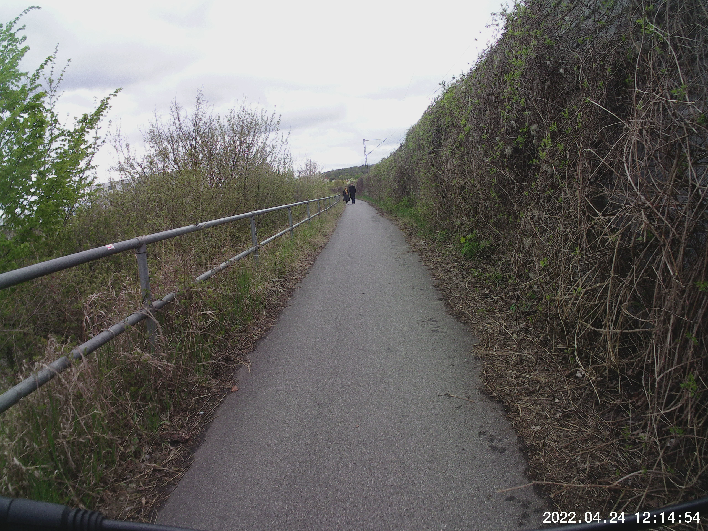  
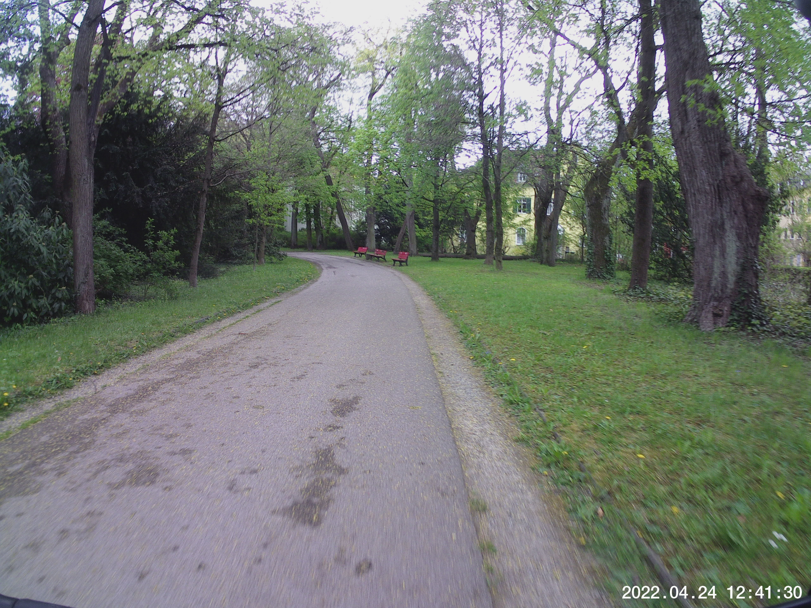  


## Route
You might need to tap or click the map to make it bigger.  



## Stats

```
Total Distance:       21 km 
Time:               1:33
Calories:            963
Calories from fat:    23 %
Average Heart Rate:  124
Maximum Heart Rate:  154
Fat Burn:           0:24
Fitness:            1:08
```

