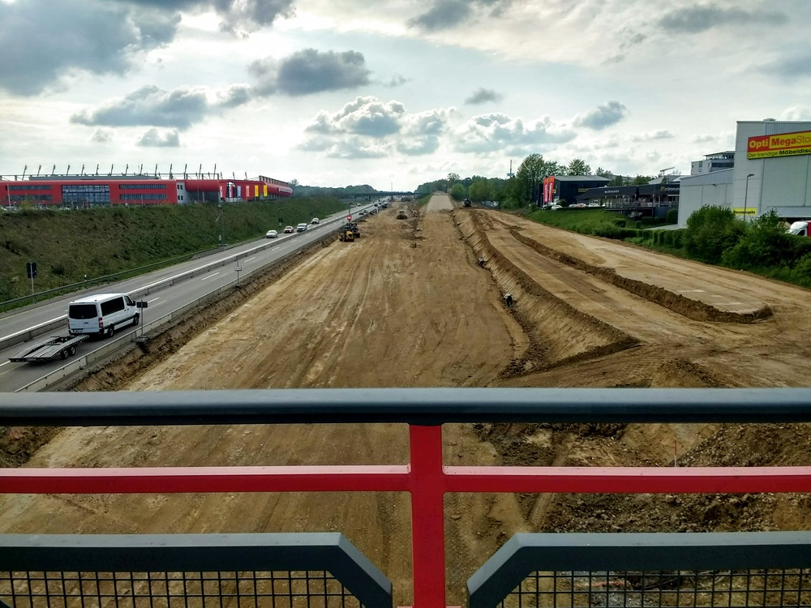
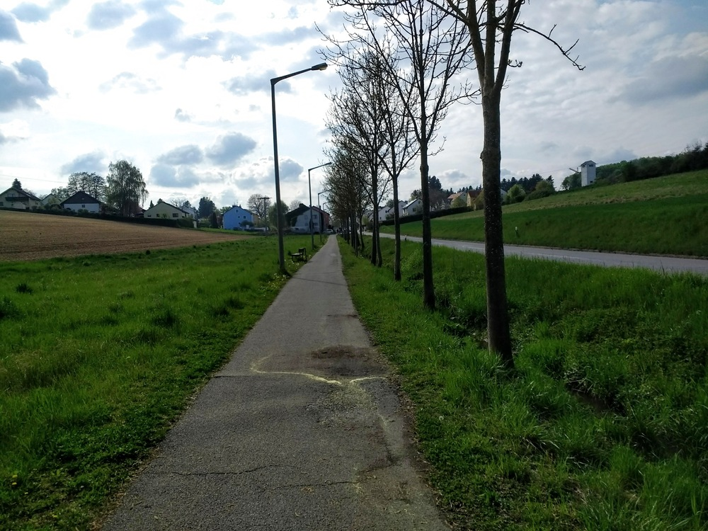
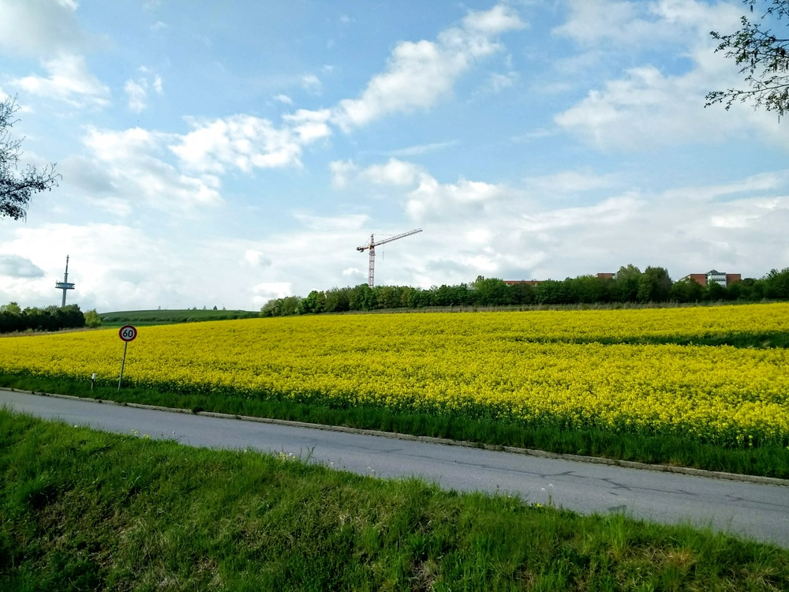
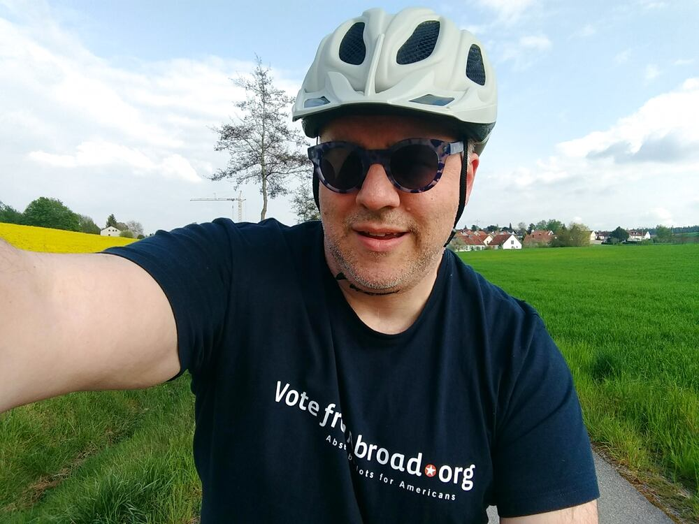
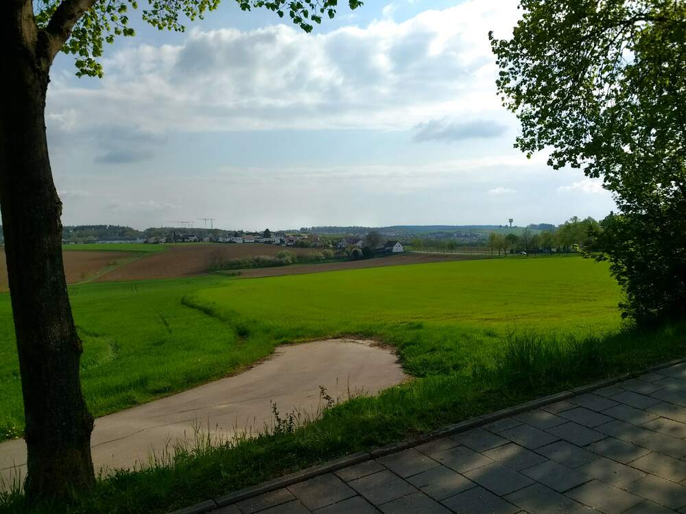
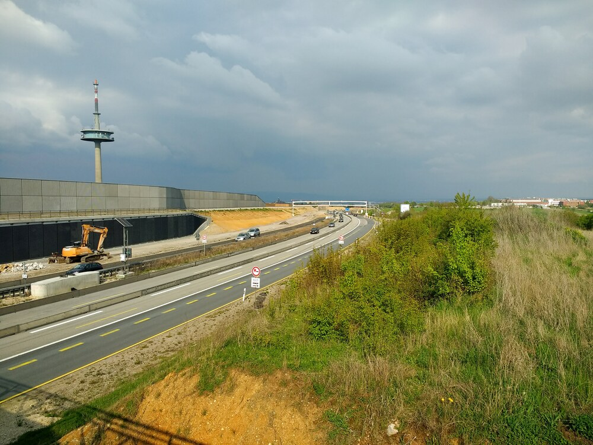

> *Hooray!  Hooray!  The First of May!*

You know the rest of that chant. 

It was rainy this morning, but lightened up in the afternoon, so I squeezed in 11.5 km before dinner.  

## Snaps


  
The A3 is going to be messed up for a long time still.

  
  
  
  
  


## Video Recap

The video is from the top of Ziegetsdorf down the hill and back home.

* around 17:12 I ran a red light.
* shortly after that I was amused by a dude in a complete *Seppl-Anzug* riding a scooter &mdash; *bestimmt* on his way back from raising a Maypole.  I like the juxtapositioning there.



## Route
You might need to tap or click the map to make it bigger.  The red solid route was my intention.  The blue dashed route is my actual route.  



## Stats

```
Total Distance:       11.5 km 
```

