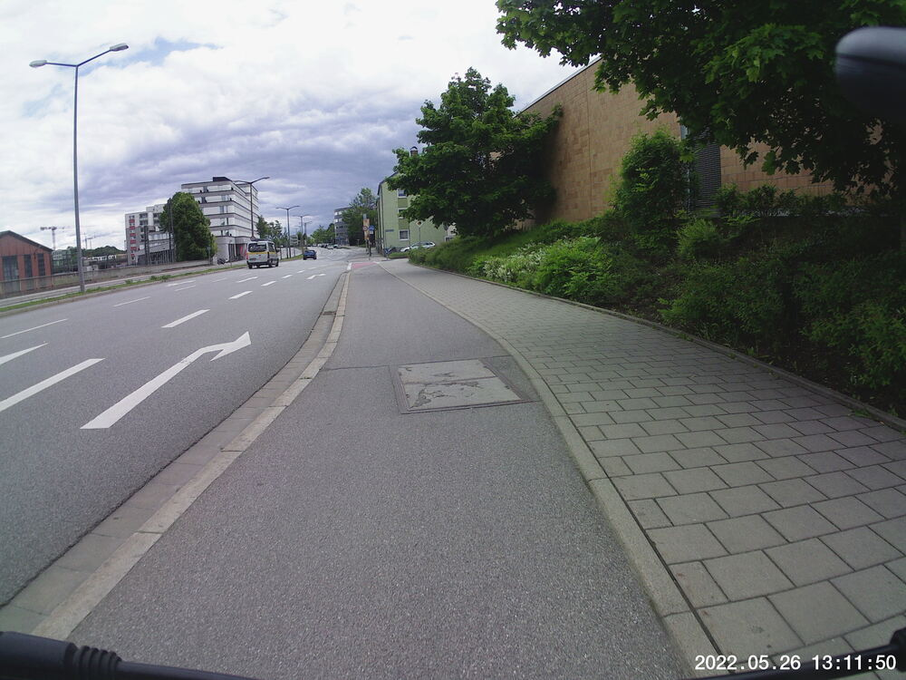

As the Christ flies, it's certainly more direct.  But my buddy from Parsberg met me in Beratzhausen at the train station and and we followed a route he'd mostly done before.  

The weather looked promising at the start, and more threatening at the end.  But no rain fell upon us, despite the clouds.  A Catholic holiday miracle!

We saw plenty of Good Ol' Boys grilling and tugging their *Bollerwägen* full of beer into and out of the woods, because *Christi Himmelfahrt* is also celebrated as *der Vatertag* in Germany, and that's the tradition.

The sheep and goats were a cute surprise.

We rewarded ourselves with Sarah's company and some *Biergarten* grub on Neupfarrplatz.

## Snaps

  
  
  
  
  
  
  
  
  
  
  
  
  
  
  
  
  
  
  
  
  
  
  
  
  


## Video Recap
Here's the steepest part of the whole trip:  down from Beratzhausen Bahnhof into and out of town.  You might want to turn the sound down; there's nothing of value there.



## Route
You might need to tap or click the map to make it bigger.  The red solid route was my expectation, having mapped it out in advance.  The blue dashed route is our actual route.  



## Stats

I left the house in kind of a rush and completely forgot my heart rate monitor.  By the feel of it, it wasn't overly taxing.  

```
Total Distance:       41.8 km 
Time:                 2:50
```

