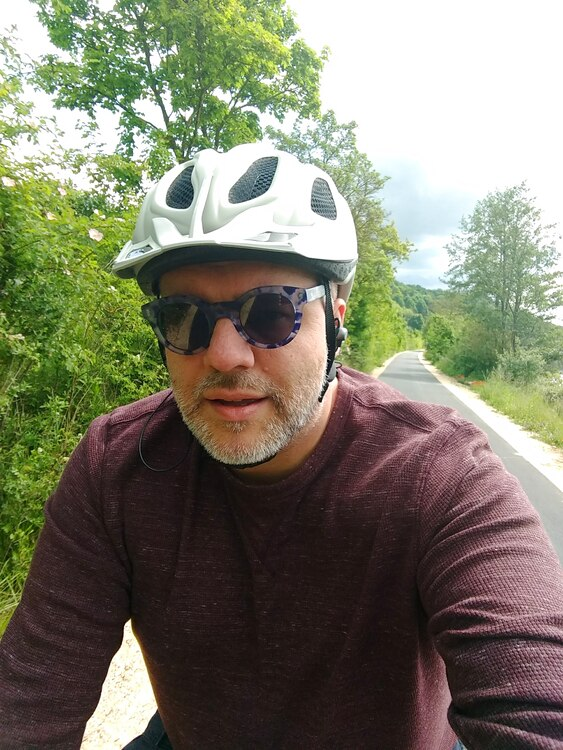
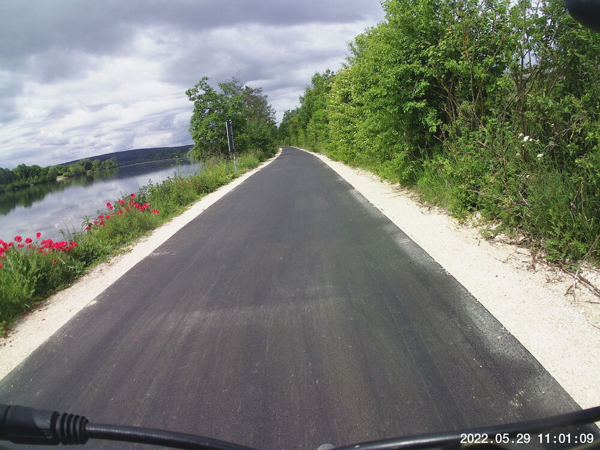
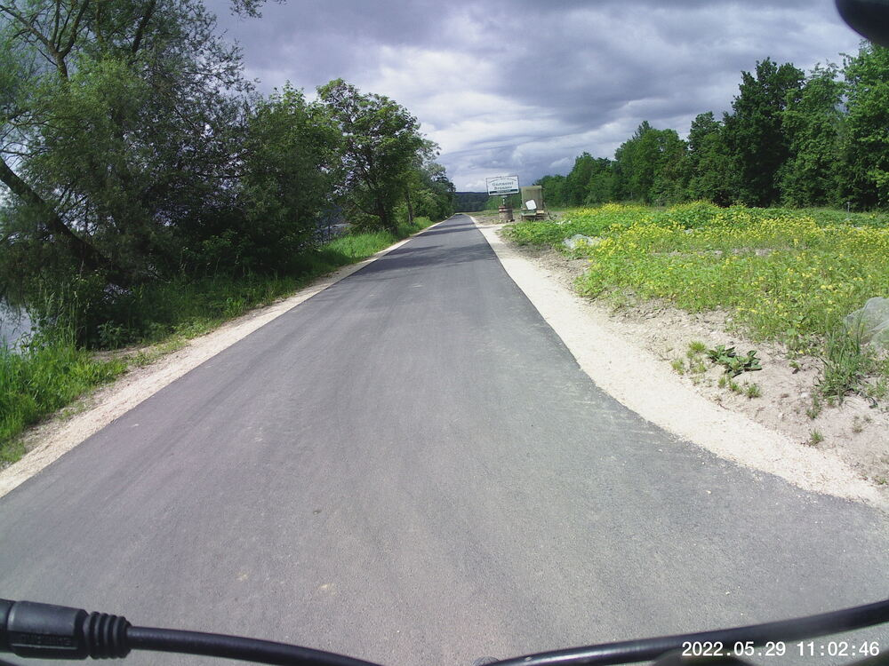
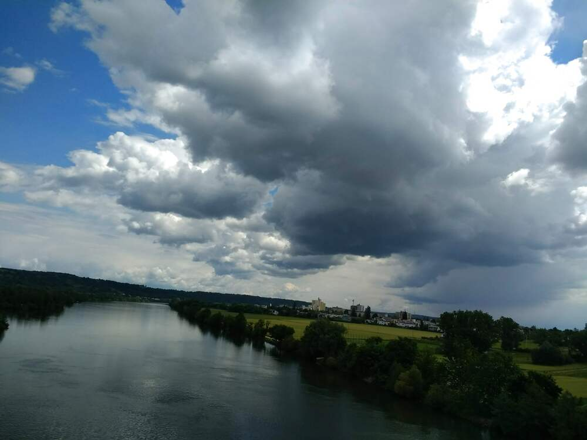
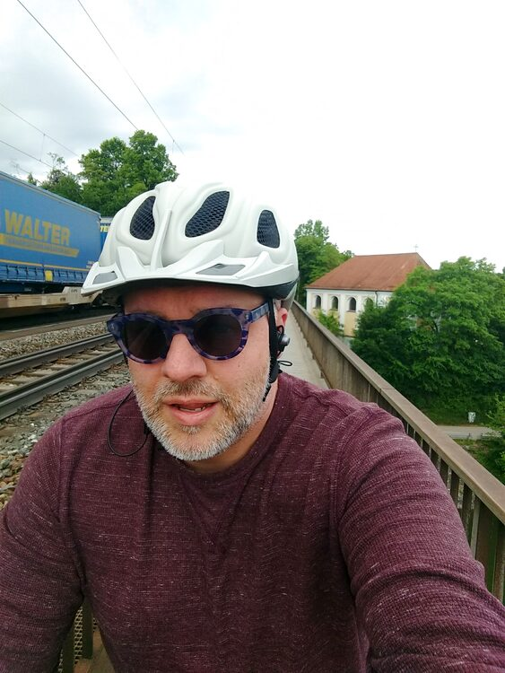
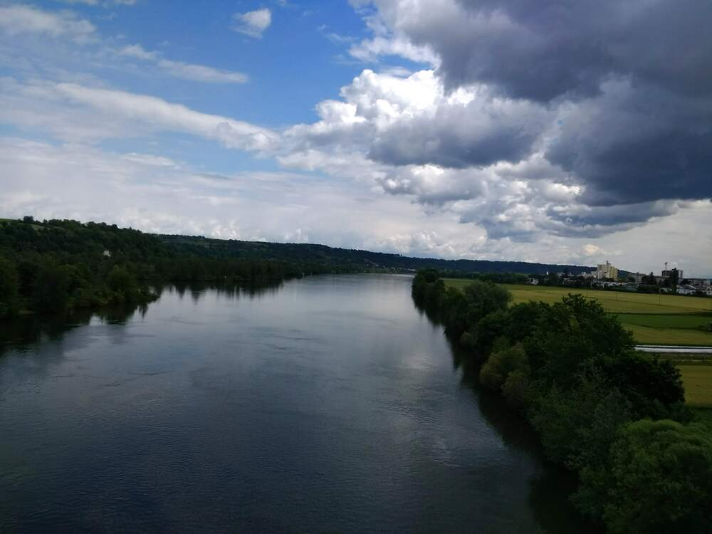
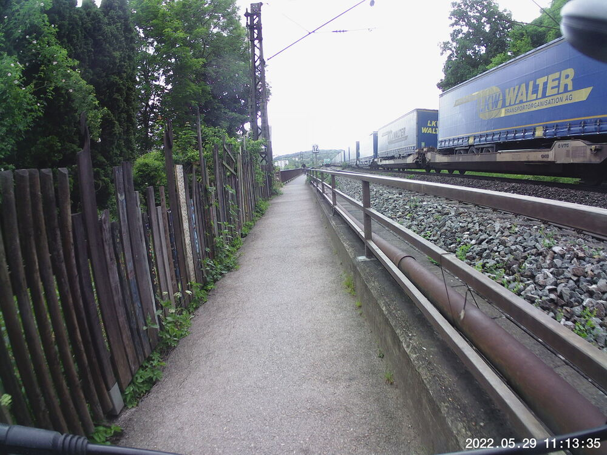
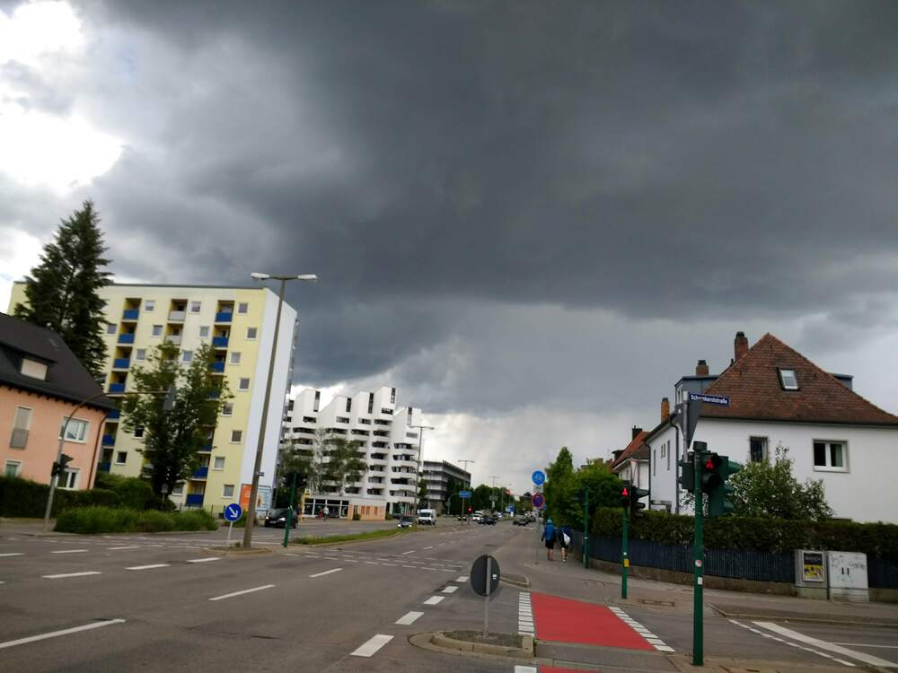
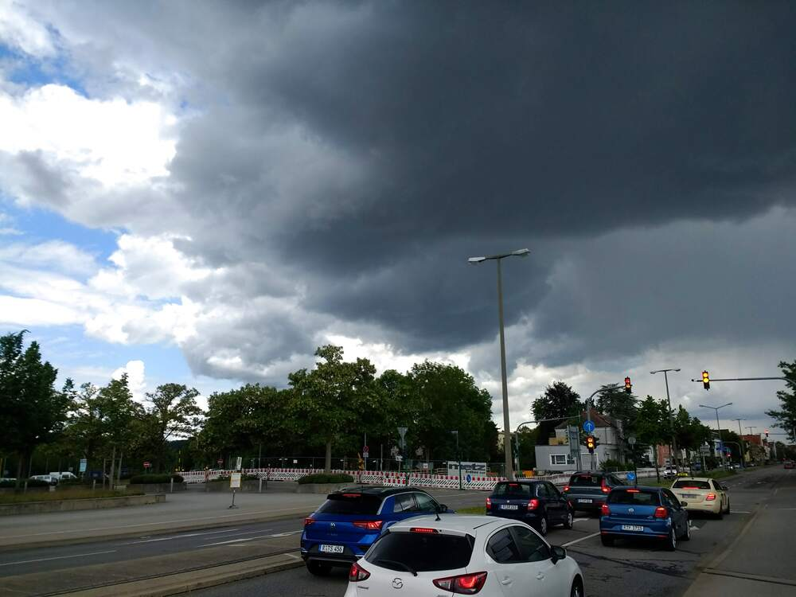

Heh; it wasn't *my* marathon.  The Regensburg marathon is today.  I was only going to do about 30 km, not 26 miles.  But along the way the weather started looking foreboding (much earlier than predicted), and glancing down, my rear tire looked a little low.  So I cut my route way short in order to beat the rain home, and... still got rained on.  Not drenched, but enough that a nice warm cup of tea was just my...cup of tea.


## Snaps

  
  

  
  
  
  
  
  
  
  
  


## Video
Want to see what it looks like on the bridge when a train is going by?



## Route
You might need to tap or click the map to make it bigger.  The red solid route was my intention.  The blue dashed route is my actual route.  



## Stats

```
Total Distance:       13.8 km 
Time:                 1:01
Calories:              622
Calories from fat:      23 %
Average Heart Rate:    123
Maximum Heart Rate:    165
Fat Burn:             0:14
Fitness:              0:47
```

