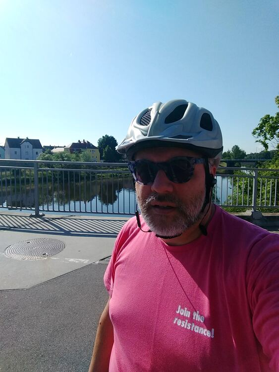
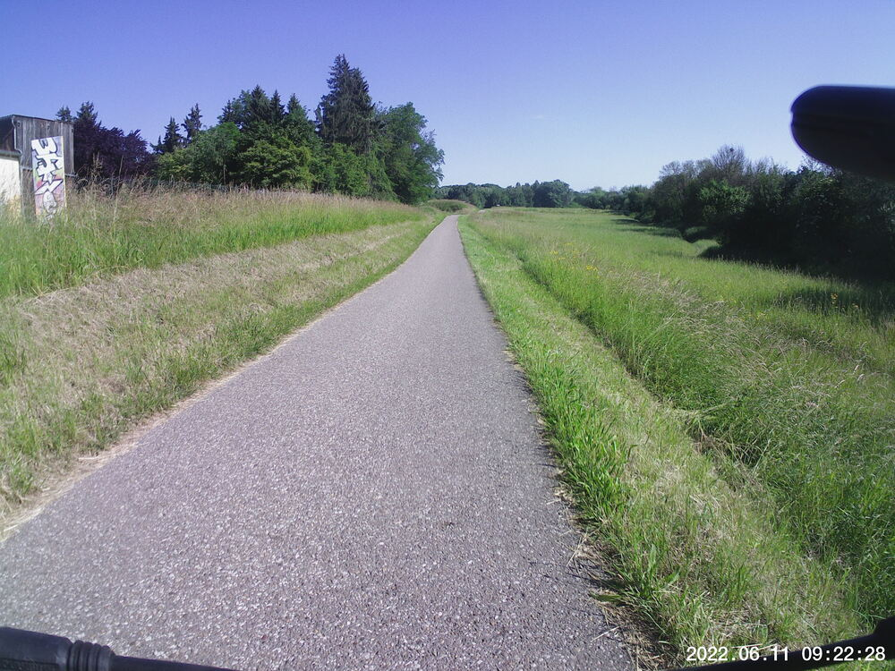
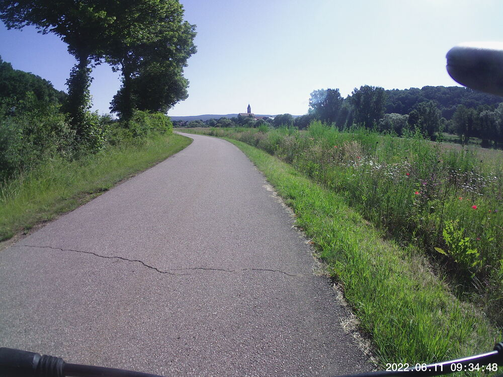
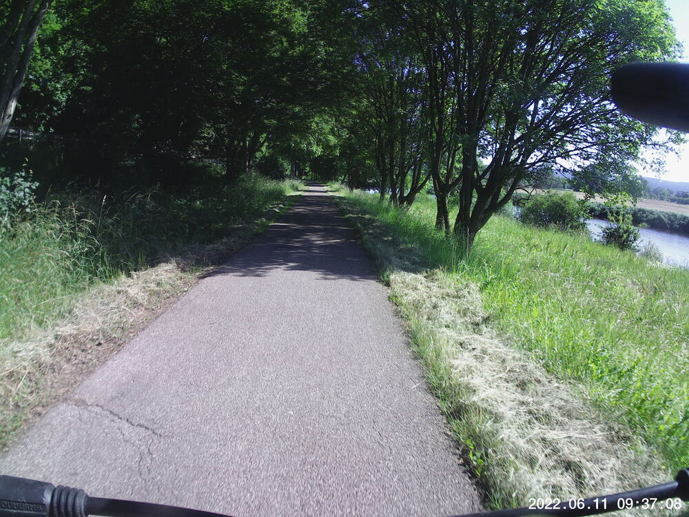
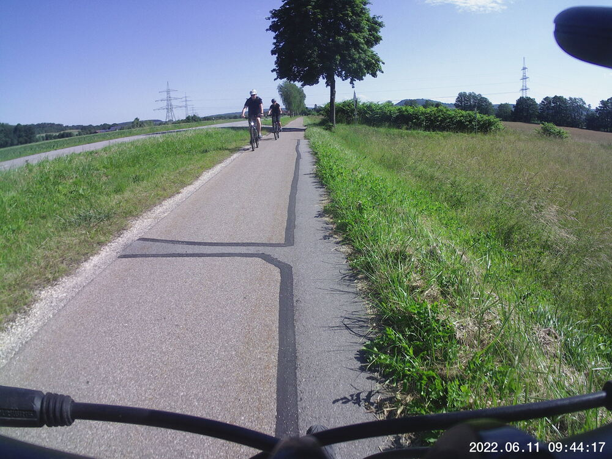
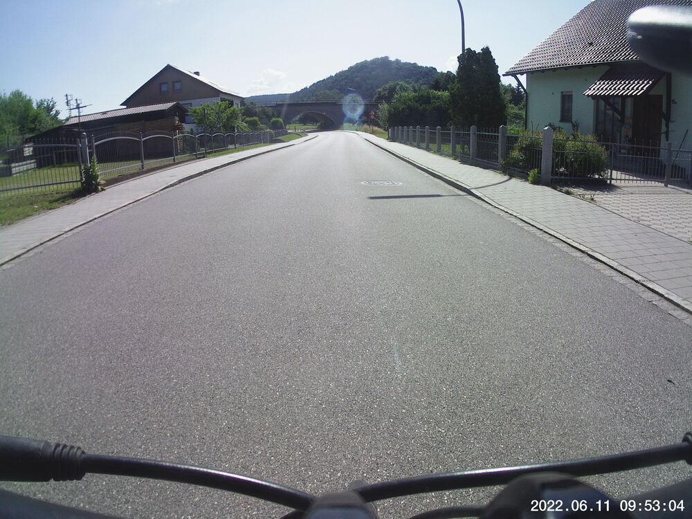
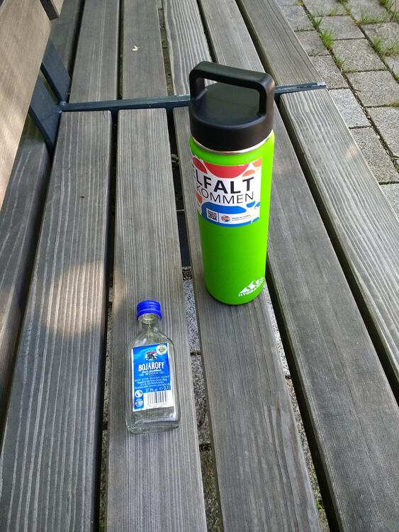
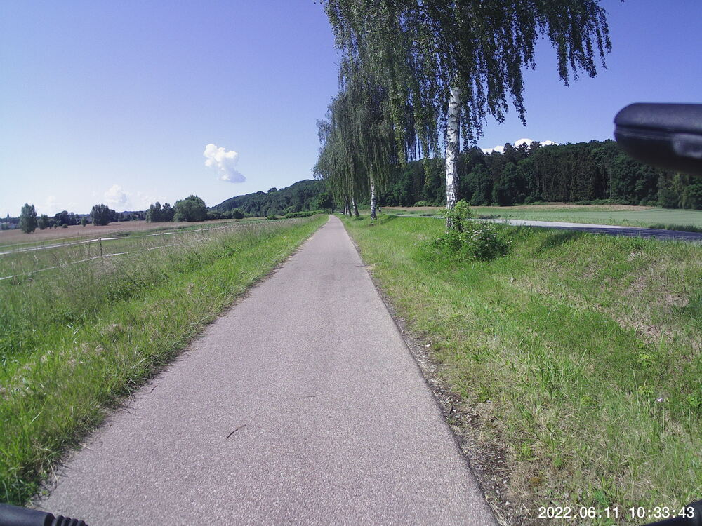
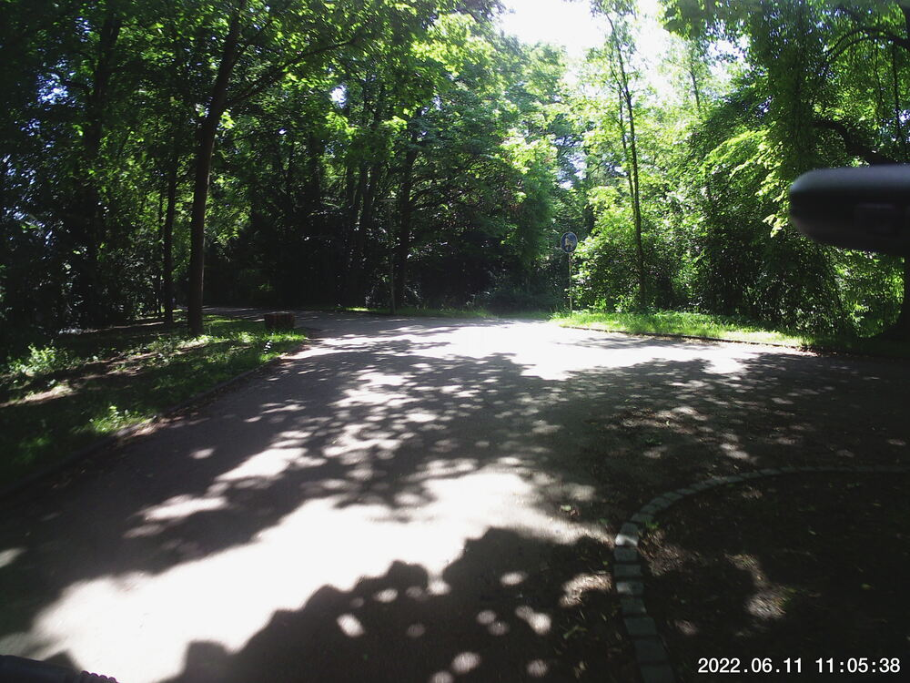

I was running low on Earl Grey, organic and packaging free, so I grabbed an empty, cleaned-out pickle jar or something and hustled up to [Quantum Satis](https://www.quantum-satis.de/) to refill on that, and green cardamom pods, and star anise.  They were out of star anise, and they won't be restocking it:  sadly, they're shuttering for good on July 31st, 2022.  The owner told me the economic situation of their store is just not sustainable.  That means the only *Unverpacktladen* I know of in the area will be [Füllgut](https://fuellgutregensburg.de/) (a play on *fühl gut*, or "feel good") in the Regensburger *Altstadt*.  

Bummer.


## Snaps

  
  
  
  
  
  
  
  
  


## Video Recap
It's just a shorty video of me heading down into an underpass and coming back out.



## Route
It was pretty much straight up and down the banks of the Regen river.  I neglected to stop recording the track upon my return, so that kinda ruined it.

## Stats

```
Total Distance:        30 km 
Time:                1:35
Calories:            1044
Calories from fat:     19 %
Average Heart Rate:   128
Maximum Heart Rate:   151
Fat Burn:            0:13
Fitness:             1:22
```

