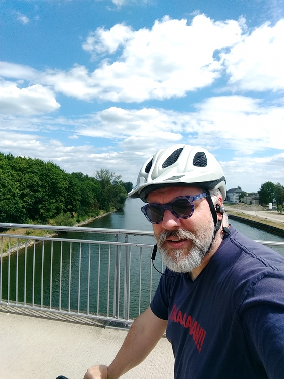
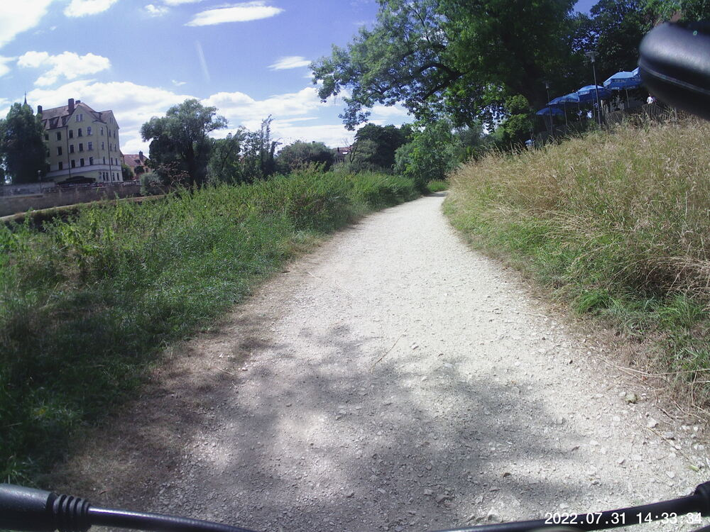
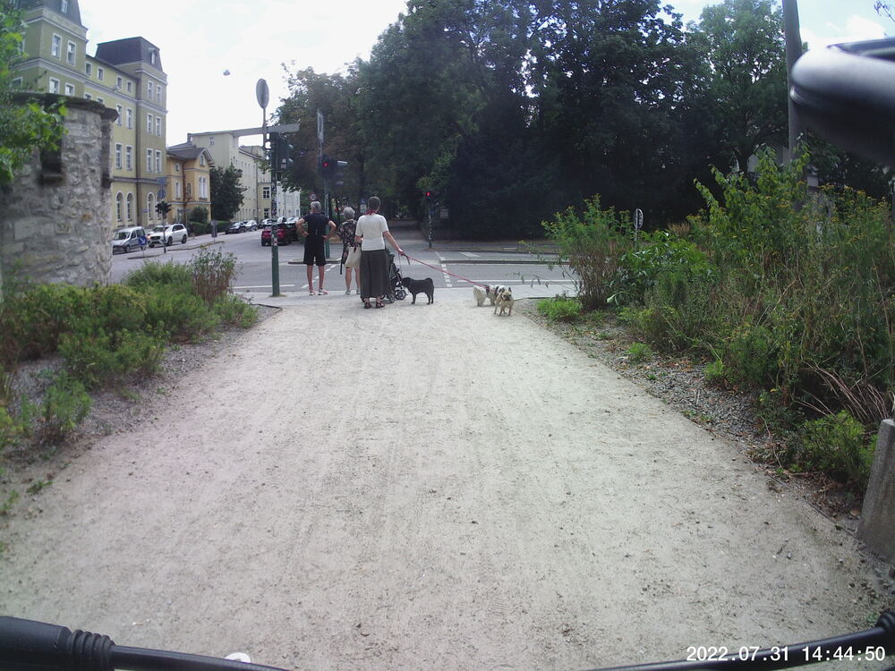

My biking routine got messed up by a flat tire I discovered at the start of [last week's would-be ride](/posts/walks/20220724/).

This past Saturday afternoon I pumped up the tire again and cautiously took a lap around the parking garage.  Seemed okay. 

I let it rest overnight.  Seemed okay.

I did a cautious ride yesterday to make sure I was not too far from home to push my bike back if need be.  It seemed okay the whole time.  That's the reason for the weird route shown below.


## Snaps

  
  
  

## Video Recap
This density of people would have been unthinkable two years ago.  Let's not forget that the pandemic isn't over and "long covid" is still not yet understood.



## Route
You might need to tap or click the map to make it bigger.  The red solid route was my intention.  The blue dashed route is my actual route.  



## Stats

Pretty sure my ancient Polar watch is borked and I will need a new one.  It was a good run.  (Ha.)  Thus:  only distance and time stats until I get something else.

```
Total Distance:       12 km 
Time:               0:51
```

