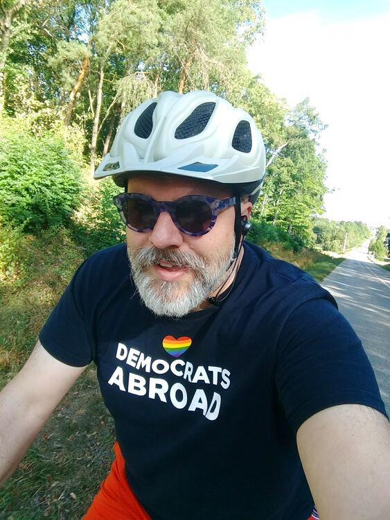
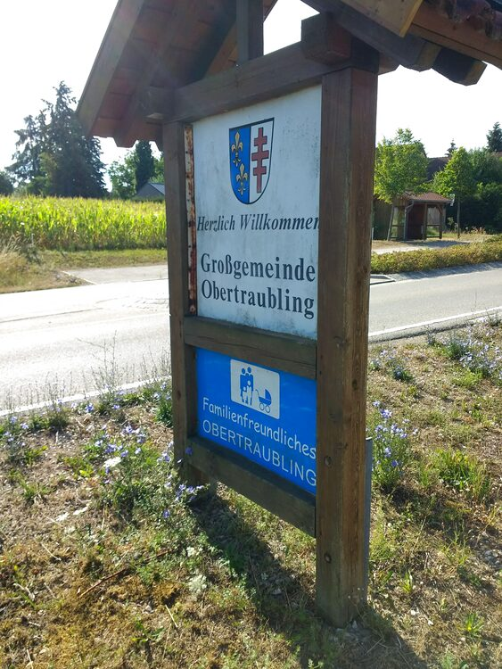
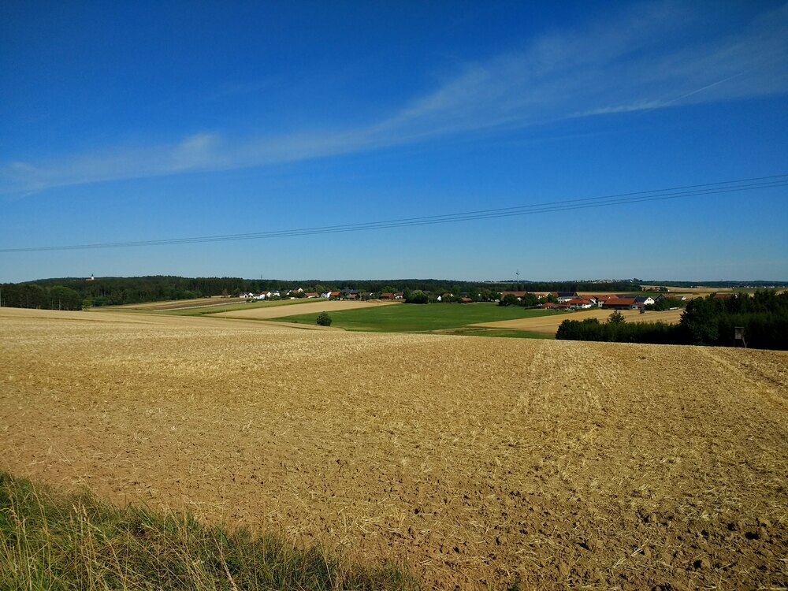
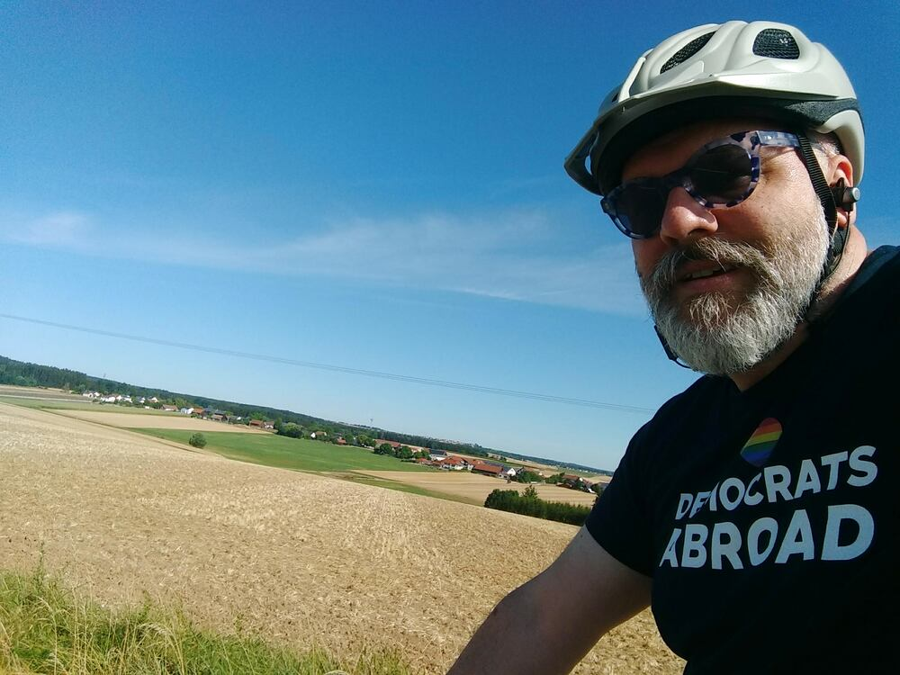
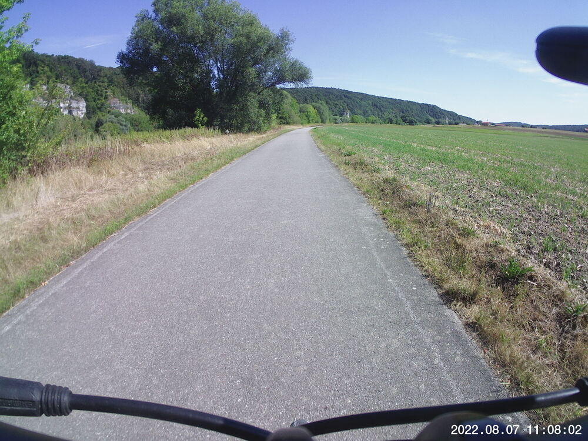
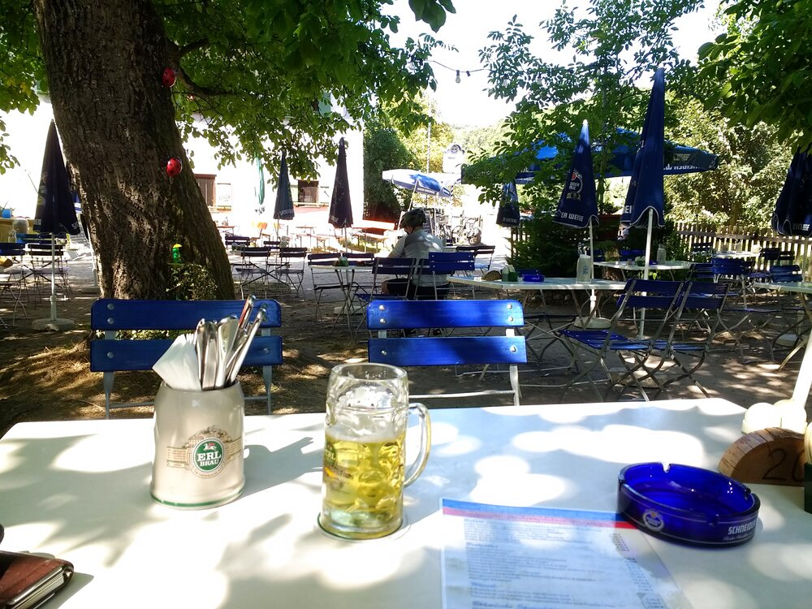
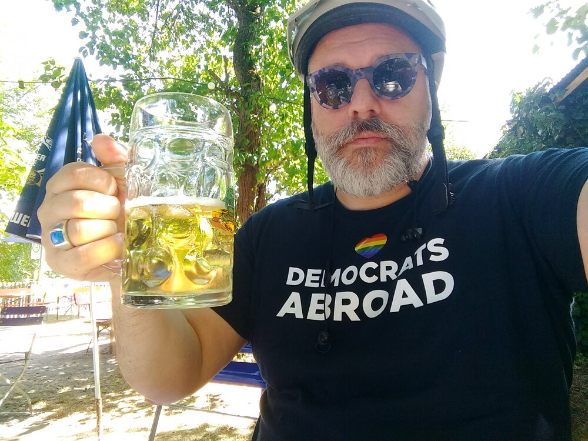
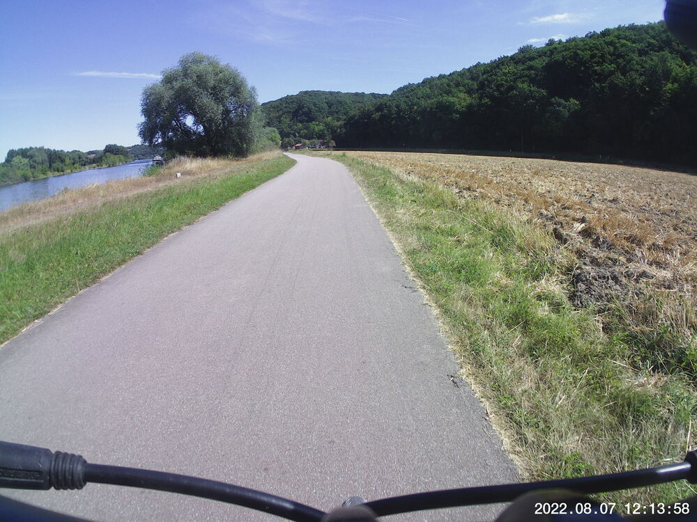
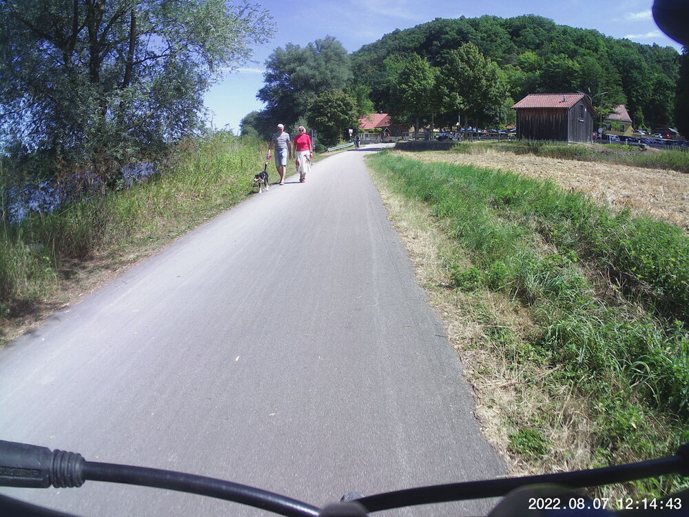

I did one of my most common routes this morning, but I changed it up by stopping for lunch at the [Zunftstüberl](https://osm.org/go/0JHEh~LW?layers=H&m=&node=510159162) outside of Matting for lunch.  I was cruising by, making good time, and I thought 

> Dang, a *Radler* sounds great about now.

So I pulled in at the Zunftstüberl.  Couple points to mention:

1. Great *Kartoffelsuppe* with chopped up hotdog in it.
2. Their *warme Küche* doesn't start until 11:30; don't let that mess up your plans.
3. Waiter guy told me for sure, no kidding, seriously 100% they're firing up on time.

I ordered in advance and decided to wait it out on faith that my bowl of soup would come out of the kitchen at 11:32.

\**Voice over*\*:
> *This was not going to happen.*

So I *hauled ass* back to the house, trying to keep my schedule for the day, and that felt like the fastest I've ever done that stretch of the route.  Checking the average speed for that segment, though, I see it was NBD.  21 km/h on flat ground (although that includes waiting around at three or four stopilights along Friedenstraße/Furtmayrstraße, so maybe there is something to it).

## Snaps

  

I'm not sure if this is a real estate developer's statement, or a wish for multi-generational demographics, or a subtle (maybe not so subtle) statement about what the residents in Obertraubling think a typical family should look like.  Jury's still out on whether I'm annoyed about this or not.  

  
  
  
  
  
  
  


## Video Recap
I accidentally left the video running much longer than I meant.  So I sped up the movies by a factor of four.  I hope you don't get see-sick.  (Ha.)



## Route
You might need to tap or click the map to make it bigger.  I've done this route so many times I don't need to map it out in advance anymore.  Thus there is only the red solid route.  



## Stats
The Polar watch I'm using is iffy, but the chest strap definitely needs a new CR2025 battery, and I don't happen to have one of those lying around.

```
Total Distance:       34 km 
Time:               1:52
Max Speed:            47 km/h
```

