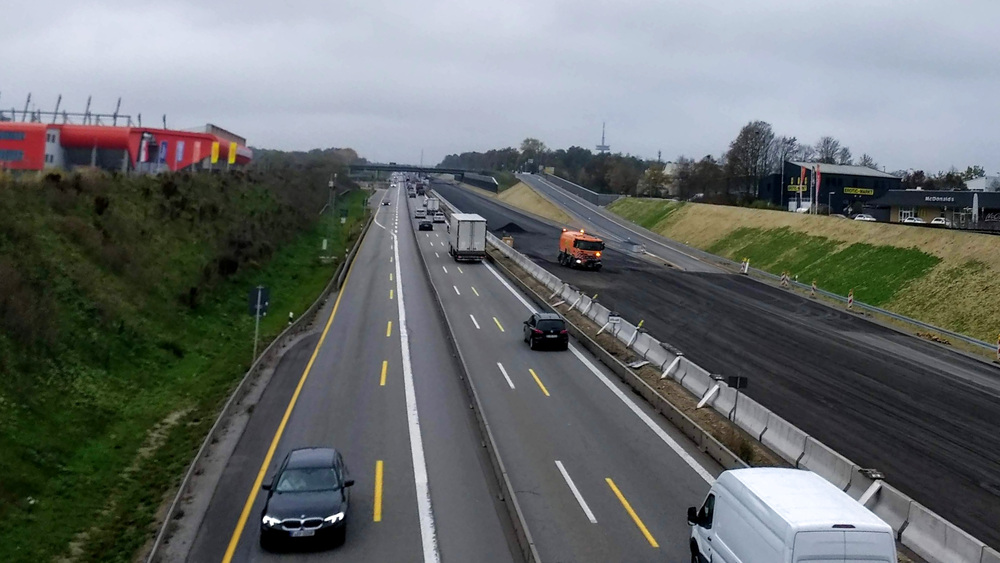
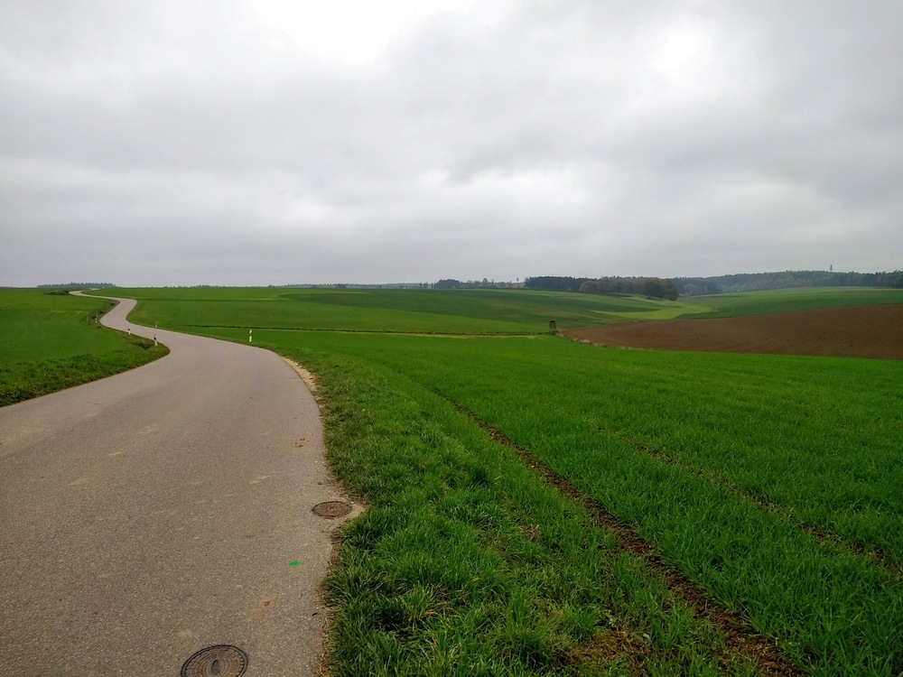
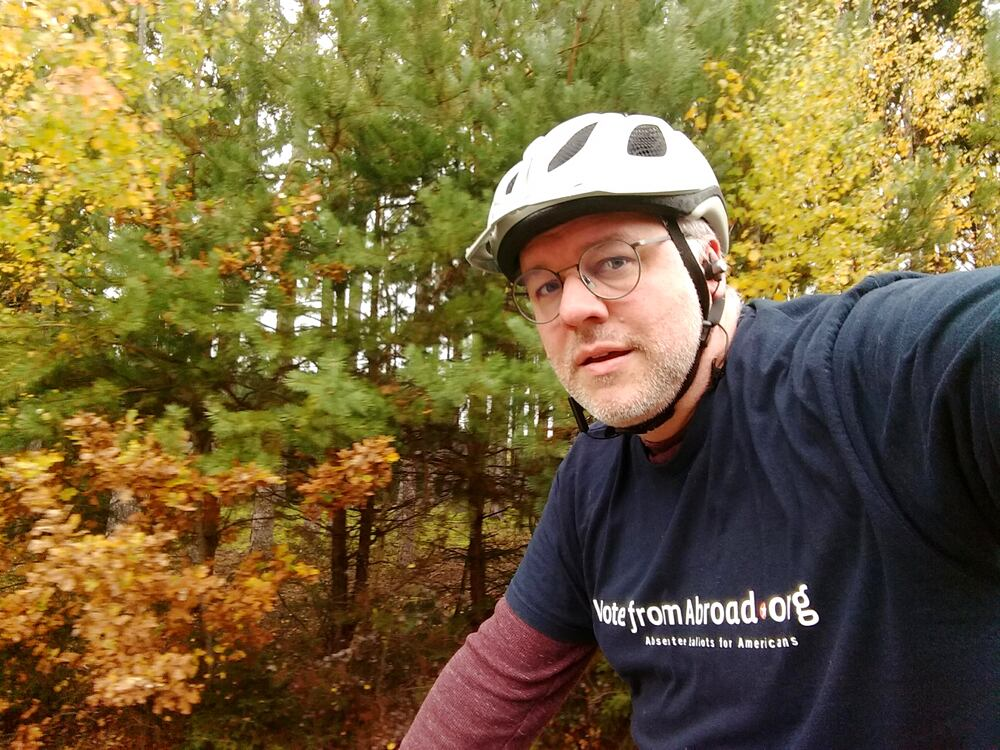
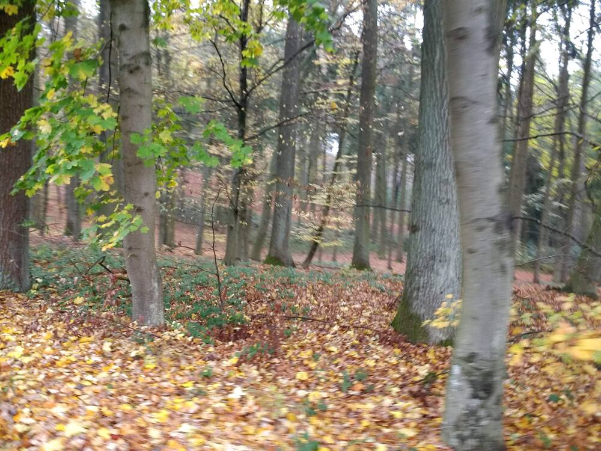
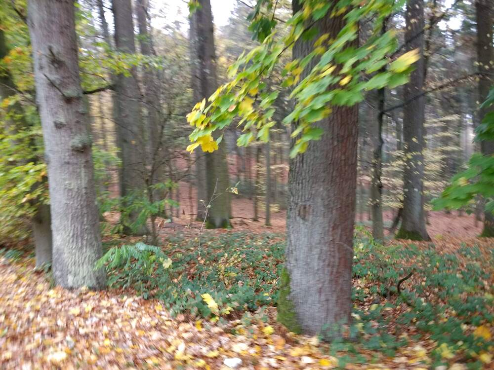
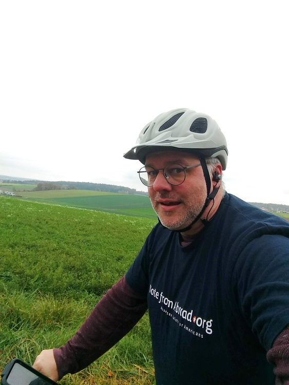
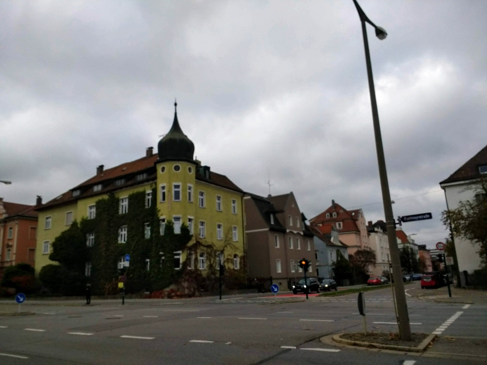

It's been a while since I biked and recorded a route and route about it.  Which is not good, of course, but better late than never.

This was a nice, gentle step back into it.  I was debating whether to do a short loop through Leoprechting and Graß, or a longer loop down to Bad Abbach, and in the end I split the difference and opted for Scharmassing and Neudorf and Hohengebraching as waypoints.  There are (what look like) some nice walking paths between Neudorf and Pentling; we should go give those a try before the weather gets too wintry.  

With a high of 10 °C today, I was just barely warm enough in my two layers, as long as I kept moving.  That's not going to last.  


## Snaps


Out doing some human billboarding.  Election day approacheth!


The A3 is *still* being worked on near the ~~Conti-Arena~~ Jahnstadion.  Glad we don't plan on using the car there much in the near future.  

  
  
  

Sort of interesting blur effect from being in motion and holding the camera.  

  
  


## Route
You might need to tap or click the map to make it bigger.  The red solid route was my intention.  The blue dashed route is my actual route.  



## Stats

```
Total Distance:       17 km 
Time:               1:08
Average speed:        15 km/h
Max speed:            45 km/h
Altitude range:  334-447 m
```

