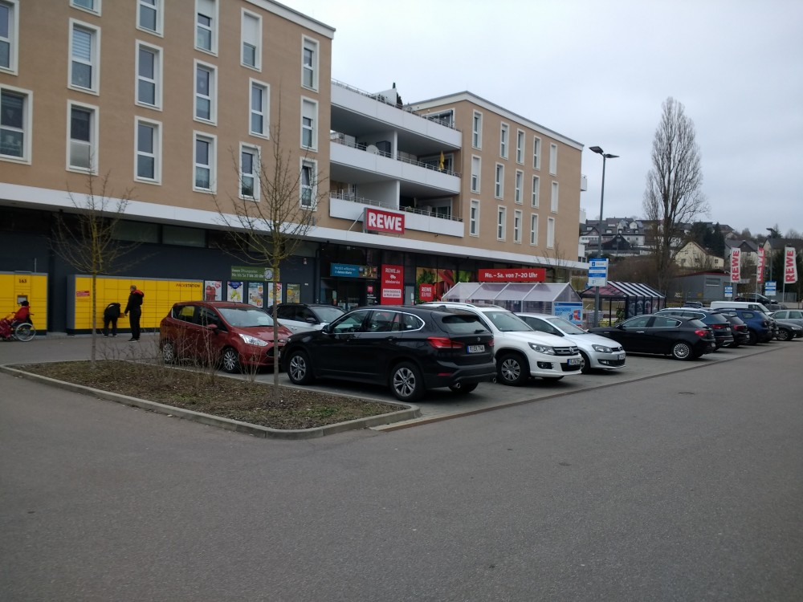
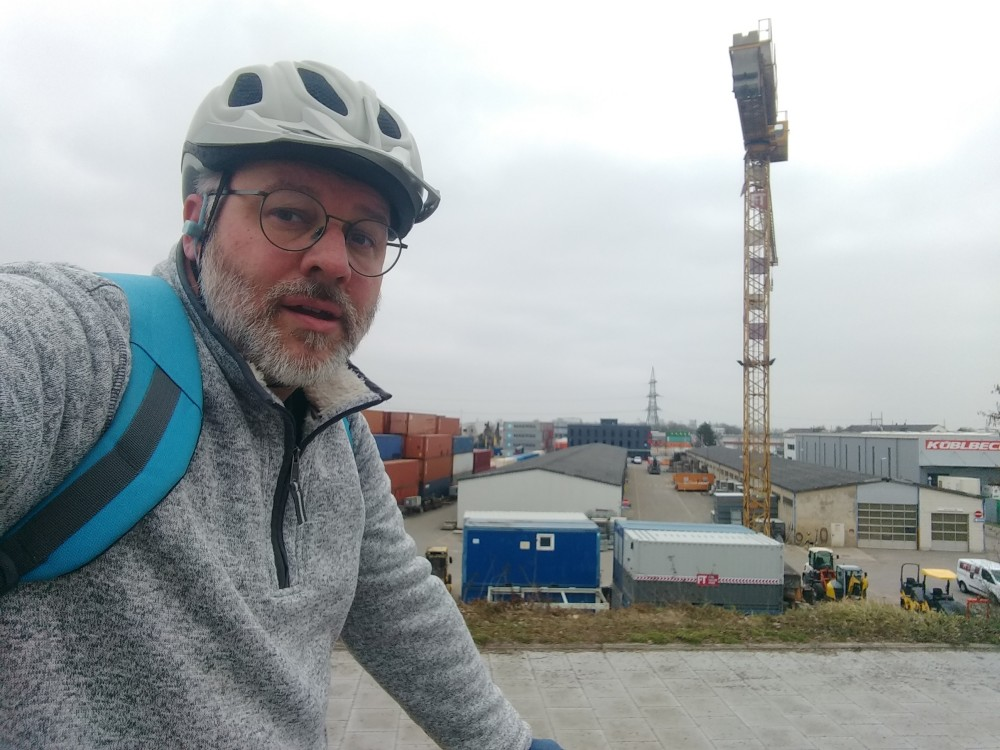

Kicking off the year a bit late with a start in early March...but BLTN.

Inner monologue:

> Mmm, a BLT Now.

I needed to get some groceries for the weekend and the upcoming week, so my plan to was to stop at a REWE on the way back.  And I did, but not where I expected.  Rather, along Pilsen Allee in Brandlberg (you can see it in the map below as the little blue notch on the long straight north/south line.


## Snaps

  
  


## Route
You might need to tap or click the map to make it bigger.  The red solid route was my intention.  The blue dashed route is my actual route.  



## Stats

```
Total Distance:       15 km 
Total Time:         1:03
Moving Time:        0:59
Average Speed:         8 min/km
Altitude Range:  328-350 m
```

