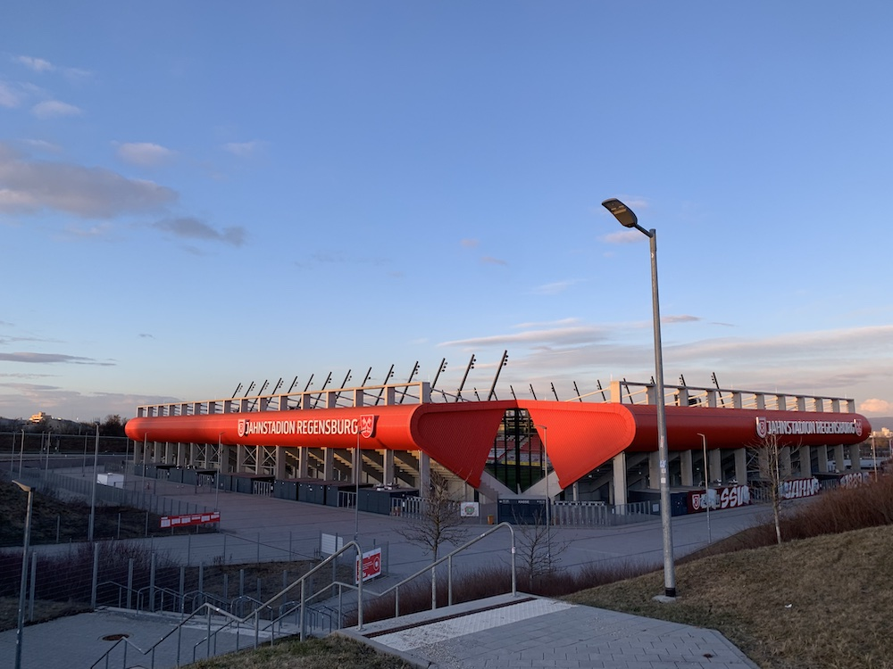

It was time to donate blood again today.

I didn't get my morning walk in, so I took a three kilometers stroll up to the Jahnstadion after work and got there dreadfully early for my 18:30 appointment.  So I kept strolling and killed a little time, padding out my walk to five kilometers.

I had my phone set to mark my position every 30 seconds, and that makes my traversal of the parking lot rows look sloppy.  I suppose that's the trade-off for reduced impact on the battery:








## Route

  

```
Distance:           5.0 km
Time:              1:21 
Calories:           687 
Calories from fat:   36%
Average Heart Rate: 112
Maximum Heart Rate: 135 
Fat Burn:          1:10
Fitness:           0:11
```
