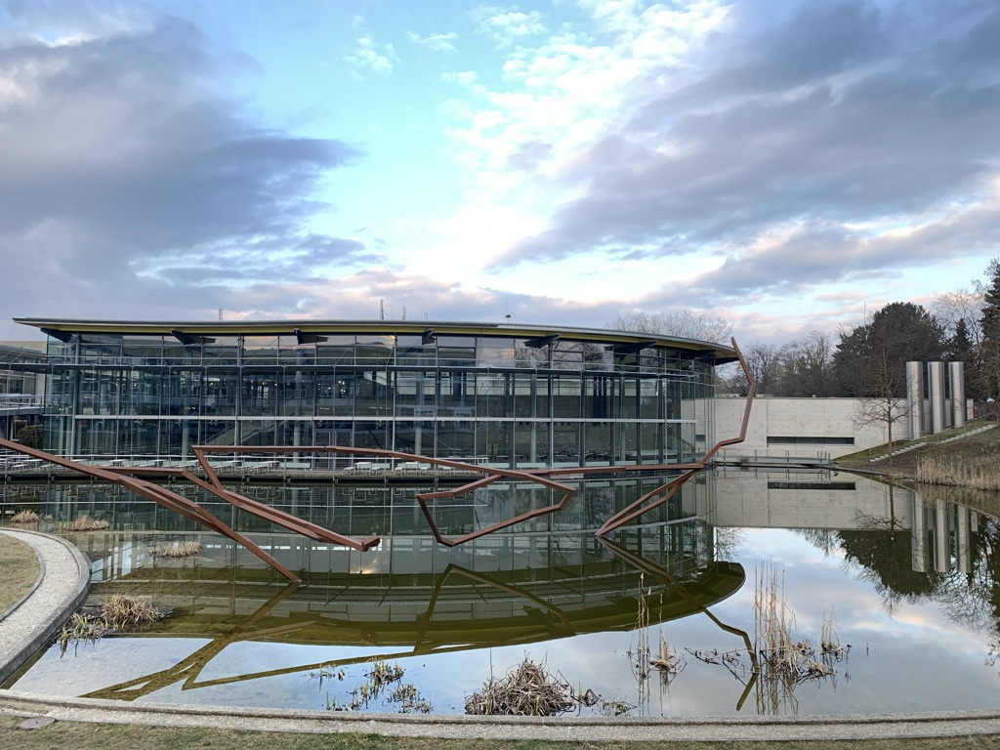
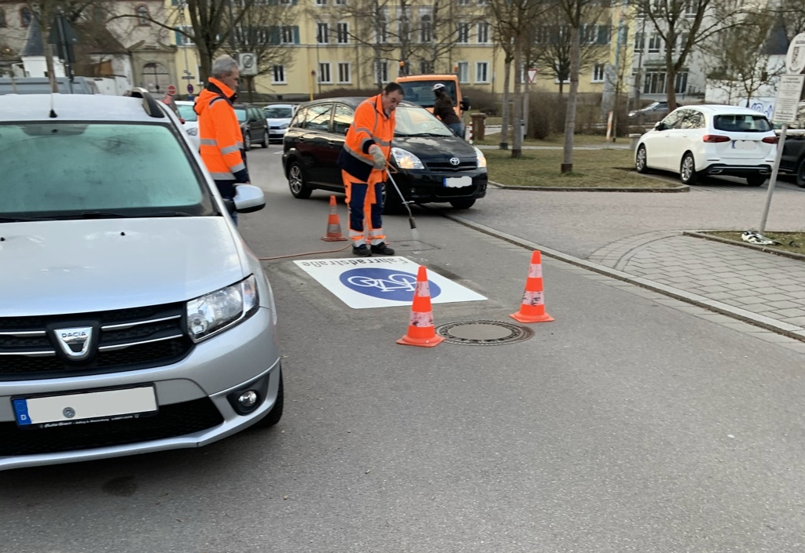

Got up way too early today.  Why not turn it into a walk?  The timezone shift is coming soon; might as well embrace the sunlight.

## Snaps

  
The OTH pond was nice and still.

  
I liked the irony of both a car and a bike swerving onto the sidewalk to drive around the crew applying a *Fahrradstrasse* sign on the street.

## Route

  

```
Distance:           6.5 km
Time:              1:30
Calories:           781
Calories from fat:   30%
Average Heart Rate: 114
Maximum Heart Rate: 134
Fat Burn:          1:16
Fitness:           0:14
```
