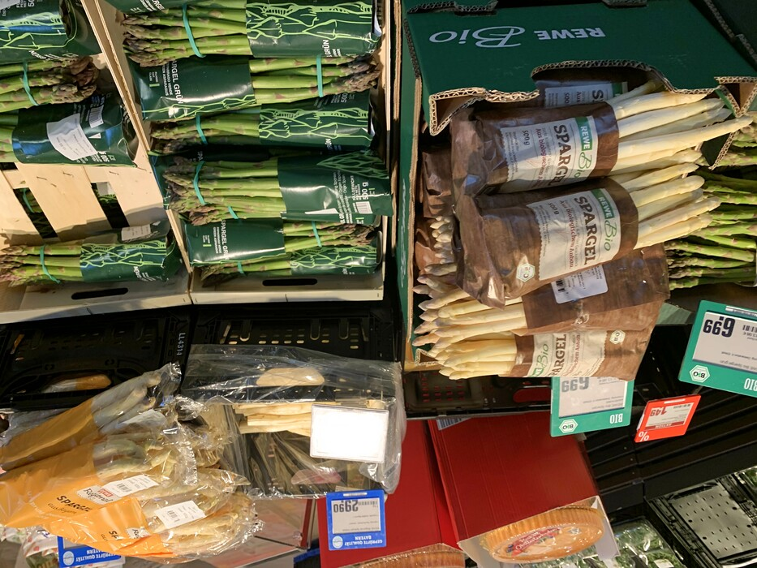

*Die Spargelzeit*, that is.

German asparagus is available at REWE near us.  *Lass den Spargelwahn krachen.*

## Snaps

  
That building across the street from REWE and Candis Park is getting bigger everytime I walk by.

  
Not all of the stuff shown here is domestic or even regional.  But at least the white asparagus in the yellow plastic bag is the REWE *Regional* brand.  So it won't be much longer until everyone's griping about the workers imported from Eastern European countries bringing Covid in with them to steal German bikes and not appreciably drop the prices on a *Pfund* of asparagus.

## Route

  

Note:  something was definitely screwy with the heart rate monitor.  I was thinking about work stuff, sure, but there's **no way** I got up to 197 beats per minute.  I happened to see that on the watch read-out, adjusted the chest strap a little, and the numbers immediately got back down to a reasonable range. 

```
Distance:          5.55  km
Time:              1:22 
Calories:           810 
Calories from fat:   25 %
Average Heart Rate: 121
Maximum Heart Rate: 197
Fat Burn:          0:33
Fitness:           0:49
```
