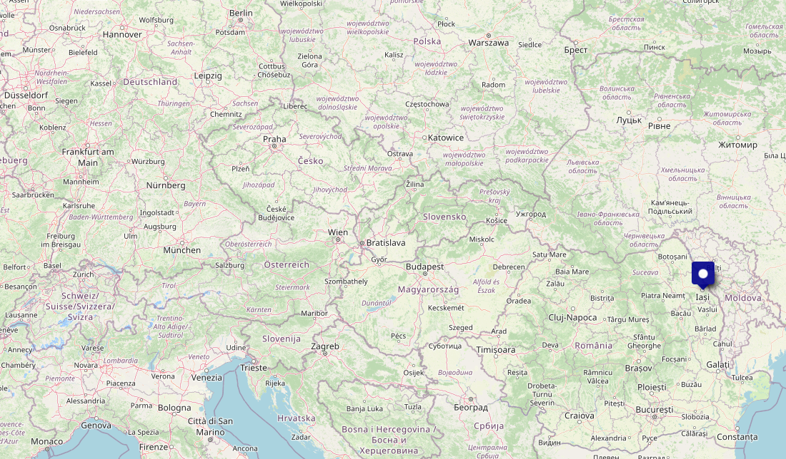
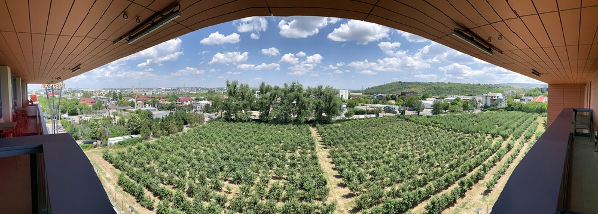
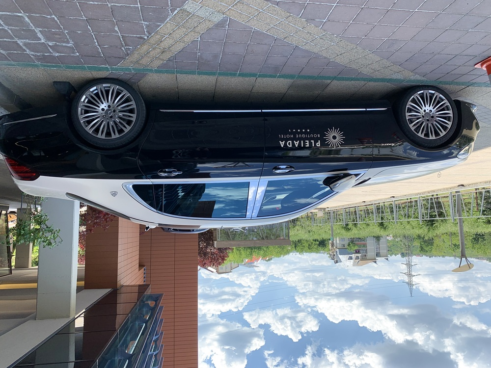
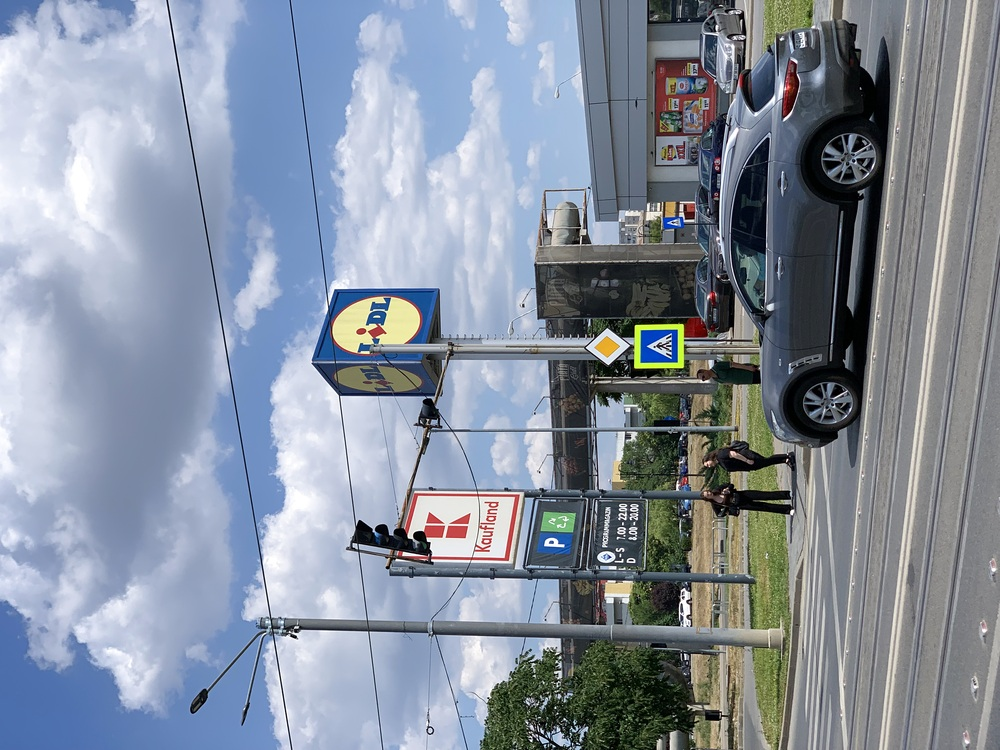
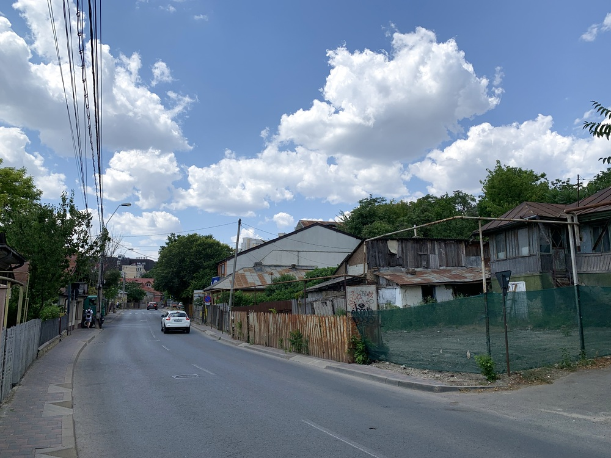
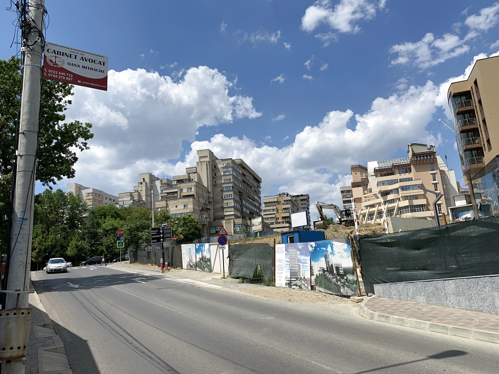
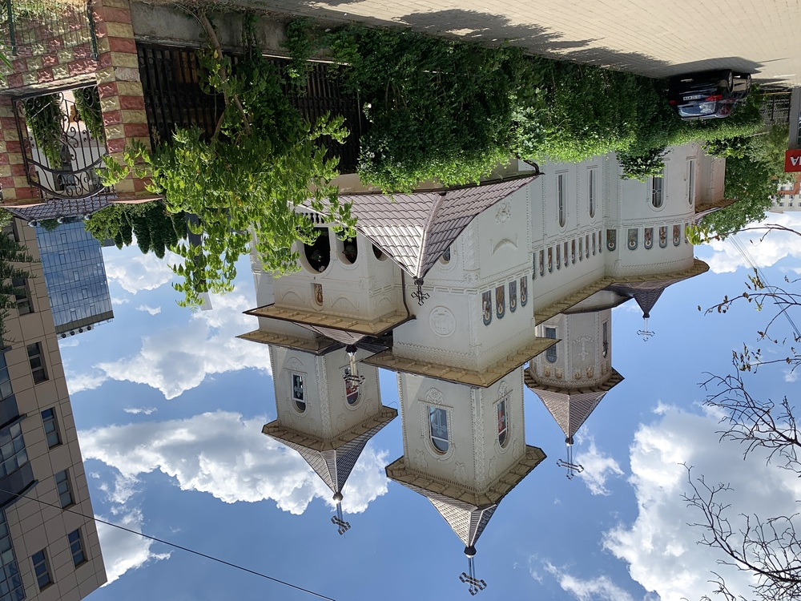
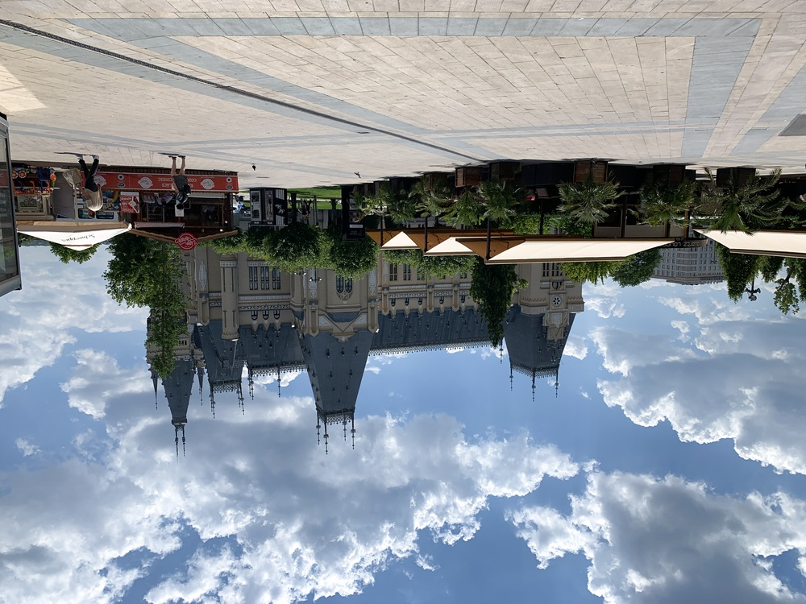
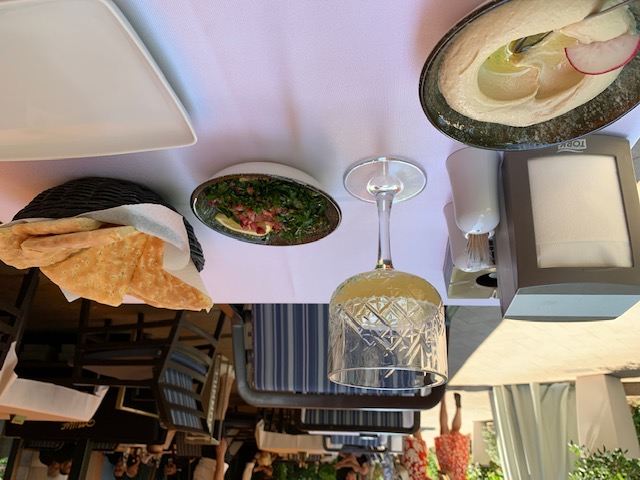

I'm in Iași for a couple weeks and just hit the half-way point.  

  


I've been visiting this city on business a few times per year since 2006, but usually just for part of a week.  As near as I can tell, this is only the third or fourth time I've been over a weekend, and only the third time not during the winter.  And I'm staying in a new (to me) hotel quite close to the office.  So, with some time to kill yesterday, I decided to go walking around in neighborhoods I don't know on my way to the Palas Complex (malls, restaurants, parks, fountains, etc. in the backyard of the Cultural Palace).

I could have taken a more-or-less straight line path from my hotel in the south to my destination (a Lebanese restaurant I visit a couple times per trip), but I decided to stretch it out.  Maybe not the best idea under those weather conditions (93 °F / 34 °C), but I managed to find shady sidewalks and there was sometimes a light breeze that at least kept the air moving.

When I got to my hummous and tabbouleh, however, I was drenched.  I took a taxi back.


## Snaps


Panorama view from my room's balcony overlooking an apple orchard with a major avenue in the southeast part of town beyond it.  


The hotel's airport shuttle?  This is the closest I've ever been to a Maybach outside of a museum.


Still need your German grocery fix while traveling?  Kaufland and Lidl have got you covered in Iași.


Within sight of the fancy, glitzy, *schicky-micky* palace complex, you will still find plenty of scenes like this.


But there's new construction going up all the time, too.


And still some oldy-woldy churchy stuff, obviously restored to beautiful condition.


The Cultural Palace &mdash; almost there!


Poftă Bună!

## Route



```
Distance:           5.66 km

```
