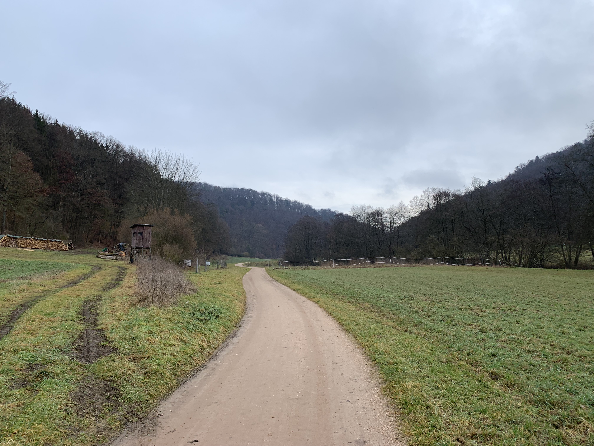
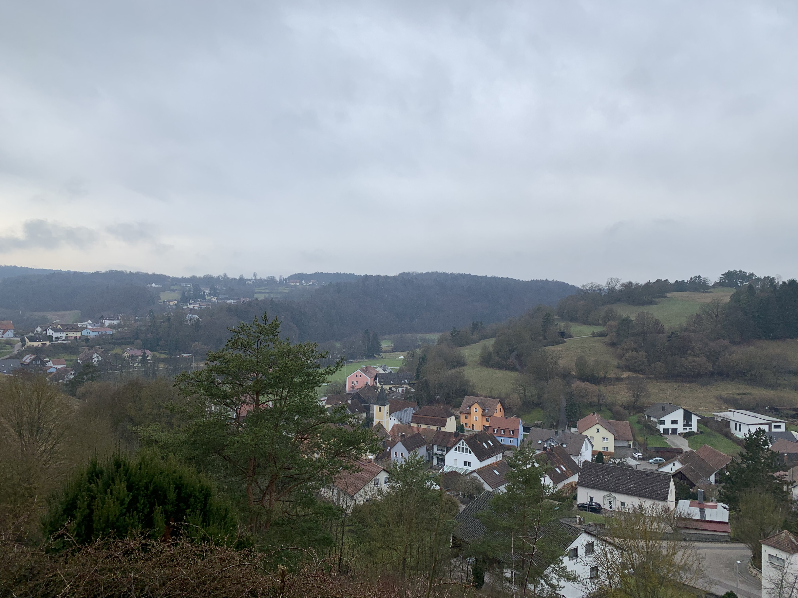
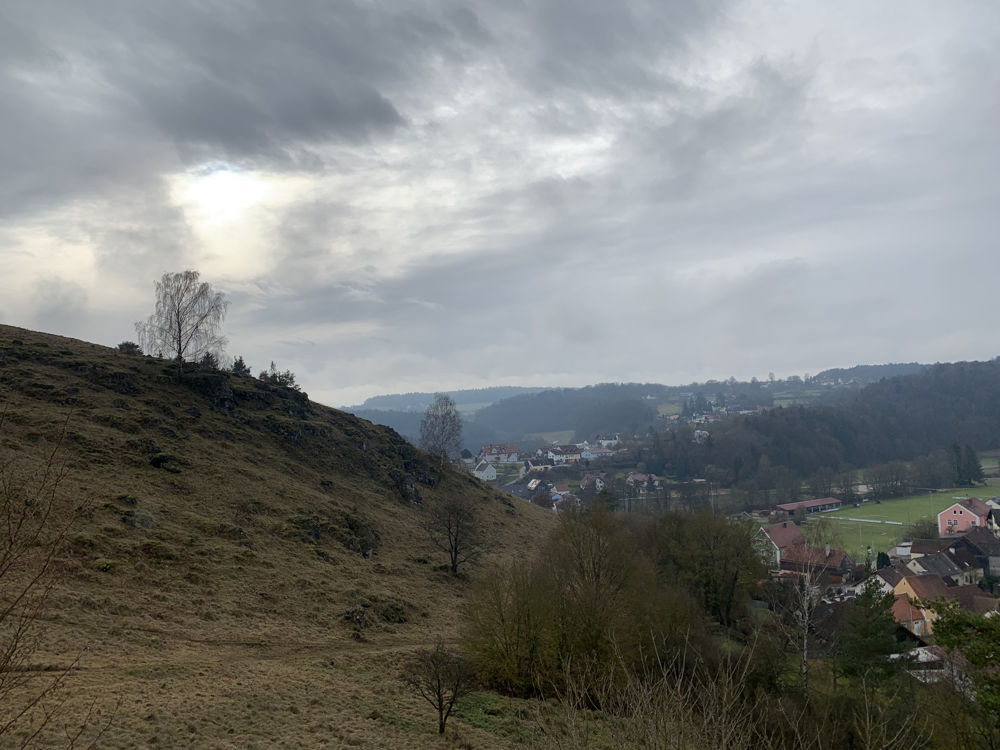
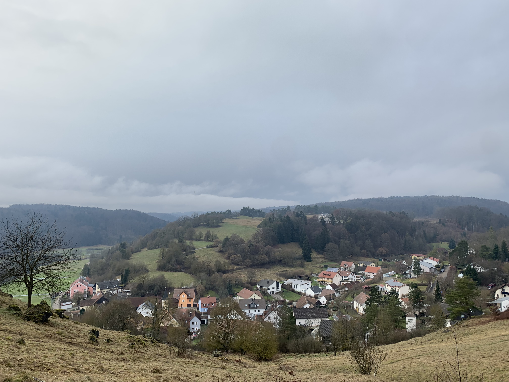
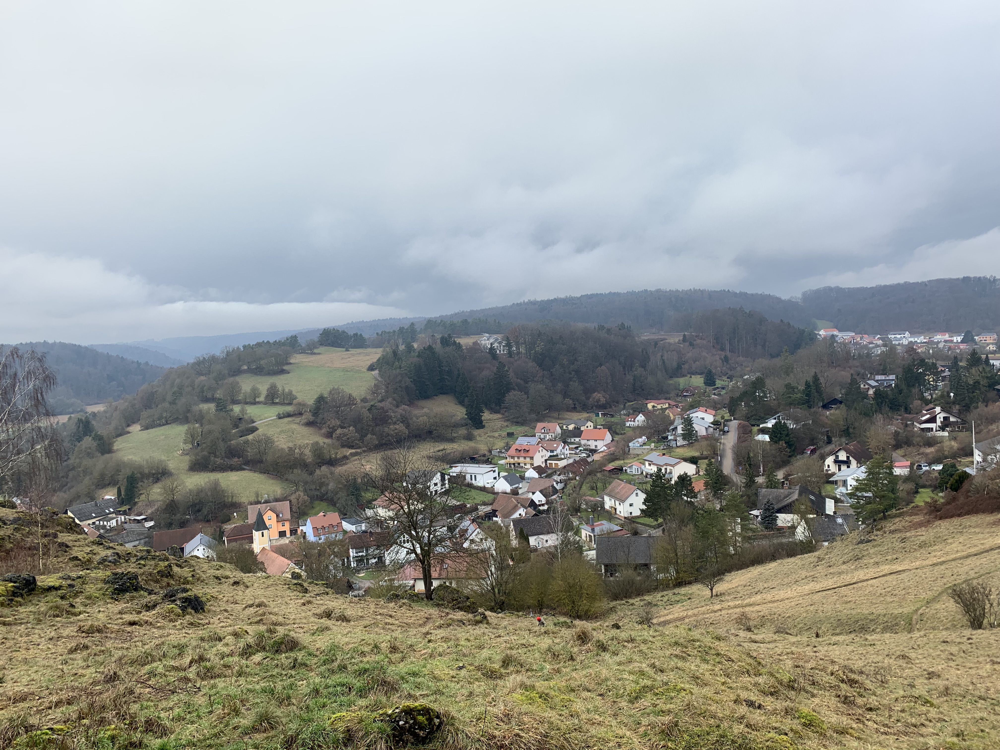
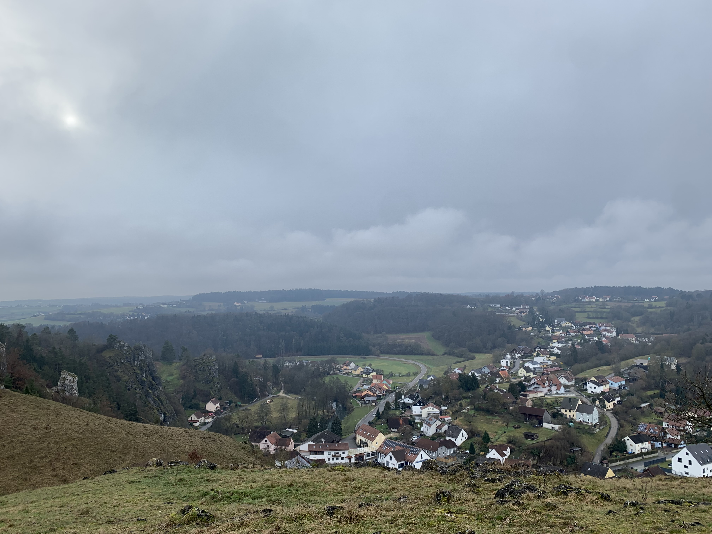
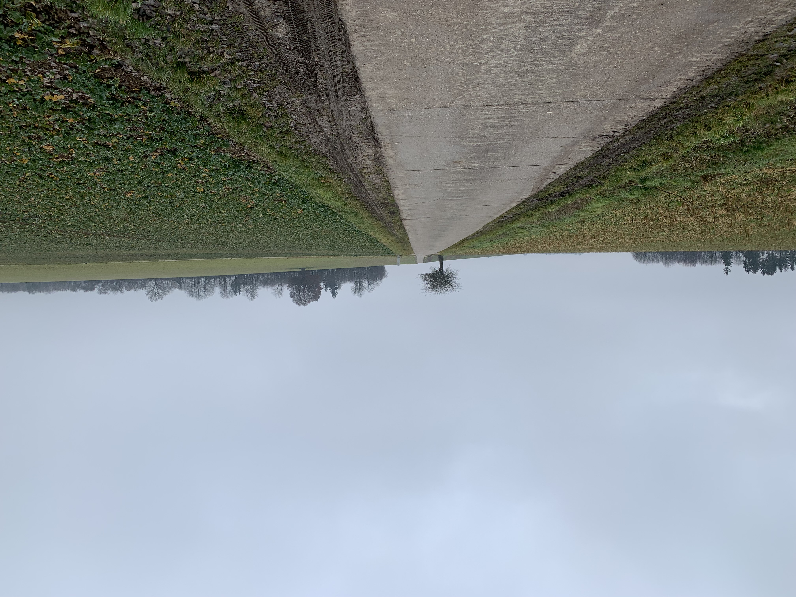

Our first longer walk of the year yielded quite a bit of elevation, in slippery mud, on rocky paths.  It was mostly a place we'd been a few times before &mdash; the [*Alpiner Steig*](https://www.openstreetmap.org/?mlat=49.01066&mlon=11.96408#map=18/49.01066/11.96408) outside Eilsbrunn and Schönhofen, but this was the first time we stopped in at the *Schlossbrauerei Eichhofen* after the stroll.  I daresay we'll be doing that again.

## Snaps


  
  
  
  
  
  
  
  
  
  
  


## Route

  

```
Distance:          10.5ish km
Moving Time:       2:28
Average Speed:        8 min/km

```
